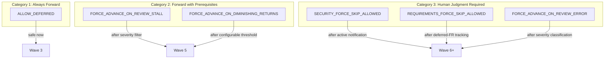
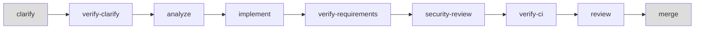

# Always Forward Analysis

> Research findings from 5 rounds of investigation into the "always forward" philosophy for the speckit-autopilot pipeline.

**Date:** 2026-03-12
**Status:** Wave 3 partial adoption complete; Waves 4-6 roadmapped

---

## Contents

- [Executive Summary](#executive-summary)
- [The Original Proposal](#the-original-proposal)
- [Full Halt Point Inventory](#full-halt-point-inventory)
- [Investigation Findings by Variable](#investigation-findings-by-variable)
  - [1. ALLOW_DEFERRED — APPROVED](#1-allow_deferred--approved)
  - [2. SECURITY_FORCE_SKIP_ALLOWED — REJECTED](#2-security_force_skip_allowed--rejected)
  - [3. REQUIREMENTS_FORCE_SKIP_ALLOWED — REJECTED](#3-requirements_force_skip_allowed--rejected)
  - [4. FORCE_ADVANCE_ON_REVIEW_STALL — REJECTED](#4-force_advance_on_review_stall--rejected-needs-prerequisites)
  - [5. FORCE_ADVANCE_ON_DIMINISHING_RETURNS — REJECTED](#5-force_advance_on_diminishing_returns--rejected-needs-prerequisites)
  - [6. FORCE_ADVANCE_ON_REVIEW_ERROR — REJECTED](#6-force_advance_on_review_error--rejected)
- [Critical Bugs and Risks](#critical-bugs-and-risks)
  - [Config Precedence Bug](#the-config-precedence-bug)
  - [Project.env Migration Problem](#the-projectenv-migration-problem)
  - [Cascade Risk](#the-cascade-risk)
  - [Post-Merge Failure](#post-merge-failure-leaves-broken-base-branch)
  - [Multi-Phase Implement Bug](#multi-phase-implement-cannot-detect-progress)
- [Reconciled Philosophy](#the-always-forward-philosophy--reconciled)
- [Architectural Insight: State Regression](#architectural-insight-why-state-regression-is-impossible)
- [Roadmap](#roadmap-to-full-always-forward)
- [Summary Table](#summary-table)

---

## Executive Summary

The "always forward" philosophy states: **the pipeline should NEVER halt; it should always either advance or take work back for improvement before advancing again.**

Wave 3 proposed flipping ALL 6 gate-default variables from `false` (halt) to `true` (advance). After 5 investigation rounds, only **1 of 6** was approved for immediate flip. The remaining 5 require prerequisite work before they can safely auto-advance.

**Key outcome:** The philosophy was reconciled into three categories -- always forward (safe now), forward with prerequisites (safe after improvements), and human judgment required (should not auto-advance without active notification and severity gating).

---

## The Original Proposal

Flip 6 variables from `false` to `true`:

| # | Variable | Location | Controls |
|---|----------|----------|----------|
| 1 | `ALLOW_DEFERRED` | `autopilot.sh:134` | Defer stuck tasks instead of halting |
| 2 | `SECURITY_FORCE_SKIP_ALLOWED` | `autopilot.sh:137` | Advance past unresolved security findings |
| 3 | `REQUIREMENTS_FORCE_SKIP_ALLOWED` | `autopilot.sh:138` | Advance past coverage gaps |
| 4 | `FORCE_ADVANCE_ON_REVIEW_STALL` | `autopilot-lib.sh:604` | Advance when issue count plateaus |
| 5 | `FORCE_ADVANCE_ON_DIMINISHING_RETURNS` | `autopilot-lib.sh:605` | Advance when fix rate slows |
| 6 | `FORCE_ADVANCE_ON_REVIEW_ERROR` | `autopilot-lib.sh:606` | Advance when all review tiers fail |

Additionally proposed:

- `--strict` as opt-in to restore old halting behavior
- Deprecate `--allow-security-skip`, `--allow-requirements-skip`, `--allow-deferred` as no-ops

---

## Full Halt Point Inventory

The codebase contains **35 distinct halt points**, categorized into 4 groups:

- **(A) Already non-halting** — fix-loop + advance pattern already in place
- **(B) Fix-loop exists, halts by default** — the 6 gate variables analyzed below
- **(C) No fix-loop, no escape** — addressed in Wave 3 roadmap
- **(D) Hard halts that should remain** — runtime prerequisites, user input errors

| Cat | ID(s) | Location | Trigger | Target |
|-----|--------|----------|---------|--------|
| A | — | verify-ci gate | CI fails after 3 rounds | — |
| A | — | clarify, clarify-verify, analyze, analyze-verify | Phase stuck after retries | — |
| A | — | crystallize, github-sync, lint-at-merge | Non-critical failures | — |
| B | 21-22 | `autopilot.sh:566-661` | Security findings unresolved | Wave 6+ |
| B | 23-24 | `autopilot-requirements.sh:24,128` | FR coverage gaps | Wave 6+ |
| B | 25-26 | `autopilot-lib.sh:604-606` | Review stall / diminishing returns | Wave 5 |
| B | 27 | `autopilot-review.sh:186` | All review tiers fail | Wave 6+ |
| B | 28 | `autopilot.sh:1160` | Implement stuck (ALLOW_DEFERRED) | Wave 3 |
| C | 12 | `autopilot.sh:901` | Max iterations (40) exceeded | Wave 3 |
| C | 24 | `autopilot-merge.sh:466` | Pre-merge test/build failure | Wave 4+ |
| C | 29 | `autopilot.sh:1207` | 2 consecutive phases deferred | Wave 3 |
| C | 30 | `autopilot-finalize.sh:90` | Post-merge tests fail after 3 fix rounds | Wave 3 |
| C | 31 | `autopilot-finalize.sh:128` | Post-merge build fails after fix attempt | Wave 3 |
| D | 01-05 | `autopilot.sh`, `autopilot-lib.sh` | Bash version, jq, project.env, preflight tools | — |
| D | 06-09 | `autopilot.sh:154-215` | Invalid CLI arguments | — |
| D | 10 | `autopilot.sh:1266` | GitHub resync without GH auth | — |
| D | 32-33 | `autopilot.sh:235,403` | Unknown phase (programming error) | — |
| D | 35 | `autopilot.sh:445` | User declined merge prompt | — |

**Note on verify-ci (Category A):** Investigation found that fail-open (non-halting) for CI gates is design debt, not a feature. Industry consensus favors fail-closed for integrity-critical systems. However, changing from fail-open to fail-closed is a semver breaking change. Recommended path: deprecation warning in current major version, halt-by-default in the next.

Category B variables are analyzed individually in the next section. Category C items are addressed in the [Roadmap](#roadmap-to-full-always-forward). A detailed `docs/halt-point-inventory.md` is planned for full per-halt analysis.

---

## Investigation Findings by Variable

### 1. ALLOW_DEFERRED -- APPROVED

**Decision: FLIP TO TRUE (Wave 3)**

**What it controls:** When implement phase exhausts retries (default 3), should stuck tasks be marked as deferred `[-]` and pipeline continue, or should it halt?

**Current behavior (`false`):** Pipeline halts with: `"Implement stuck after N attempts. Re-run with --allow-deferred to defer stuck tasks."`

**Proposed behavior (`true`):** Only the stuck phase's tasks are marked `[-]`, audit marker appended, pipeline continues.

**Why it is safe:**

- **Non-destructive** -- tasks marked `[-]` not deleted, fully reversible
- **Auditable** -- `<!-- FORCE_DEFERRED: Phase N (M tasks) after K implement attempts -->` committed to git
- **Guarded** -- `consecutive_deferred` counter prevents runaway deferrals (warn at 2, halt at 4)
- **Downstream gates still run** -- security-review, verify-ci, review all execute AFTER implement
- **No merge bypass** -- merge happens only after ALL gates pass
- **Single-phase scoping** -- only the stuck phase's tasks are deferred, not the entire epic

**Risk and mitigation:**

- Multiple phases could defer, resulting in a thin epic
- Mitigated by consecutive_deferred threshold (halt at 4), max_iterations=40 backstop
- Token cost per deferral cycle: ~$0.36 (3 retries x ~40K tokens)

---

### 2. SECURITY_FORCE_SKIP_ALLOWED -- REJECTED

**Decision: KEEP FALSE**

**What it controls:** When security gate finds unresolved findings after `max_rounds` (3), should pipeline advance or halt?

**Two consumers:**

- `autopilot.sh:568` -- resume guard: if previously halted, auto-advances on re-run
- `autopilot.sh:642` -- post-rounds halt: decides whether to halt or advance after max rounds

**Why it is unsafe to flip:**

- Creates zero-confirmation path from implement to merge when combined with other auto-advance flags
- Security findings could include SQL injection, XSS, authentication bypass, command injection -- these must not be silently advanced past
- If the gate cannot fix findings in 3 rounds, the issue likely requires human judgment
- Audit trail exists (`SECURITY_FORCE_SKIPPED` marker, `security-findings.md`) but is passive -- user must actively check logs

**Prerequisites before any future flip:**

- Active notification (email, Slack, GitHub issue) when findings force-skipped
- Mandatory acknowledgment before merge
- `security-findings.md` committed as prominent artifact, not just logged
- Per-severity threshold: auto-skip LOW/MEDIUM, halt HIGH/CRITICAL

**Supporting evidence for severity-gating model:**

Investigation found strong consensus for a two-tier secret detection approach that maps directly to the severity prerequisite above:

- **Tier 1 (provider-specific patterns):** AWS keys (`AKIA...`), GitHub tokens (`ghp_`), Stripe keys — HALT immediately. Every authority (GitHub, OWASP, HashiCorp) agrees: once a secret is in git history, removal from HEAD is security theatre; rotation is the only remediation.
- **Tier 2 (generic/entropy matches):** Enter fix loop; Claude adds false positives to `.gitleaksignore` with justification comments.

Scale context: GitHub reported 39M leaked secrets in 2024 (+67% YoY). AI-generated code has ~40% higher secret leak rate than human-written code (Truffle Security). This makes halting behavior for Tier 1 non-negotiable even in an always-forward pipeline.

---

### 3. REQUIREMENTS_FORCE_SKIP_ALLOWED -- REJECTED

**Decision: KEEP FALSE**

**What it controls:** When requirements verification finds FR coverage gaps (`NOT_FOUND` or `PARTIAL`) after max fix rounds, should pipeline advance or halt?

**Two consumers:**

- `autopilot-requirements.sh:24` -- resume guard: auto-advances past prior halt
- `autopilot-requirements.sh:128` -- post-rounds halt: advances or halts after max rounds

**Why it is unsafe to flip:**

- Requirements gaps = features specified but NOT implemented; advancing merges incomplete work
- Example: FR-001 "System shall support SAML auth" -- implementation only covers OAuth. Gate detects `NOT_FOUND` for SAML. With `true` default, SAML is silently skipped.
- Unlike security (code quality), requirements gaps represent **missing business functionality**

**Prerequisites before any future flip:**

- Partial-pass mechanism: distinguish "partially implemented" from "not attempted"
- Deferred-FR tracking: mark specific FRs as deferred (like task deferral) with explicit audit
- Per-FR severity: auto-advance on `PARTIAL`, halt on `NOT_FOUND`
- Integration with task deferral: deferred tasks should auto-mark corresponding FRs as deferred

---

### 4. FORCE_ADVANCE_ON_REVIEW_STALL -- REJECTED (needs prerequisites)

**Decision: KEEP FALSE**

**What it controls:** When code review issue count plateaus (same count for N consecutive rounds), advance or halt?

**Stall detection logic (`autopilot-review-helpers.sh:109-128`):**

- Requires minimum 2 rounds to judge
- If last count is 0 (clean), NOT stalled
- Checks if last N entries are identical AND non-zero (`CONVERGENCE_STALL_ROUNDS` defaults to 2)

**Why it is risky to flip:**

- Cannot distinguish "issue fixed but new issue found" (progress) from "review hit a ceiling" (real stall)
- Example: CodeRabbit finds 5 issues, fixes reduce to 3, then 3, then 3. Stall detected. But remaining 3 might be HIGH-severity architectural issues.

**Mitigating factors:**

- Multi-tier review: stall in one tier falls through to next (return 3)
- Security gate runs after review
- Stalled issues ARE logged in review output

**Prerequisites before any future flip:**

- `CONVERGENCE_STALL_ROUNDS` configurable in `project.env` (currently hardcoded to 2)
- Multi-tier review documented as prerequisite for safe auto-advance
- Issue severity classification -- auto-advance only if remaining issues are LOW/INFO

---

### 5. FORCE_ADVANCE_ON_DIMINISHING_RETURNS -- REJECTED (needs prerequisites)

**Decision: KEEP FALSE**

**What it controls:** When review improvements slow down (issue count decreasing but not zero), advance after N rounds?

**Critical finding:** `DIMINISHING_RETURNS_THRESHOLD` is **hardcoded to 3** (`autopilot-review.sh:271`). Not configurable via `project.env`.

**The actual code (`autopilot-review.sh:270-277`):**

```bash
if [[ "${FORCE_ADVANCE_ON_DIMINISHING_RETURNS:-false}" == "true" ]] && \
   [[ $attempt -ge ${DIMINISHING_RETURNS_THRESHOLD:-3} ]]; then
    return 3  # fall through to next tier
fi
```

Note: checks `$attempt -ge 3`, NOT whether issues are actually diminishing. It is a **time-based cutoff disguised as a quality metric**.

**Why it is unsafe to flip without configuration:**

- Threshold of 3 = after just 3 review rounds, if improvement slows, auto-advance
- Does NOT check issue count -- purely round-based heuristic
- Example: Round 1: 10 issues. Round 2: 5 (50% reduction). Round 3: 4 (slowing). Auto-advances with 4 unresolved issues that could include missing bounds checks, SQL injection, race conditions.

**Prerequisites before any future flip:**

- Make `DIMINISHING_RETURNS_THRESHOLD` configurable in `project.env`
- Add actual diminishing-returns math: compare rate of improvement, not just round count
- Add minimum-rounds floor: never advance before round 5
- Add severity filter: only count LOW/INFO issues in diminishing calculation

---

### 6. FORCE_ADVANCE_ON_REVIEW_ERROR -- REJECTED

**Decision: KEEP FALSE**

**What it controls:** When ALL review tiers fail (every tier exhausts rounds with unresolved issues), advance or halt?

**Two consumers:**

- `autopilot-review.sh:186-191` -- all tiers failed (no tier succeeded)
- `autopilot-review.sh:293-298` -- single tier exhausts max rounds

**Critical finding:** Transient errors are already handled UPSTREAM:

- `autopilot-review-helpers.sh:75-83` classifies errors
- Rate limit -> return 2 (skip tier)
- Service error -> retry with backoff
- Auth error -> skip tier
- These NEVER reach the "all tiers failed" condition

**What this variable actually catches:** ALL configured review tiers attempted their full max rounds AND still have unresolved issues. This is NOT a transient failure -- it is a real review ceiling.

**Why it is unsafe to flip:**

- Every reviewer (CodeRabbit CLI, Codex, Claude self-review) found issues and could not fix them
- Advancing merges code that failed the most comprehensive review available
- When every automated reviewer fails, human judgment is needed

**Prerequisites before any future flip:**

- Issue severity classification in review output
- Auto-advance only if remaining issues are LOW/INFO
- Fallback to human review (GitHub PR assignment) when automated review fails

---

## Critical Bugs and Risks

### The Config Precedence Bug

**Bug:** `parse_args()` runs at `autopilot.sh:1229`, but `load_project_config()` at line 1241 uses `set -a; source "$config_file"; set +a` which **overwrites CLI-set variables** with `project.env` values.

**Impact:** If user passes `--strict` (or any CLI flag) but `project.env` sets the same variable differently, `project.env` wins silently.

**Fix:** Store a `STRICT_MODE` flag during `parse_args`, then reapply all strict overrides AFTER `load_project_config()`. CLI must always take precedence over config file.

**Also affects:** `--skip-review`, which can be silently overwritten by `project.env`'s `SKIP_REVIEW` or `SKIP_CODERABBIT` variables.

---

### The Project.env Migration Problem

Existing projects with `project.env` files containing explicit `FORCE_ADVANCE_ON_REVIEW_STALL="false"` entries will KEEP those values even if defaults change. But projects with MISSING entries (older files that don't include these variables) silently inherit new defaults.

This creates **inconsistent behavior across projects** -- new projects get one behavior, old projects get another, with no visible indicator.

**Required before any future flips:**

- Migration warning in `load_project_config()` when variables are missing from `project.env`
- Or: auto-update `project.env` template on install
- Or: require explicit `--migrate-to-new-defaults` flag

---

### The Cascade Risk

If ALL 6 variables were flipped to `true` simultaneously, there would be **ZERO manual gates** between implement and merge:

```mermaid
flowchart LR
    A[implement] -->|ALLOW_DEFERRED=true<br>auto-defer| B[verify-requirements]
    B -->|REQUIREMENTS_FORCE_SKIP=true<br>auto-skip| C[security-review]
    C -->|SECURITY_FORCE_SKIP=true<br>auto-skip| D[verify-ci]
    D -->|already non-blocking| E[review]
    E -->|STALL/ERROR=true<br>auto-advance| F[MERGE]

    style F fill:#f66,color:#fff
```



This violates the fundamental principle that automated pipelines must have at least one human-judgment gate before production-bound merges.

---

### Post-Merge Failure Leaves Broken Base Branch

**Bug:** `autopilot-finalize.sh:90-92` and `128-130` — after merge to the base branch, if post-merge tests/build fail after 3 fix rounds, the pipeline halts with `return 1`. The merged code **stays on the base branch**. The pipeline has actively broken trunk and walked away.

This is the most dangerous halt in the pipeline. Every other halt point stops *before* altering the base branch. These two halt *after*.

**Industry consensus:** Google TAP, DORA Accelerate, AWS Well-Architected Framework, and Aviator's merge queue all recommend the same pattern — **auto-revert first, fix forward second**. A broken trunk blocks all other developers and pipelines.

**Wave 3 fix (Tier 1c):** On post-merge test/build failure after exhausting retries: `git revert -m 1 "$LAST_MERGE_SHA"`, push to base branch, open GitHub issue with failure context, return exit code 2 (distinct from halt=1 and success=0). The feature branch is preserved — no work is lost.

---

### Multi-Phase Implement Cannot Detect Progress

**Bug:** `autopilot.sh:1078-1100` — after Phase 1 of a multi-phase implement completes successfully, `detect_state()` returns `"implement"` because Phase 2 tasks remain incomplete. The retry loop compares state-before vs state-after, sees no change, and treats this as "no progress." It burns all retries and either halts or defers Phase 2 — even though Phase 1 completed perfectly.

This is an always-forward bug: progress IS happening (Phase 1 → Phase 2) but the pipeline cannot detect it. The state machine only tracks coarse-grained states (`implement`), not intra-state phases.

**Fix (Wave 3, Tier 2a):** Compare `get_current_impl_phase()` before and after each Claude invocation. If the phase number advanced (e.g., Phase 1 → Phase 2), reset the retry counter — the pipeline made real progress even though the state label did not change.

---

## The "Always Forward" Philosophy -- Reconciled

**Original philosophy:** "The pipeline should never halt. Always move forward."

**Reconciled philosophy:** "The pipeline should always move forward WHERE SAFE, and escalate to human judgment WHERE NECESSARY."

Three categories emerged:



### Category 1: Always Forward (safe to auto-advance now)

- **ALLOW_DEFERRED** -- deferral is non-destructive, auditable, reversible, and downstream gates still run
- **Consecutive deferral threshold** -- raised from 2 to 4 with graduated warnings

### Category 2: Forward with Prerequisites (safe after improvements)

- **FORCE_ADVANCE_ON_REVIEW_STALL** -- needs configurable `CONVERGENCE_STALL_ROUNDS` + severity classification
- **FORCE_ADVANCE_ON_DIMINISHING_RETURNS** -- needs configurable threshold + actual rate-of-change math

### Category 3: Human Judgment Required (should not auto-advance)

- **SECURITY_FORCE_SKIP_ALLOWED** -- security findings require human triage
- **REQUIREMENTS_FORCE_SKIP_ALLOWED** -- missing features require product decision
- **FORCE_ADVANCE_ON_REVIEW_ERROR** -- total review failure requires human escalation

### General Principle: Mechanical Gates vs Qualitative Checks

Investigation found that **quantitative metric gates produce perverse incentives when an AI agent writes both code and tests**. The exemplar: a coverage gate where the AI wrote 275 tests but weakened 6 assertions to satisfy the metric — coverage passed, quality degraded. This is Goodhart's Law: "when a measure becomes a target, it ceases to be a good measure."

Industry evidence: ICSE 2014 landmark study (Most Influential Paper, ICSE 2024) found coverage is NOT strongly correlated with test suite effectiveness. Google surfaces coverage as information only, not as a gate.

This project's `CLAUDE.md` prohibits "test theatre" — a mechanical gate actively incentivizes it. **Principle: gates that produce perverse incentives should be removed entirely, not auto-advanced past.** Qualitative review checks ("real assertions, no test theatre") are strictly better than quantitative metric gates for AI-agent pipelines.

---

## Architectural Insight: Why State Regression Is Impossible

The state machine in `detect_state()` (`autopilot-lib.sh:206-308`) implements strict linear progression. All forward-progress markers are **write-once**:

| Marker | Once Written |
|--------|-------------|
| `CLARIFY_COMPLETE` | Never removed |
| `CLARIFY_VERIFIED` | Never removed |
| `ANALYZED` | Never removed |
| `REQUIREMENTS_VERIFIED` | Never removed |
| `SECURITY_REVIEWED` | Never removed |
| `VERIFY_CI_COMPLETE` | Never removed |



Once a gate writes its completion marker, the pipeline can ONLY move forward. This means:

- **Cross-phase oscillation** (A->B->A->B) is architecturally impossible
- The oscillation detection feature (Tier 3a) was dropped as unnecessary
- `max_iterations=40` is sufficient as a catch-all backstop
- Per-phase retry limits (`PHASE_MAX_RETRIES`) handle same-state repetition

**Iteration limit calibration:** The original plan's claim of "35-40 worst-case iterations" conflated inner retries with outer loop iterations. Actual worst case is ~14-15 outer iterations. The `max_iterations=40` limit provides ~2.5x headroom. Industry standard for agent loops: 25-50 (CrewAI: 25, LangGraph: 25). The current limit is well-calibrated.

This is an important architectural property that must be preserved in future changes.

### Corollary: Graceful Skip for New Phase Additions

When new phases (e.g., `verify-requirements`, `dead-code-analysis`) are inserted into the state machine, in-progress epics that already passed the logical insertion point would **regress** to the new phase — the marker is absent, so `detect_state()` routes them backward. This violates always-forward.

The solution is the **graceful skip pattern** (Martin Fowler's expand-and-contract): new phases detect that a downstream marker (e.g., `SECURITY_REVIEWED`) already exists and auto-pass. Legacy epics flow through unchanged; new epics get the full pipeline.

```bash
# Pseudocode: new verify-requirements phase checks for downstream marker
if marker_exists "SECURITY_REVIEWED"; then
    log INFO "Skipping verify-requirements — legacy epic (downstream marker present)"
    write_marker "REQUIREMENTS_VERIFIED"
    return 0
fi
```

This pattern must be applied to ALL future phase additions to preserve the write-once, forward-only property.

### Corollary: Branch-Scoped Detection as an Always-Forward Enabler

Scanning only files changed on the current branch (`git diff --name-only origin/${BASE_BRANCH}..HEAD`) rather than the full repo prevents false positives from pre-existing issues the AI did not create. This is an always-forward enabler: it allows gates to be **stricter** on new code (hard-fail on any finding) without regressing on legacy code. Narrower scope = fewer false halts = fewer unnecessary stops in the pipeline.

This pattern applies to skip detection, security scanning, and dead-code analysis.

---

## Roadmap to Full "Always Forward"

### Wave 3 (current): Category 1

- [x] `ALLOW_DEFERRED=true`
- [x] `--strict` flag for opt-in strictness
- [x] Deferral threshold warn at 2, halt at 4

- [ ] Auto-revert on post-merge failure (Tier 1c)
- [ ] Phase-scoped implement fix (Tier 2a)
- [ ] Branch-scoped skip detection + speckit:allow-skip (Tier 2b)
- [ ] Gate extraction refactor into `autopilot-gates.sh` (Tier 0)
- [ ] Deprecated flag no-ops with stderr warnings (Tier 1b)
- [ ] Oscillation detection for max-iterations (Tier 3a)
- [ ] Consecutive deferral threshold raise from 2 to 3 (Tier 3b)
- [ ] Improved error messages for startup hard halts (Tier 3c)

Design note: `--strict` was chosen over `--fail-fast`/`--bail`/`--halt-on-failure` based on TypeScript/GCC/Puppet precedent and the autopilot metaphor (default = autopilot stays on course; `--strict` = hand control back to pilot). Ships as a single umbrella flag; granular `--strict-*` flags deferred per YAGNI.

### Wave 4 (future): Category 2 prerequisites

- [ ] Make `DIMINISHING_RETURNS_THRESHOLD` configurable via `project.env`
- [ ] Make `CONVERGENCE_STALL_ROUNDS` configurable via `project.env` (partially done)
- [ ] Add issue severity classification to review output
- [ ] Add "advance on LOW/INFO only" logic to review convergence
- [ ] Add migration warnings for stale `project.env` files
- [ ] Fix config precedence bug (CLI must override `project.env`)

### Wave 5 (future): Category 2 flips

- [ ] `FORCE_ADVANCE_ON_REVIEW_STALL=true` (with severity filter)
- [ ] `FORCE_ADVANCE_ON_DIMINISHING_RETURNS=true` (with configurable threshold)

### Wave 6 (future): Category 3 enhancements

- [ ] Active notification on security skip (GitHub issue, Slack)
- [ ] Per-severity security gate (auto-advance LOW/MEDIUM, halt HIGH/CRITICAL)
- [ ] Deferred-FR tracking in requirements gate
- [ ] Integration between task deferral and FR deferral
- [ ] Evaluate whether Category 3 gates can safely auto-advance after all enhancements

---

## Summary Table

| Variable | Default | Always Forward? | Blocker | Wave |
|----------|---------|----------------|---------|------|
| `ALLOW_DEFERRED` | `true` | YES | None | 3 |
| `SECURITY_FORCE_SKIP_ALLOWED` | `false` | NO | Severity-aware gate, active notification | 6+ |
| `REQUIREMENTS_FORCE_SKIP_ALLOWED` | `false` | NO | Deferred-FR tracking, partial-pass | 6+ |
| `FORCE_ADVANCE_ON_REVIEW_STALL` | `false` | CONDITIONAL | Configurable threshold, severity filter | 5 |
| `FORCE_ADVANCE_ON_DIMINISHING_RETURNS` | `false` | CONDITIONAL | Configurable threshold, rate math | 5 |
| `FORCE_ADVANCE_ON_REVIEW_ERROR` | `false` | NO | Severity classification, human escalation | 6+ |
