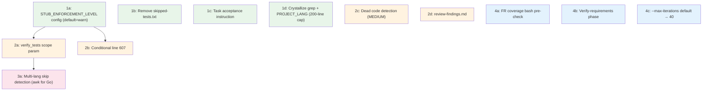

# Wave 2 — Finalised Implementation Plan

## Context

The autopilot pipeline has three verification gaps confirmed by the epic 008 failure:

- **Gap 1**: Task completion is self-reported (`[x]`) with no output verification
- **Gap 2**: No FR-to-code traceability check exists anywhere in the pipeline
- **Gap 3**: Crystallize writes function names from memory, producing hallucinated module maps

**Epic 008's kill chain**: FR-003 required dual CSS declarations → T040 explicitly stated the requirement → `colorMixHex()` was implemented but never wired up → tests asserted `var()` output (test theatre) → T040 marked `[x]` → crystallize wrote non-existent `hexToHSL()`/`adjustLightness()` into CLAUDE.md → all review phases passed.

---

## The 11 Fixes

### Tier 1 — Foundation (no dependencies, can run in parallel)

#### 1a. `STUB_ENFORCEMENT_LEVEL` config

**Files**: `autopilot-lib.sh`, `autopilot-detect-project.sh`

Add `STUB_ENFORCEMENT_LEVEL` with values `error` / `warn` / `off`, defaulting to `warn` for initial rollout.

Changes:
- `autopilot-lib.sh:38` (after `CRYSTALLIZE_MAX_DIFF_CHARS`): Add `STUB_ENFORCEMENT_LEVEL="warn"`
- `autopilot-detect-project.sh:442` (before `EOF` at line 443): Add config entry with comment
- `autopilot-lib.sh:572` (after `HAS_GH_CLI` default block): Add `STUB_ENFORCEMENT_LEVEL="${STUB_ENFORCEMENT_LEVEL:-warn}"`

Naming rationale: Follows Terraform Sentinel (`enforcement_level`) + ESLint (`error/warn/off`) conventions.

Default rationale: `warn` for initial rollout — logs stubs but does not block. Promote to `error` after 2–3 projects run clean with no false-positive reports.

Backward compatibility: Existing `project.env` files work unchanged — missing variable defaults to `warn` via the belt-and-suspenders pattern at `load_project_config()` (line 531).

**Breaking risk**: NONE

---

#### 1b. Remove `skipped-tests.txt` write

**Files**: `autopilot-verify.sh:51-54`

Delete the 3 lines that write to `.specify/logs/skipped-tests.txt`:
```bash
# Line 52: mkdir -p "$repo_root/.specify/logs"
# Line 53: echo "$skip_files" > "$repo_root/.specify/logs/skipped-tests.txt"
# Line 54: log ERROR "Skipped test list written to .specify/logs/skipped-tests.txt"
```

Confirmed zero consumers across 4+ projects. Actual data flows via `LAST_TEST_OUTPUT` global variable (line 33), not this file.

**Breaking risk**: NONE

---

#### 1c. Task acceptance instruction in `prompt_implement()`

**Files**: `autopilot-prompts.sh:430`

Insert before the closing quote of the subagent instruction block (after line 430 "never hardcode hex color values..."):

```
Before marking a task [x], list each concrete deliverable in the task
description and verify each one separately. If the task says "A AND B",
verify A exists in code, then verify B exists in code. Only mark [x] if
ALL deliverables are confirmed.
```

This directly addresses Gap 1. Epic 008's T040 had two deliverables (`clamp()` for fonts AND dual declarations for colors). Claude implemented the first, self-assessed as complete, marked `[x]`.

Interaction with parallel `[P]` tasks: The instruction is in the subagent dispatch block — each subagent reads it. No serialisation impact.

**Breaking risk**: NONE

---

#### 1d. Crystallize grep-based source reading

**Files**: `autopilot-detect-project.sh:442`, `autopilot.sh:327-358`, `autopilot-prompts.sh:732-783`

**Prerequisite**: Add `PROJECT_LANG` to `project.env`. Currently `detected` is a local variable in `autopilot-detect-project.sh:200-213` but is **not exported**. Add to the `cat > "$ENV_FILE"` block (line ~442):

```bash
# Detected project language (used by crystallize for module map extraction).
PROJECT_LANG="$detected"
```

Also add belt-and-suspenders default in `load_project_config()` (line ~572):
```bash
PROJECT_LANG="${PROJECT_LANG:-unknown}"
```

**Pre-compute grep output** in `autopilot.sh` crystallize case (line 327-358). After assembling the diff file (line 354), inject module extraction with a **200-line truncation cap**:

```bash
# Module map extraction (grounded source of truth for crystallize)
local grep_output=""
case "${PROJECT_LANG:-unknown}" in
    Go)
        grep_output=$(grep -rnE '^func\s+(\([^)]+\)\s+)?[A-Z]\w*\(' "$repo_root" \
            --include='*.go' --exclude-dir=vendor --exclude-dir=.git \
            --exclude-dir=node_modules --exclude-dir=third_party \
            --exclude='*_test.go' 2>/dev/null | head -200 || true)
        ;;
    Node/JS/TS|Node-Monorepo)
        grep_output=$(grep -rnE '^export\s+(async\s+)?(function|const|class|interface|type|enum)' "$repo_root" \
            --include='*.ts' --include='*.tsx' --include='*.js' --include='*.jsx' \
            --exclude-dir=vendor --exclude-dir=.git --exclude-dir=node_modules \
            --exclude-dir=dist --exclude='*.test.*' --exclude='*.spec.*' 2>/dev/null | head -200 || true)
        ;;
    Python)
        grep_output=$(grep -rnE '^(def|class) ' "$repo_root" \
            --include='*.py' --exclude-dir=vendor --exclude-dir=.git \
            --exclude-dir=node_modules --exclude-dir=__pycache__ \
            --exclude='test_*' --exclude='*_test.py' 2>/dev/null | head -200 || true)
        ;;
    Rust)
        grep_output=$(grep -rnE '^\s*pub\s+(fn|struct|enum|trait)' "$repo_root" \
            --include='*.rs' --exclude-dir=vendor --exclude-dir=.git \
            --exclude-dir=target 2>/dev/null | head -200 || true)
        ;;
esac

if [[ -n "$grep_output" ]]; then
    printf '\n\n%s\n' "SOURCE MODULE MAP (pre-computed from actual source files):" >> "$diff_file"
    printf '%s\n' "$grep_output" >> "$diff_file"
fi
```

**Update crystallize prompt** (`autopilot-prompts.sh:751-757`) — grounding instruction is **conditional** on non-empty SOURCE MODULE MAP. For unknown/Makefile languages where no grep extraction runs, the prompt omits the grounding constraint and keeps current behaviour:

```bash
$(if [[ -n "$grep_output" ]]; then cat <<'GROUNDING'
IMPORTANT — Ground the module map in actual source code:
The diff file includes a SOURCE MODULE MAP section pre-computed from actual
source files. This is your ONLY source of truth for function signatures.
- ONLY include functions that appear in the SOURCE MODULE MAP section
- If a signature is truncated, read that file at the line number shown
- Group results by file path; omit files with no exported functions
- Use exact names from source — never paraphrase or rename
- If a function appeared in the diff but is NOT in the SOURCE MODULE MAP, it was deleted
GROUNDING
fi)
```

When `PROJECT_LANG=unknown` (Makefile projects, unrecognised languages), `grep_output` is empty → the grounding instruction is not emitted → crystallize uses its current behaviour (best-effort from diff context).

Research basis: "Retrieval before generation" eliminates hallucination. The LLM receives ground truth as input, not as an instruction to discover.

**Breaking risk**: LOW — `PROJECT_LANG=unknown` for stale `project.env` files simply skips grep extraction (graceful degradation).

---

### Tier 2 — Depends on Tier 1a

#### 2a. `verify_tests` optional scope param

**Files**: `autopilot-verify.sh:19`

Change signature from:
```bash
verify_tests() {
    local repo_root="$1"
```
to:
```bash
verify_tests() {
    local repo_root="$1"
    local enforcement="${2:-warn}"  # default matches STUB_ENFORCEMENT_LEVEL initial rollout
```

Behaviour by enforcement level:
- `error`: Current behaviour — hard-fail on stubs
- `warn` (default): Log stubs but `return 0`
- `off`: Skip stub detection entirely

All 9 existing callers pass only `"$repo_root"` — no changes needed. Verified callers:
1. `autopilot.sh:422`
2. `autopilot-finalize.sh:39`
3. `autopilot-finalize.sh:113`
4. `autopilot-finalize.sh:128`
5. `autopilot-merge.sh:146`
6. `autopilot-merge.sh:222`
7. `autopilot-merge.sh:231`
8. `autopilot-merge.sh:238`
9. `autopilot-verify.sh:186` (from `verify_ci`)

The optional `$2` defaults to `warn`, preserving graceful behaviour for all callers. The `verify_ci` caller (line 186) can be updated to pass `"$STUB_ENFORCEMENT_LEVEL"`.

**Breaking risk**: NONE

---

#### 2b. Conditional line 607

**Files**: `autopilot-prompts.sh:607`

Line 607 currently always includes the `t.Skip()` CRITICAL instruction. Make it conditional on `STUB_ENFORCEMENT_LEVEL`:

```bash
$(if [[ "${STUB_ENFORCEMENT_LEVEL:-warn}" == "error" ]]; then cat <<'STUB'
   - Integration tests containing t.Skip() are CRITICAL findings. These are stubs that must be implemented, not dismissed. Report each skipped test file as a separate CRITICAL issue.
STUB
fi)
```

- `STUB_ENFORCEMENT_LEVEL=error`: Keep line 607 as CRITICAL (current behaviour)
- `STUB_ENFORCEMENT_LEVEL=warn` or `off`: Omit line 607 entirely

**Breaking risk**: NONE — if `STUB_ENFORCEMENT_LEVEL` is unset, defaults to `warn` (omits the CRITICAL instruction; graceful rollout).

---

#### 2c. Dead code detection in review prompt (MEDIUM severity)

**Files**: `autopilot-prompts.sh:607` (review checklist section)

Add to the review checklist, scoped to the epic's diff (not the whole codebase):

```
   - Among files changed in this epic (see git diff --name-only above), check for
     exported functions/methods with zero callers outside test files.
     For exported functions with no callers in the diff, use Grep to search the
     FULL project for callers before reporting. Only report as MEDIUM dead code
     if zero callers found project-wide.
     Do NOT report as dead code: init() functions, interface method implementations,
     HTTP/RPC handler functions registered via mux/router, or functions referenced
     in generated code.
     Report each confirmed case as:
     MEDIUM: Dead code: file:line — functionName() has no callers in non-test code
```

**Severity rationale — MEDIUM, not HIGH**:

Industry consensus: no AI code review tool auto-fixes dead code at HIGH severity:
- SonarQube classifies unused code as Minor
- ESLint `no-unused-vars` is a Warning
- CodeRabbit reports dead code as Informational

Claude cannot reliably detect dead code by diff alone — it misses interface dispatch, route handlers, `init()` functions, and cross-module callers. A grep-verify instruction mitigates this but cannot eliminate false positives entirely.

**How MEDIUM interacts with the existing review loop**:
1. `_self_review_is_clean()` (line 245) checks only CRITICAL|HIGH → MEDIUM dead code **passes** (no aggressive auto-fix)
2. `_count_self_issues()` (line 260) counts CRITICAL|HIGH|MEDIUM → MEDIUM dead code **is tracked** for convergence trend analysis
3. This asymmetry is the **correct design** — dead code is logged and tracked, but never triggers the aggressive fix loop that could cascade into removing code that is actually used

**NO changes needed** to `_self_review_is_clean()` or the fix loop. The existing asymmetry between `_self_review_is_clean()` (HIGH+CRITICAL only) and `_count_self_issues()` (includes MEDIUM) is intentional and correct for this use case.

Scoping to epic diff plus the grep-verify instruction prevents false positives on library functions designed for external consumers. Only newly-added exported functions with zero callers project-wide are flagged. This would have caught `colorMixHex()` in epic 008 (grep would find zero callers outside the defining file).

**Breaking risk**: LOW — MEDIUM findings are tracked but never trigger aggressive auto-deletion cascades.

---

#### 2d. `review-findings.md` with distinct sections

**Files**: `autopilot-prompts.sh` (review prompt output section)

Single file `review-findings.md` in the spec directory, following the `security-findings.md` append-only pattern:

```markdown
## Spec Compliance (P1)
[FR coverage findings]

## Dead Code
[Dead code findings with MEDIUM severity]

## Issues Found
[Other review findings]
```

The existing review summary (step 7 text output) remains separate — human-readable summary vs machine-parseable audit trail.

Committed by orchestrator following the same pattern as `security-findings.md` (confirmed in ADflair epics 004-008).

**Breaking risk**: NONE

---

### Tier 3 — Depends on Tier 2a

#### 3a. Multi-lang skip detection (unconditional skips only)

**Files**: `autopilot-verify.sh:41-56`

Expand stub detection beyond Go. Detect only **unconditional** skips without reason strings — these are the stubs. Conditional/reasoned skips are legitimate.

Selection logic: Read `PROJECT_LANG` from `project.env` (added in fix 1d), run only the relevant language's pattern.

| Language | Pattern (unconditional only) | File filter |
|----------|------------------------------|-------------|
| Go | awk first-statement detection (see below) | `*_test.go` |
| Python | `@pytest\.mark\.skip\b` (no `skipif`) | `test_*.py`, `*_test.py` |
| JS/TS | `^\s*(it\|test\|describe)\.skip\s*\(`, `^\s*x(it\|describe\|test)\s*\(`, `^\s*(it\|test)\.todo\s*\(` | `*.test.ts`, `*.test.js`, `*.spec.ts` |
| Rust | `#\[ignore\]` (no `= "reason"`) | `*.rs` |

**Go — awk first-statement detection**:

The current grep pattern (`t\.(Skip|Skipf|SkipNow)\(`) produces ~50–60% accuracy because it matches conditional skips deep inside test functions (e.g. `if os.Getenv("CI") == "" { t.Skip("no CI") }`). Replace with awk that detects `t.Skip*()` only when it is the **first non-blank statement** at one-tab indent inside `func Test*` bodies:

Usage in `autopilot-verify.sh`:
```bash
skip_files=$(find "$repo_root" -name '*_test.go' \
    -not -path '*/vendor/*' -not -path '*/.git/*' \
    -not -path '*/node_modules/*' -not -path '*/third_party/*' \
    -exec awk '
/^func Test[A-Za-z0-9_]*\(/ { in_test=1; found_first=0; next }
in_test && /^}/ { in_test=0; next }
in_test && !found_first && /^\t[^\t ]/ {
    found_first=1
    if (/^\tt\.(Skip|Skipf|SkipNow)\(/) {
        print FILENAME ":" NR ": " $0
    }
}
' {} +)
```

Reliability improvement: ~95–99% accuracy vs ~50–60% with grep. The awk approach correctly ignores conditional skips (`if ... { t.Skip() }`) because those appear after the first statement or at deeper indentation. Only stub-pattern skips (bare `t.Skip()` as the very first line of the test body) are flagged.

**JS/TS — anchored patterns**:

Patterns are anchored to line start to prevent matching inside comments or string literals:
- `^\s*(it|test|describe)\.skip\s*\(` — matches `it.skip(`, `test.skip(`, `describe.skip(`
- `^\s*x(it|describe|test)\s*\(` — matches `xit(`, `xdescribe(`, `xtest(`
- `^\s*(it|test)\.todo\s*\(` — matches `it.todo(`, `test.todo(`

**Python**: `@pytest.mark.skip\b` pattern is correct as-is. `@pytest.mark.skipif` (conditional) is explicitly excluded by the word boundary. No changes needed.

**Rust**: `#[ignore]` without `= "reason"` is correct as-is. No changes needed.

Excluded languages: Ruby (not detected by `autopilot-detect-project.sh`), Java (only via Makefile fallback).

False positive mitigation:
- Exclude `vendor/`, `node_modules/`, `.git/`, `third_party/` (consistent with existing patterns at line 43)
- Only match in test files (file filter column above)
- `@pytest.mark.skipif` (conditional) explicitly excluded
- `#[ignore = "reason"]` (reasoned) explicitly excluded
- Go awk pattern eliminates conditional skip false positives

**Breaking risk**: MEDIUM — new detections may surface in existing projects. Mitigated by `STUB_ENFORCEMENT_LEVEL=warn` default (fix 1a).

---

### Tier 4 — Independent, higher complexity

#### 4a. FR coverage bash pre-check (deterministic)

**Files**: New function in `autopilot-lib.sh`, called from `autopilot.sh`

Two checkpoints, both deterministic (~15 lines bash each):

**Checkpoint 1 — After analyze phase:**
Extract all `**FR-NNN**:` from `spec.md`. For each, verify at least one task in `tasks.md` references that `FR-NNN`. Flag any FR with zero task references.

```bash
spec_frs=$(grep -oE '\*\*FR-[0-9]{3}\*\*' spec.md | sort -u)
task_frs=$(grep -oE 'FR-[0-9]{3}' tasks.md | sort -u)
# diff the two sets
```

**Forward-only**: Only matches `FR-NNN` format. Older epics using `R-NNN` are not affected (verified: epics 001, 003, 004, 006 used R-NNN in tasks but all use FR-NNN in spec.md going forward).

**Checkpoint 2 — After implement phase (in verify-requirements):**
For each FR-NNN referenced by a `[x]` task, confirm the FR is covered. For each FR-NNN referenced only by `[ ]` or `[-]` tasks, flag as uncovered or deferred.

**Breaking risk**: LOW

---

#### 4b. Verify-requirements phase (new state)

**Files**: `autopilot-lib.sh:293`, `autopilot.sh` (phase arrays + gate function), `autopilot-prompts.sh` (new prompt), `autopilot-watch.sh:17`, `tests/test-detect-state.sh`

**State machine insertion** at `autopilot-lib.sh:293`, add **before** SECURITY_REVIEWED check:

```bash
elif ! grep -q '<!-- REQUIREMENTS_VERIFIED -->' "$spec_dir/tasks.md" 2>/dev/null; then
    echo "verify-requirements"
```

This sits in the `if [[ "$((complete + deferred))" -gt 0 ]]` block (line 289), after all tasks are done, before security review. Order becomes:

1. Is it merged? → `done`
2. **Are requirements verified? → `verify-requirements`** (NEW)
3. Is security reviewed? → `security-review`
4. Is CI verified? → `verify-ci`
5. Otherwise → `review`

Backward compatibility: Unknown markers are silently ignored by older code. New marker doesn't interfere with existing checks. Resume across versions is safe.

**Phase arrays** (`autopilot.sh`):

```bash
PHASE_MODEL[verify-requirements]="$SONNET"   # code-matching task, cheaper than Opus
PHASE_TOOLS[verify-requirements]="Read,Write,Glob,Grep"  # read-only like security-review
PHASE_MAX_RETRIES[verify-requirements]=2
```

`PHASE_MAX_RETRIES=2` confirmed sufficient — phase retries happen inside single main iterations (not counted separately), and real-world investigation confirms adequate headroom.

**Watch dashboard** (`autopilot-watch.sh:17`):
```bash
PHASES=(... implement verify-requirements security-review verify-ci review ...)
```

**CLI flag** (`autopilot.sh:156`):
```bash
--allow-requirements-skip)  REQUIREMENTS_FORCE_SKIP_ALLOWED=true ;;
```
Plus global default at line ~131: `REQUIREMENTS_FORCE_SKIP_ALLOWED=false`
Plus help text at line ~187.

**Gate function**: `_run_requirements_gate()` following `_run_security_gate()` template (lines 511-629). Structure:

1. **Resume guard**: Check `<!-- REQUIREMENTS_FORCE_SKIPPED -->` + `--allow-requirements-skip`
2. **Initialise**: Create `requirement-findings.md` in spec directory
3. **Review loop** (up to `max_rounds`):
   - Shell pre-computes: extract FR-NNN list from `spec.md`, grep codebase for each FR's key terms, produce evidence summary
   - Sonnet receives: FR list + grep evidence + `requirement-findings.md` (if retry)
   - Sonnet classifies each FR: `PASS` / `PARTIAL` / `NOT_FOUND` / `DEFERRED`
   - If any `NOT_FOUND` or `PARTIAL`: write findings, dispatch `requirements-fix` phase → scoped re-implement (only tasks linked to failing FRs)
   - If all `PASS`: write marker, advance
4. **Outcome markers**: `<!-- REQUIREMENTS_VERIFIED -->` / `<!-- REQUIREMENTS_FORCE_SKIPPED -->`
5. **Failure**: After max rounds → `--allow-requirements-skip` flag → force-advance with audit marker; no flag → halt with actionable error

Follows established patterns:
- **Temp file injection**: Pass `requirement-findings.md` to scoped fix prompt
- **Round counter**: Include "Requirement verification round N/M" in prompt
- **Phase-scoped context**: Re-implement only tasks linked to failing FRs
- **Accumulation files**: `requirement-findings.md` is append-only
- **Force-advance marker**: `<!-- REQUIREMENTS_FORCE_SKIPPED -->` for audit trail

Cost: ~$0.30-0.50 per epic per verification pass (Sonnet + pre-filtered context).

**Test coverage**: ~15 new test cases in `test-detect-state.sh` for new state transitions.

**Breaking risk**: LOW — state machine insertion is confirmed safe, force-advance prevents hard-blocking.

---

#### 4c. `--max-iterations` default raised to 40

The `--max-iterations` default should be raised from 30 to 40.

**Rationale**: Real-world worst case is 16 iterations (ADflair epic 005). Phase retries happen inside single main iterations (not counted separately), so the iteration counter tracks only top-level loops. 40 gives a 2.5× safety margin over the observed worst case and accommodates verify-requirements feedback loops (which add 1–3 extra top-level iterations per epic).

**Change**: `autopilot.sh:853` default assignment (currently `local max_iter=${MAX_ITERATIONS:-30}`) → change `30` to `40`.

**Breaking risk**: NONE — only increases headroom; `--max-iterations` CLI flag still overrides.

---

## Version Compatibility

No version compatibility changes needed. The architecture already handles cross-version scenarios:

- **Unknown markers**: `detect_state()` silently ignores markers it doesn't recognise — an older autopilot version resuming after a newer version ran will skip unknown state checks without error.
- **Missing config vars**: Belt-and-suspenders defaults (`${VAR:-default}` in `load_project_config()`) ensure new config variables degrade gracefully when absent from older `project.env` files.
- **Upgrade mechanism**: `install.sh` is the upgrade path — it replaces script files atomically. No migration scripts or version negotiation needed.

---

## Decision Table

| Decision | Answer | Rationale |
|----------|--------|-----------|
| Variable name | `STUB_ENFORCEMENT_LEVEL` | Industry consensus (Sentinel + ESLint) |
| Values | `error` / `warn` / `off` | ESLint tri-state; `warn` has real use case for incremental dev |
| Default value | `warn` | Graceful rollout; promote to `error` after 2–3 projects run clean with no false-positive reports |
| Include `warn` from day one? | Yes | 3 lines in a case statement; migration aid |
| Merge gate enforcement | Always `error` | Merge is a quality gate, not configurable |
| Finalize enforcement | Always `error` — override config | Main branch is deployable |
| Dead code severity | **MEDIUM** | Industry consensus (SonarQube=Minor, ESLint=Warning, CodeRabbit=Informational). Claude cannot reliably detect dead code by diff alone. MEDIUM = tracked by `_count_self_issues()` for trend analysis, but does NOT trigger aggressive fix loop via `_self_review_is_clean()`. |
| Ruby detection? | No | `autopilot-detect-project.sh` doesn't detect Ruby |
| Java detection? | No (defer) | Only reachable via Makefile fallback |
| Verify-requirements failure mode? | Retry loop feeding back to implement | Matches existing patterns. `--allow-requirements-skip` as escape valve. |
| PHASE_MAX_RETRIES for verify-requirements | 2 | Sufficient headroom confirmed by investigation |
| FR pre-check model? | Sonnet | Code-matching task, 5x cheaper than Opus |
| Crystallize anti-hallucination? | Pre-computed grep injected into prompt (200-line cap, conditional grounding) | Retrieval before generation. Follows commit 1fd48ff pattern. |
| `PROJECT_LANG` storage | Persisted to `project.env` | Follows existing pattern (HAS_CODERABBIT, etc.). Detection runs once, reused by all phases. |
| FR format scope | Forward-only (`FR-NNN`) | Older epics used `R-NNN` — not worth backward compat for a legacy format |
| `review-findings.md` commit pattern | Dedicated commit by orchestrator | Matches `security-findings.md` |
| Dead code detection scope | Files changed in current epic's diff only + grep-verify for full project | Prevents false positives on library code and cross-module callers |
| `--max-iterations` default | 40 (raised from 30) | 2.5× safety margin over observed worst case (16 iterations). Phase retries are internal, not counted. Accommodates verify-requirements feedback loops. |
| Version compatibility | No changes needed | Unknown markers ignored by `detect_state()`, missing config vars get defaults, `install.sh` is upgrade mechanism |
| Test file splitting | No split needed | ~550 lines acceptable for test files |

---

## Implementation Order (Dependency Graph)



**Tier 1** (parallel, no deps): 1a, 1b, 1c, 1d
**Tier 2** (depends on 1a): 2a, 2b; independent: 2c, 2d
**Tier 3** (depends on 2a): 3a
**Tier 4** (independent, complex): 4a, 4b, 4c (4a's output feeds into 4b's prompt; 4c is a one-line change)

---

## Files Modified

| File | Fixes | Changes |
|------|-------|---------|
| `autopilot-lib.sh` | 1a, 4a, 4b | Config default (line 38), belt-and-suspenders default (line 572), `detect_state()` insertion (line 293), FR check function |
| `autopilot-detect-project.sh` | 1a, 1d | `project.env` generation: add `STUB_ENFORCEMENT_LEVEL` + `PROJECT_LANG` (line ~442) |
| `autopilot-verify.sh` | 1b, 2a, 3a | Remove skipped-tests.txt write (lines 51-54), `verify_tests` optional param (line 19), multi-lang detection (lines 41-56) |
| `autopilot-prompts.sh` | 1c, 1d, 2b, 2c, 2d, 4b | Implement instruction (line 430), crystallize grounding (line 751, conditional), conditional line 607, dead code check (MEDIUM + grep-verify), review-findings output, new verify-requirements + requirements-fix prompts |
| `autopilot.sh` | 1d, 4b, 4c | Crystallize grep pre-computation (line 327-358, 200-line cap), phase arrays, gate function, `--allow-requirements-skip` flag, state dispatch, `--max-iterations` default → 40 |
| `autopilot-watch.sh` | 4b | PHASES array (line 17) |
| `tests/test-detect-state.sh` | 4b | ~15 new test cases for new state transitions |

**Total**: 7 core files + tests

---

## Risk Summary

**Breaking changes**: None. All fixes use optional parameters with backward-compatible defaults, additive prompt text, or forward-compatible markers.

**Risk reduction from amendments**:
- **MEDIUM dead code** (2c): No aggressive auto-deletion cascade. Dead code is tracked for trends but never triggers the fix loop, eliminating the risk of Claude removing code that has cross-module callers, interface implementations, or route handlers it cannot see in the diff.
- **Improved skip patterns** (3a): Go awk first-statement detection (~95–99% accuracy vs ~50–60% with grep) and anchored JS/TS patterns drastically reduce false positives.
- **`warn` default** (1a): Graceful rollout — stubs are logged but do not block, giving teams time to clean up before promoting to `error`.

**Highest-risk items**:
1. **3a** (multi-lang detection): May surface unconditional stubs in existing projects that were previously invisible. This is intentional but could surprise users. Mitigated by `STUB_ENFORCEMENT_LEVEL=warn` default.
2. **4b** (verify-requirements phase): Most complex change. State machine insertion is confirmed safe, but the retry loop feeding back to implement is novel. Needs thorough testing.

**Lowest-risk items**: 1b (remove dead file write), 1c (prompt text addition), 4c (one-line default change).
