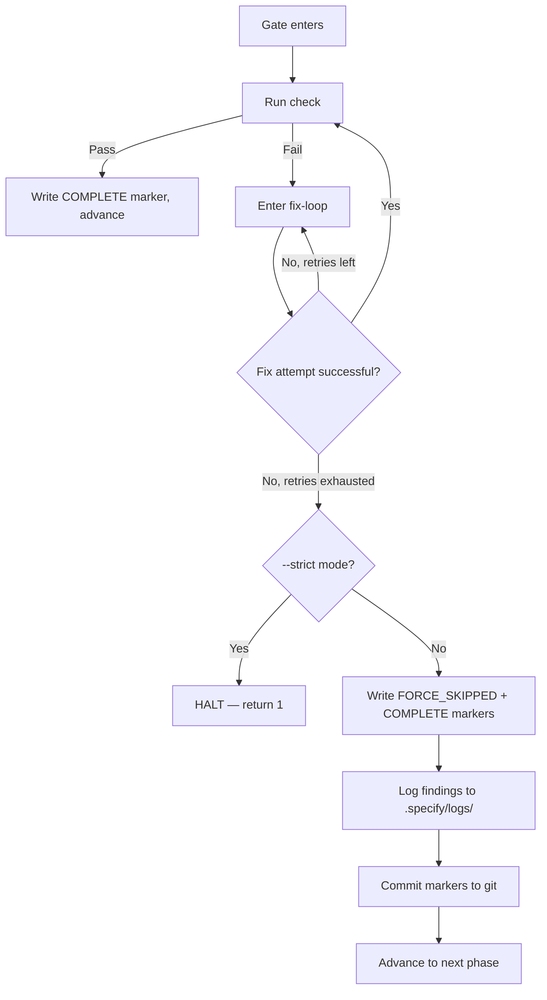

# Wave 3 Implementation Plan

> Single source of truth for Wave 3 changes to speckit-autopilot.
> Consolidates findings from 5 rounds of investigation.
> Target version: **0.10.0** (current: 0.9.6)

---

## Context

The speckit-autopilot pipeline has systemic gaps discovered during the ADflair epic-008 audit:

1. Gates halt instead of advancing — all 6 gate variables default to false, violating "always move forward"
2. Implement phase is not phase-scoped — multi-phase epics burn retries because retry loop can't detect phase-level progress
3. Skip detection flags pre-existing stubs — full-repo scan needs inline suppression mechanism
4. No guardrail prevents merge to main/master — autopilot can merge directly to production branch
5. Oscillation wastes tokens when phases stall — no detection before max_iter ceiling
6. Finalize tests wrong branch — `run_finalize()` checks out `BASE_BRANCH` but code was merged to `MERGE_TARGET`, testing stale code when the two differ
7. No cascade awareness — multiple gates can force-skip in series with zero cumulative tracking; `detect_state()` treats force-skipped gates identically to normal completions
8. verify-ci gate has no guard variable — force-skips unconditionally after max rounds, bypassing `--strict`

Wave 3 addresses these plus supporting improvements across 27 approved items.

---

## Architecture Overview

```mermaid
graph TD
    subgraph "Wave 3 Changes"
        A[Item 1: Gate Extraction] --> B[autopilot-gates.sh]
        C[Item 2: ALLOW_DEFERRED=true] --> D[Item 8: Threshold warn@3]
        C --> E[Item 3: --strict flag]
        E --> F[Item 4: Deprecation of all 3 --allow-* flags]
        E --> K[Item 10: Full default flip - all 6 vars]
        G[Item 5: Finalize revert + reporting]
        G -.- N
        H[Item 6: speckit:allow-skip]
        I[Item 7: Prompt changes]
        J[Item 9: Better error messages]
        L[Item 11: Phase-scoped implement]
        M[Item 12: Oscillation detection]
        N[Item 13: Merge-to-main guardrail]
        O[Item 14: Startup BASE_BRANCH warning]
        P[Item 15: Detect-project prefers staging]
        Q[Item 16: Force-advance review retry]
        R[Item 17: Config precedence fix]
        S[Item 18: max_iter force-complete]
        T[Item 19: main() exit code fix]
        U[Item 20: CI gate guard variable]
        V[Item 21: Cascade circuit breaker]
        W[Item 22: Pre-merge gate history check]
    end

    subgraph "Source Load Order"
        S1[autopilot.sh] --> S2[autopilot-lib.sh]
        S2 --> S3[autopilot-requirements.sh]
        S3 --> S4[autopilot-verify.sh]
        S4 --> S5["autopilot-gates.sh (NEW)"]
        S5 --> S6[autopilot-prompts.sh]
        S6 --> S7[autopilot-finalize.sh]
        S7 --> S8[autopilot-merge.sh]
        S8 --> S9[autopilot-detect-project.sh]
        S8 --> S10[autopilot-stream.sh]
    end
```

---

## Always-Forward Gate Pattern

Every gate in the pipeline follows this universal retry-then-advance contract:



**Key principle:** Gates try to fix issues first. Only after exhausting retries does the gate advance past failures. All skipped findings are logged so a human can address them later. `--strict` is the opt-in to halt on any gate failure.

**Documented exceptions to "always forward":**

| Exception | Justification | Override |
|-----------|---------------|----------|
| `--strict` mode | User explicitly opted into halt-on-failure | Remove `--strict` flag |
| Merge guardrail (Item 13) | Prevents misconfigured merge to production branch | `--allow-main-merge` |
| max_iter ceiling (Item 18) | Infrastructure circuit breaker — not a quality gate | Resume gives fresh iteration budget |
| HIGH/CRITICAL security (Item 10) | Real vulnerabilities must not be auto-skipped | `SECURITY_MIN_SEVERITY_TO_HALT=LOW` |
| Cascade circuit breaker (Item 21) | Prevents multiple gates force-skipping in series without human review | `--allow-cascade` |

> **Principle:** Always forward applies to quality gates (security, requirements, review, CI). The exceptions above are infrastructure safety mechanisms — they protect the pipeline itself, not code quality.

---

## Implementation Order

```mermaid
graph LR
    S0["Step 0: Item 17<br/>Config precedence fix"] --> S05["Step 0.5: Item 0.5<br/>.gitignore verification"]
    S05 --> S1["Step 1: Item 2<br/>ALLOW_DEFERRED=true"]
    S1 --> S2["Step 2: Item 8<br/>graduated force-forward"]
    S2 --> S3["Step 3: Item 1<br/>Gate extraction"]
    S3 --> S35["Step 3.5: Severity gating<br/>~30 lines in gates.sh"]
    S35 --> S36["Step 3.6: Item 10a<br/>partial-pass"]
    S36 --> S37["Step 3.7: Item 10b<br/>review error audit"]
    S37 --> S38["Step 3.8: Item 10c<br/>stall config"]
    S38 --> S39["Step 3.9: Item 12-related<br/>diminishing rate math"]
    S39 --> S310["Step 3.10: Item 10d<br/>shared audit helper"]
    S310 --> S311["Step 3.11: Item 20<br/>CI gate guard variable"]
    S311 --> S312["Step 3.12: Item 21<br/>Cascade circuit breaker"]
    S312 --> C1["commit + test"]
    C1 --> S4["Step 4: Item 10<br/>Full default flip<br/>(NOW SAFE)"]
    S4 --> S5["Step 5: Item 3<br/>--strict + reapply"]
    S5 --> S6["Step 6: Item 4<br/>Deprecation"]
    S6 --> C2["commit + test"]
    C2 --> S7["Steps 7-18<br/>Items 5,6,7,9,10a,11,12,13,14,15,16,18,19<br/>(parallel where independent)"]
    S7 --> C3["commit + test"]
```



| Step | Item | Rationale |
|------|------|-----------|
| 0 | Item 17 (config precedence fix) | Tier 0 prerequisite — correct CLI override behavior |
| 0.5 | Item 0.5 (consumer .gitignore verification) | Ensure `.specify/logs/` blanket-ignored in consumer repos before new log files are created |
| 1 | Item 2 (ALLOW_DEFERRED=true) | Establishes baseline behavior |
| 2 | Item 8 (warn@3) | Safe with Item 2 active |
| 3 | Item 1 (gate extraction) | Removes ~218 lines, shifts line numbers |
| 3.5 | Item 10 severity gating (~30 lines) | Prerequisite for safe gate flip — `_classify_security_severity()` in new `autopilot-gates.sh` |
| 3.6 | Item 10a (requirements partial-pass, ~50 lines) | Prerequisite for safe gate flip — PARTIAL vs NOT_FOUND distinction + ≥80% threshold |
| 3.7 | Item 10b (review error audit trail, ~20 lines) | Prerequisite for safe gate flip — persistent FORCE_SKIPPED marker for review gate |
| 3.8 | Item 10c (review stall config + progress gate, ~35 lines) | Prerequisite for safe gate flip — configurable thresholds + hybrid minimum-progress gate |
| 3.9 | Item 12-related (diminishing-returns rate math, ~25 lines) | Promoted from optional to prerequisite — rate-of-change analysis replaces round-count cutoff |
| 3.10 | Item 10d (shared audit helper, ~55 lines) | Unified `_write_force_skip_audit()` + GitHub issue dedup + `gh_sync_done()` exclusion |
| 3.11 | Item 20 (CI gate guard variable, ~8 lines) | Bug fix — verify-ci force-skip currently ungated; `--strict` cannot prevent CI force-skips without this |
| 3.12 | Item 21 (cascade circuit breaker, ~35 lines) | Prerequisite for safe default flip — prevents multiple gates force-skipping in series without human review |
| --- | commit + test | --- |
| 4 | Item 10 (full default flip) | All 7 variables to true — NOW SAFE with Steps 3.5-3.12 prerequisites |
| 5 | Item 3 (--strict with reapply) | After extraction, stable line refs; escape hatch for Item 10 |
| 6 | Item 4 (all 3 --allow-* deprecations) | Depends on Items 2+10 |
| --- | commit + test | --- |
| 7 | Item 5 (finalize revert + reporting) | Independent; high priority — includes auto-revert, requires dedicated test coverage |
| 8 | Item 6 (speckit:allow-skip) | Independent |
| 9 | Item 7 (prompt changes) | Independent |
| 10 | Item 9 (better error messages) | Independent |
| 11 | Item 11 (phase-scoped implement) | Independent |
| 12 | Item 12 (oscillation detection) | Independent |
| 13 | Item 13 (merge-to-main guardrail) | Independent, high priority |
| 14 | Item 14 (startup BASE_BRANCH warning) | Independent |
| 15 | Item 15 (detect-project prefers staging) | Independent |
| 16 | Item 16 (force-advance review retry) | Independent |
| 17 | Item 18 (max_iter force-complete) | Independent |
| 18 | Item 19 (main() exit code fix) | Independent |
| 19 | Item 22 (pre-merge gate history check) | Independent; complements Item 21 |
| --- | commit + test | --- |

Item 17 (config precedence) should be implemented early (Tier 0) since it's a prerequisite for correct `--strict` behavior. Items 7-16, 18-19 are independent and can be implemented in parallel.

---

## Line Number Drift

Gate extraction (Item 1) removes lines 554-772 (~218 lines) from `autopilot.sh`. Items 2 and 8 **MUST** be implemented BEFORE extraction to use current line numbers. Items 3-4 are implemented AFTER extraction with shifted line numbers.

Post-extraction approximate mapping:

| Reference | Pre-extraction | Post-extraction |
|-----------|---------------|-----------------|
| ALLOW_DEFERRED | Line 134 | Line 134 (before extraction region) |
| consecutive_deferred | Line 1207 | ~989 |
| parse_args call in main | Line 1229 | ~1011 |
| load_project_config call | Line 1241 | ~1023 |

---

## Approved Items (24 total)

### Item 0.5: Consumer .gitignore Enforcement

**Goal:** Ensure consumer repos blanket-ignore `.specify/logs/` to prevent Wave 3 log files from being committed.

**Background:** `_ensure_gitignore_logs()` already exists in `autopilot-detect-project.sh:41-53` and appends `.specify/logs/` to the consumer's `.gitignore` during project detection. This is idempotent and already called at line 451.

**Problem:** Existing consumer repos (e.g., ADflair) may have granular `.gitignore` patterns (e.g., `.specify/logs/*.jsonl`, `.specify/logs/autopilot-status.json`) instead of the blanket pattern. Wave 3 introduces new log files that would NOT be covered by granular patterns:
- `.specify/logs/gate-skipped-findings.log` (Item 10d)
- `.specify/logs/finalize-failure.json` (Item 5c)
- `.specify/logs/finalize-test-output.txt` (Item 5c)
- `.specify/logs/deferred-phases.log` (Item 8)
- `.specify/logs/{epic}-partial-halt.md` (Item 18)

**Fix:** No code changes needed — `_ensure_gitignore_logs()` already handles new repos correctly. For existing consumers:

**Pre-upgrade action (documented in migration guide):**
1. Re-run `autopilot-detect-project.sh` (re-runs `_ensure_gitignore_logs`, adds blanket pattern), OR
2. Manually replace granular patterns with `.specify/logs/` in `.gitignore`

**Risk:** LOW. Documentation-only change for existing consumers. New consumers auto-handled.

---

### Item 1: Gate Extraction Refactor (Tier 0)

**Goal:** Extract gate functions from `autopilot.sh` into new `autopilot-gates.sh`.

**What moves:**
- `_run_security_gate` (lines 554-672, 119 lines)
- `_run_verify_ci_gate` (lines 674-772, 99 lines)

**Wiring:**
- Add `source "$SCRIPT_DIR/autopilot-gates.sh"` after line 36 (after `autopilot-requirements.sh`)
- Add `autopilot-gates.sh` to `install.sh` line 116 script loop
- Source ordering: MUST be after `autopilot-verify.sh` (gates depend on `verify_ci()`, `_detect_test_modifications()`)

**Dependencies staying in autopilot.sh:**
- `invoke_claude()` and `_accumulate_phase_cost()` remain as globals (same pattern as autopilot-requirements.sh)

**Global side effects:**
- `CI_FIX_WARNINGS` must be initialized in new file

**Risk:** LOW. Purely structural move, function signatures unchanged.

**Tests:**
- Existing tests pass unchanged
- Create `test-gates-extraction.sh` (~80 lines) to verify functions exist and markers work

---

### Item 2: ALLOW_DEFERRED=true Default Flip

**Change:** `autopilot.sh` line 134: `ALLOW_DEFERRED=false` -> `ALLOW_DEFERRED=true`

This is one of 6 variables being flipped to true in Wave 3. See Item 10 for the full default flip of all gate variables. Item 2 is implemented first as the lowest-risk flip to establish the pattern.

**Behavioral change:** When implement phase exhausts retries, tasks are automatically deferred (marked `[-]`) instead of halting. Previously required `--allow-deferred` flag.

**Markers written on deferral:**
- `- [ ]` -> `- [-]` in stuck phase only
- `<!-- FORCE_DEFERRED: Phase N (M tasks) after K implement attempts -->`

**Audit trail:** Deferral committed to git with descriptive message.

**Guard:** `consecutive_deferred` counter prevents cascading deferrals (see Item 8).

**No data loss:** Deferred tasks are marked, not deleted.

**Risk:** LOW. Well-guarded code path with audit trail.

**Tests:**
- `test-max-iterations.sh` line 38 sets `ALLOW_DEFERRED=false` explicitly -- no breakage
- Create `test-allow-deferred-default.sh` (~50 lines)

---

### Item 3: --strict Flag with CLI-Override Reapply

**Add new `--strict` flag to `parse_args` (around line 162).**

`--strict` sets:
- `ALLOW_DEFERRED=false`
- `FORCE_ADVANCE_ON_REVIEW_STALL=false`
- `FORCE_ADVANCE_ON_DIMINISHING_RETURNS=false`
- `FORCE_ADVANCE_ON_REVIEW_ERROR=false`
- `SECURITY_FORCE_SKIP_ALLOWED=false`
- `REQUIREMENTS_FORCE_SKIP_ALLOWED=false`
- `CI_FORCE_SKIP_ALLOWED=false` (Item 20 — currently missing; verify-ci gate is ungated)
- `FORCE_SKIP_CASCADE_LIMIT=0` (Item 21 — defense-in-depth; any force-skip halts in strict mode)

**CRITICAL BUG FIX:** `parse_args()` runs at line 1229, `load_project_config()` at line 1241. `project.env` uses `set -a; source; set +a` which overwrites CLI-set variables.

**Fix:** Store `STRICT_MODE=true` during `parse_args`, then reapply all strict overrides AFTER `load_project_config()`.

```
# After line 1241 (load_project_config), before line 1247 (gh_detect):
if [[ "${STRICT_MODE:-false}" == "true" ]]; then
    ALLOW_DEFERRED=false
    FORCE_ADVANCE_ON_REVIEW_STALL=false
    FORCE_ADVANCE_ON_DIMINISHING_RETURNS=false
    FORCE_ADVANCE_ON_REVIEW_ERROR=false
    SECURITY_FORCE_SKIP_ALLOWED=false
    REQUIREMENTS_FORCE_SKIP_ALLOWED=false
    CI_FORCE_SKIP_ALLOWED=false
    FORCE_SKIP_CASCADE_LIMIT=0
fi
```

This fix also addresses `--skip-review` being overwritable by `project.env` `SKIP_REVIEW`/`SKIP_CODERABBIT`.

**Legacy alias safe:** `FORCE_ADVANCE_ON_REVIEW_FAIL` (line 597-601) uses `${VAR:-true}` which preserves already-set values.

**Scope note:** The general config precedence bug (`set -a; source project.env; set +a` clobbering CLI flags) is fixed by Item 17 (moving `load_project_config()` before `parse_args()`). With Item 17 applied, the `STRICT_MODE` reapply block above becomes defense-in-depth rather than the primary fix. Both are retained — Item 17 fixes the root cause for ALL flags, the reapply block provides belt-and-suspenders safety for `--strict` specifically.

**Update help text to document `--strict`.**

**Risk:** LOW with reapply fix. Without it, `--strict` is unreliable.

**Tests:** Test `--strict` overrides `project.env` settings.

---

### Item 4: --allow-* Flag Deprecations

**Change all three `--allow-*` flags in `parse_args` to no-ops that log WARN.**

```
--allow-deferred)
    log_warn "--allow-deferred is deprecated (deferral now allowed by default). Use --strict to prevent deferral. Will be removed in v0.11.0."
    ;;
--allow-security-skip)
    log_warn "--allow-security-skip is deprecated (gates now advance by default). Use --strict to halt. Will be removed in v0.11.0."
    ;;
--allow-requirements-skip)
    log_warn "--allow-requirements-skip is deprecated (gates now advance by default). Use --strict to halt. Will be removed in v0.11.0."
    ;;
```

All three flags still accepted (no parse error) — backward compatible for CI scripts.

Also in `autopilot-lib.sh` `load_project_config()` around line 597: when `FORCE_ADVANCE_ON_REVIEW_FAIL=true` is read from `project.env`, keep existing deprecation warning but update text to reference `--strict`.

**Update:** README lines 36, 82-107 and help text at line 193.

**Risk:** LOW. No behavioral change (defaults already true from Items 2+10).

---

### Item 5: Finalize: Test on MERGE_TARGET + Auto-Revert + Error Reporting (Tier 1c)

**Goal:** Fix finalize to test on the correct branch, auto-revert merge on post-merge test failure, and improve error reporting.

**Sub-item 5a: Finalize branch bug fix**

`run_finalize()` (`autopilot-finalize.sh` lines 19-25) checks out `BASE_BRANCH` to run tests, but code was merged to `MERGE_TARGET`. When `MERGE_TARGET=staging` and `BASE_BRANCH=main`, finalize tests stale code on main instead of the newly merged code on staging.

**Fix:** Change branch checkout in `autopilot-finalize.sh`:
```bash
# Before:
if [[ "$current_branch" != "$BASE_BRANCH" ]]; then
    log INFO "Switching to $BASE_BRANCH for finalize"
    git -C "$repo_root" checkout "$BASE_BRANCH"
fi

# After:
local finalize_branch="${MERGE_TARGET:-$BASE_BRANCH}"
if [[ "$current_branch" != "$finalize_branch" ]]; then
    log INFO "Switching to $finalize_branch for finalize"
    git -C "$repo_root" checkout "$finalize_branch"
fi
```

When `MERGE_TARGET == BASE_BRANCH` (no staging branch), behavior is unchanged.

**Sub-item 5b: Opt-in auto-revert on post-merge test failure**

Auto-revert is **opt-in** (default OFF). Two mechanisms:

1. **Default behavior (no flag):** Print a copy-paste revert command in the error message. The user decides whether to execute it.
2. **`--auto-revert` flag / `AUTO_REVERT_ON_FAILURE=true` config:** Actually execute the revert automatically.

**Add `--auto-revert` flag** to `parse_args` in `autopilot.sh`:
```bash
--auto-revert) AUTO_REVERT_ON_FAILURE=true ;;
```

**Add `AUTO_REVERT_ON_FAILURE=false`** to project.env template in `autopilot-detect-project.sh`.

**Revert helper** (replaces HALT-30/HALT-31 logic at lines 90-92 and 128-130):

Note: HALT-30/HALT-31 markers do not exist in the current codebase. Item 5 adds new revert capability rather than replacing existing logic.

```bash
_suggest_or_auto_revert() {
    local sha="$1" repo_root="$2"
    if [[ -z "$sha" ]]; then
        log WARN "No merge SHA available — cannot suggest revert"
        return 0
    fi
    # Validate SHA is still reachable
    if ! git -C "$repo_root" rev-parse --verify "${sha}^{commit}" &>/dev/null; then
        log ERROR "Merge SHA $sha no longer reachable — cannot auto-revert"
        return 1
    fi
    # Resolve abbreviated SHA to full
    sha=$(git -C "$repo_root" rev-parse "$sha" 2>/dev/null || echo "$sha")
    # Detect shallow clone (--is-shallow-repository requires Git 2.15+; fallback to .git/shallow)
    if [[ "$(git -C "$repo_root" rev-parse --is-shallow-repository 2>/dev/null)" == "true" ]] || \
       [[ -f "$repo_root/.git/shallow" ]]; then
        log WARN "Shallow clone detected — auto-revert may fail. Run: git fetch --unshallow"
    fi
    # Detect merge vs squash commit
    local parent_count
    parent_count=$(git -C "$repo_root" rev-list --parents -1 "$sha" 2>/dev/null | wc -w)
    local merge_flag=""
    [[ "${parent_count:-0}" -ge 3 ]] && merge_flag="-m 1"
    local display_cmd="git revert --no-edit ${merge_flag} $sha && git push"

    if [[ "${AUTO_REVERT_ON_FAILURE:-false}" == "true" ]]; then
        log WARN "Auto-reverting merge $sha on ${MERGE_TARGET:-$BASE_BRANCH}"
        # shellcheck disable=SC2086 -- merge_flag intentionally unquoted (empty or "-m 1")
        if git -C "$repo_root" revert --no-edit $merge_flag "$sha" && \
           git -C "$repo_root" push; then
            log OK "Merge reverted. Feature branch preserved — fix and re-merge."
            return 2  # distinct exit: reverted-and-safe
        else
            log ERROR "Auto-revert failed. Run manually: $display_cmd"
            return 1
        fi
    else
        log ERROR "To revert the last merge: $display_cmd"
        return 1
    fi
}
```

**Squash-merge compatibility:** The helper detects parent count via `git rev-list --parents`. Squash merges (1 parent) omit `-m 1`; true merge commits (2+ parents) include `-m 1`. ADflair uses `MERGE_STRATEGY="squash"` — this detection is mandatory.

**No eval usage:** Direct git commands are used instead of `eval "$revert_cmd"` (per ShellCheck SC2294 and OWASP CICD-SEC-4). The `$merge_flag` variable is intentionally unquoted so that when empty it expands to nothing. The `$display_cmd` string is constructed separately for the copy-paste suggestion, omitting `-C "$repo_root"` (implementation detail users don't need).

**Shallow clone safety:** CI environments often use `--depth=1`. The helper detects shallow repos and warns. If the merge SHA is at the shallow boundary, `git revert` may fail — the warning tells the user to `git fetch --unshallow`.

**LAST_MERGE_SHA reliability:** The remote merge path (`_post_merge_cleanup` at autopilot-merge.sh:442) captures abbreviated SHAs via grep. The helper resolves to full SHA with `git rev-parse`. When SHA is empty (grep failed), the helper skips with WARN.

**Confirmation pattern:** Follows the existing 3-tier pattern from `do_remote_merge()`:
- `AUTO_REVERT_ON_FAILURE=true` → auto-revert (CI path)
- Interactive TTY → error message with copy-paste command (user decides)
- Non-interactive without flag → error message only (safe default)

**Known limitation:** `LAST_MERGE_SHA` stores only the last epic's merge SHA. In multi-epic runs, only the last merged epic is revertable. Acceptable for v1.

**Exit codes:**
- `0` — success
- `1` — hard failure
- `2` — reverted-and-safe

**Sub-item 5c: Error reporting improvements**

Additionally:
1. Persist failure data to `.specify/logs/finalize-failure.json`
2. Save test output to `.specify/logs/finalize-test-output.txt`
3. Persist `LAST_MERGE_SHA` to status file (`.specify/logs/autopilot-status.json`) under new `finalize_state` object
4. **Restore `LAST_MERGE_SHA` on resume:** When autopilot resumes after a finalize failure, restore the SHA from the status file so auto-revert can still find the merge commit:
```bash
# On resume, in run_finalize() preamble:
if [[ -z "${LAST_MERGE_SHA:-}" ]] && [[ -f "$status_file" ]]; then
    LAST_MERGE_SHA=$(jq -r '.finalize_state.last_merge_sha // ""' "$status_file" 2>/dev/null)
    [[ -n "$LAST_MERGE_SHA" ]] && log INFO "Restored LAST_MERGE_SHA=$LAST_MERGE_SHA from status file"
fi
```
5. Log remediation guidance with specific commands

**Status file extension is backward compatible:** 3 consumers (`autopilot-watch.sh`, `autopilot-stream.sh`, `autopilot.sh`) all use jq patterns that ignore unknown fields.

**Use atomic write pattern** (`echo > tmp && mv tmp file`) matching `autopilot-stream.sh:381`.

**Key design point:** Auto-revert targets MERGE_TARGET (staging), NOT BASE_BRANCH (main). The feature branch is never touched — all work is preserved. A developer (or subsequent autopilot run) can fix the issue on the feature branch and re-merge. When MERGE_TARGET == BASE_BRANCH (no staging), auto-revert operates on main/master directly.

**Risk:** MEDIUM. Auto-revert is a destructive git operation. Mitigated by: (a) only fires after 3 fix rounds fail, (b) targets MERGE_TARGET not main, (c) feature branch preserved, (d) GitHub issue created for visibility, (e) exit code 2 distinguishes from hard failure.

**Recommended implementation order:** 5a (branch fix) → 5c (error reporting) → 5b (auto-revert), staged by increasing risk.

**Files modified:**
- `autopilot-finalize.sh` (+55 lines)
- `autopilot-stream.sh` (+5 lines)
- `autopilot.sh` (+3 lines)

---

### Item 6: speckit:allow-skip Annotation

**Add annotation filtering to `verify_tests()` in `autopilot-verify.sh`.**

**grep changes:** Change Python/JS/TS/Rust scanners from `grep -rl` to `grep -rn` (output `file:line:content` instead of filename-only).

**Add comment-aware post-filter for each language:**

| Language | Line | Filter |
|----------|------|--------|
| Go (line 59) | After awk pipeline | `\| grep -v '//.*speckit:allow-skip'` |
| Python (line 62) | Change `-rl` to `-rn` | `\| grep -v '#.*speckit:allow-skip'` |
| JS/TS (line 69) | Change `-rl` to `-rn` | `\| grep -v '//.*speckit:allow-skip'` |
| Rust (line 77) | Change `-rl` to `-rn` | `\| grep -v '//.*speckit:allow-skip'` |

**Fix message text** at lines 91, 98: "test file(s)" -> "skip marker(s)" (`wc -l` now counts findings not files).

**Same-line annotation ONLY** (no previous-line support):

```
Go:      t.Skip("reason") // speckit:allow-skip
Python:  @pytest.mark.skip(reason="x")  # speckit:allow-skip
JS/TS:   it.skip('test') // speckit:allow-skip
Rust:    #[ignore]  // speckit:allow-skip
```

All syntax variants confirmed valid in their languages. Go AWK scanner already outputs full line with trailing comments (`$0`) -- annotation visible to filter.

**grep exit codes unchanged** (`-rn` returns 0 on match, same as `-rl`).

**Performance:** 2-3x slower for grep phase (negligible in pipeline context).

**Risk:** LOW. ~15-18 lines of changes.

**Tests:**
- Existing 15 tests assert return codes only -- no breakage
- Add 4-6 new tests for annotation filtering

---

### Item 7: Prompt-Only Changes (Tier 2c)

**Deferred exclusion (at `autopilot-prompts.sh` lines 639-641):**

Add after existing dead-code exclusions:

> "Do NOT report as dead code: stubs or functions tied to deferred tasks (- [-] in tasks.md). However, flag deferred-task code with side effects (unused heavy imports, registered routes, open connections) as MEDIUM."

Note: This partially contradicts `autopilot.sh:334` which says "verify deferred tasks don't leave dead code paths." The prompt wording resolves this by distinguishing stubs (OK) from side-effect code (flag as MEDIUM).

**plan.md reference (at `autopilot-prompts.sh` line 1039 and line 1079):**

Add to `prompt_verify_requirements` and `prompt_requirements_fix`:

> "If specs/$short_name/plan.md exists, also read it for implementation approach context. spec.md has the 'what', plan.md has the 'how'."

Guard: "If exists" because `plan.md` may not exist at verify-requirements time.

**Note on deferred exclusion placement:** The line numbers above reference `prompt_review()` dead-code exclusions. Deferred-task handling already exists at `prompt_implement()` lines 419-421, and `autopilot.sh:334` dynamically injects deferred-awareness into the review prompt when `_review_deferred_count > 0`. The proposed static text may be redundant with this dynamic injection — assess during implementation whether the static addition is still needed.

**Risk:** LOW. Prompt text changes only.

**Tests:** Verify prompt text contains expected strings.

---

### Item 8: Deferral Threshold: Graduated Force-Forward

**Change `autopilot.sh` line 1207:** `consecutive_deferred -ge 2` -> graduated warn-then-force-forward.

| consecutive_deferred | Action |
|---------------------|--------|
| < 3 | continue silently |
| = 3 | log WARN "3 consecutive phases deferred — continuing" |
| = 4 | log WARN (louder) "4 consecutive phases deferred — force-forward imminent" |
| >= 5 | force-forward: log all deferred phases with reasons to `deferred-phases.log` and `specs/{epic}/skipped-findings.md`, continue |

**No hard halt on consecutive deferrals.** Deferrals always move forward. On force-forward at 5: write all deferred phase names and reasons to `.specify/logs/deferred-phases.log`, emit loud WARN, and continue. `max_iter` is the only remaining backstop.

`consecutive_deferred` resets on ANY state transition (line 1084) -- alternating success/defer never reaches threshold.

3+ consecutive deferrals CAN be legitimate for epics with sequential phase dependencies.

**Risk:** LOW. Always-forward, graduated warnings, bounded by max_iter.

**Tests:**
- Create `test-deferral-threshold.sh` (~80 lines): warn@3, louder@4, force-forward@5, no halt, reset on success

---

### Item 9: Better Error Messages (Tier 3c)

**`autopilot.sh` line 1233 (jq missing):** Add OS detection for install command.
- macOS: `brew install jq`
- Linux: `sudo apt install jq` (existing)
- Use `$OSTYPE` detection

**`autopilot-lib.sh` lines 578-582 (project.env missing):** Add interactive prompt IF TTY available.

```bash
if [[ -t 0 ]]; then
    read -rp "Auto-detect project settings? [Y/n] " answer
    if [[ "${answer:-Y}" =~ ^[Yy] ]]; then
        log INFO "Running auto-detection..."
        "$SCRIPT_DIR/autopilot-detect-project.sh" "$repo_root" && {
            source "$config_file"
            log OK "Project config auto-detected and loaded"
            return 0
        }
    fi
fi
log ERROR ".specify/project.env not found. Run: $SCRIPT_DIR/autopilot-detect-project.sh $repo_root"
```

**Design decision:** `detect_project` is invoked as a subprocess via `"$SCRIPT_DIR/autopilot-detect-project.sh"` (Option A), not sourced or extracted as a function. Rationale: no code duplication, no modification to detect-project.sh needed, no circular dependency risk, subprocess isolation prevents global state pollution. `autopilot-lib.sh` is already 910 lines — extracting 250+ lines of detection functions would violate the 500-line file size guideline. After successful detection, `source "$config_file"` reloads the config and `return 0` re-enters the normal flow.

**CRITICAL:** Must guard with `[[ -t 0 ]]` -- without TTY guard, script hangs in CI.

**`autopilot-lib.sh` lines 588-591 (invalid project.env):** Already shows offending lines with `-n` flag -- minimal change needed.

**`autopilot-lib.sh` lines 761-763 (preflight tools):** Current message is clear -- no change needed.

**Risk:** LOW with TTY guard. CRITICAL without TTY guard.

---

### Item 10: Full Default Flip (All 7 Gate Variables)

**Goal:** All gates advance by default after exhausting fix-loops. `--strict` (Item 3) is the opt-in to halt behavior.

**Variables flipped to true:**

| Variable | File | Line | Gate |
|----------|------|------|------|
| `ALLOW_DEFERRED` | `autopilot.sh` | 134 | Task deferral (already Item 2) |
| `SECURITY_FORCE_SKIP_ALLOWED` | `autopilot.sh` | 137 | Security review gate |
| `REQUIREMENTS_FORCE_SKIP_ALLOWED` | `autopilot.sh` | 138 | Requirements verification gate |
| `FORCE_ADVANCE_ON_REVIEW_STALL` | `autopilot-lib.sh` | 604 | Code review stall |
| `FORCE_ADVANCE_ON_DIMINISHING_RETURNS` | `autopilot-lib.sh` | 605 | Code review diminishing returns |
| `FORCE_ADVANCE_ON_REVIEW_ERROR` | `autopilot-lib.sh` | 606 | Code review error |
| `CI_FORCE_SKIP_ALLOWED` | `autopilot.sh` | ~767 | Verify-CI gate (Item 20 — previously ungated) |

**Also change:**
- `autopilot-requirements.sh` line 9: default flip to true
- `autopilot-detect-project.sh` lines 420-433: remove `FORCE_ADVANCE_ON_REVIEW_*` from project.env template (no longer needed as config overrides). Replace with a comment explaining new defaults: `# All gate variables default to true (auto-advance). Use --strict to halt on failures.`
- Add `DIMINISHING_RETURNS_THRESHOLD=3` to project.env template (currently missing from template in `autopilot-detect-project.sh`)

**Design principle:** Gates try fix-loops first. Advance ONLY after exhausting retries. All skipped findings logged with `FORCE_SKIPPED` marker + written to `.specify/logs/`. The human reviewer sees exactly what was skipped and why.

**Log-and-continue pattern:** When a gate advances past a failure:
1. Write `FORCE_SKIPPED` marker to state file
2. Write `COMPLETE` marker (so state machine advances)
3. Log findings summary to `.specify/logs/gate-skipped-findings.log`
4. Commit markers to git with descriptive message
5. Append findings summary to `specs/{epic}/skipped-findings.md` (committed to git alongside tasks.md)

**Marker format:**
- State file entry: `FORCE_SKIPPED:<gate_name>:<timestamp>:<finding_count>`
- Example: `FORCE_SKIPPED:security-review:2026-03-12T14:30:00Z:3`
- Log file: `.specify/logs/gate-skipped-findings.log`
- Log line format: `<severity>|<gate>|<description>`
- Example: `HIGH|security-review|Potential SQL injection in src/api/query.go:42`

**Committed audit trail:** `.specify/logs/gate-skipped-findings.log` is gitignored (ephemeral, real-time). For permanent record, each gate skip also appends to `specs/{epic}/skipped-findings.md` which is committed to git. Format:

```
## {gate_name} — {timestamp}
{finding_count} findings force-skipped

| Severity | Description |
|----------|-------------|
| HIGH | Potential SQL injection in src/api/query.go:42 |
| LOW | Unused import in src/util/helper.go:3 |
```

This ensures the audit trail survives beyond the pipeline run and is visible in git history for human review.

**Marker coexistence:** The new `FORCE_SKIPPED:<gate>:<timestamp>:<count>` format is written to `.specify/logs/gate-skipped-findings.log` only. The existing `<!-- SECURITY_FORCE_SKIPPED -->` and `<!-- REQUIREMENTS_FORCE_SKIPPED -->` HTML comment markers in `tasks.md` are RETAINED unchanged. `detect_state()` does not grep for FORCE_SKIPPED markers (it only checks REVIEWED/VERIFIED/COMPLETE markers), so this change has zero impact on state detection. The old HTML markers serve as resume guards in the gate functions; the new format serves as a richer audit trail.

**Active notification:** When `GH_ENABLED=true` and any gate writes `FORCE_SKIPPED`, create a GitHub issue summarizing skipped findings. Title: `"[autopilot] Skipped findings: Epic $epic_num — $gate_name"`. Body includes finding count, severity breakdown, and link to full log. This ensures visibility without requiring the human to proactively check log files. The issue should use an `autopilot:skipped-findings` label (created idempotently like existing labels in `autopilot-github.sh`) and `@mention` the assignee in the issue body to ensure it hits GitHub's "participating" notification bucket (highest delivery priority). GitHub issues alone are sufficient for v1 — repo owners receive web, email, and mobile push notifications by default. Teams wanting Slack can use the official GitHub Slack app (`/github subscribe owner/repo issues`) with zero code changes.

**Pipeline-end summary:** At pipeline end (in `run_finalize()` or `write_epic_summary()`), aggregate all `FORCE_SKIPPED` markers across gates into a summary block. Write to both `.specify/logs/project-summary.md` (existing) and stdout. Format: "X gates force-skipped: security (3 findings), requirements (2 FRs), CI (1 failure)". If `GH_ENABLED=true`, include this summary in the merge PR body or as a PR comment. This satisfies the "log so a person can fix later" philosophy by ensuring skipped findings are visible at every level: per-gate (skipped-findings.md), per-epic (summary), and in GitHub (issue/PR comment).

**Verify-CI audit trail:** When verify-ci force-skips (`autopilot.sh` lines 765-769), the actual CI failure output (`LAST_CI_OUTPUT`) is not currently persisted — only HTML markers are written to `tasks.md`. Add: persist `LAST_CI_OUTPUT` to `specs/{epic}/skipped-findings.md` under a `## verify-ci` section so CI failures are part of the committed audit trail.

**Severity-based security gating:** Even with all 6 gate variables flipped to true, the security gate applies a severity filter:
- New variable: `SECURITY_MIN_SEVERITY_TO_HALT=HIGH` (default)
- LOW or MEDIUM severity findings → auto-advance with `FORCE_SKIPPED` marker + log (no halt)
- HIGH or CRITICAL severity findings → halt the pipeline (even without `--strict`)
- This ensures SQL injection, auth bypass, and similar critical findings always halt
- ~30 lines of severity gate logic in `autopilot-gates.sh`
- **Implementation detail:** This is entirely new code — a new `_classify_security_severity()` function, not a modification of existing logic. The prompt at `autopilot-prompts.sh:540` already requires `**Severity**: CRITICAL | HIGH | MEDIUM | LOW` classification, but the gate at line 611 currently ignores severity (binary PASS/FAIL only via verdict grep). Severity parsing uses: `grep -c '\*\*Severity\*\*: CRITICAL' "$findings_file"` (etc. for each level). The `_self_review_is_clean()` function in `autopilot-review-helpers.sh` already auto-passes LOW-only findings — this is the existing precedent for the pattern.
- Makes the "flip all 6" approach safe: permissive for noise, strict for real vulnerabilities

> **Note:** `--strict` and `SECURITY_MIN_SEVERITY_TO_HALT` are orthogonal. `--strict` controls gate behavior (halt vs auto-advance); `SECURITY_MIN_SEVERITY_TO_HALT` controls severity policy (which findings are actionable). Users who want to halt on ALL findings should set `SECURITY_MIN_SEVERITY_TO_HALT=LOW` explicitly.

**Severity scope clarification:** Severity-based gating applies to the **security gate only**. Review gates (stall, diminishing returns, error) use **count-based gating** with the hybrid minimum-progress threshold (Item 10c). Rationale: CodeRabbit CLI priority ≠ security severity (they measure reviewer importance vs vulnerability impact — a category error). Claude self-review and Codex already have severity-aware counting in their existing helpers (`_self_review_is_clean` gates on CRITICAL/HIGH only; `_count_codex_issues` filters out P3/low). No cross-tier severity normalization is needed.

**Risk:** MEDIUM. Mitigated by: (a) `--strict` escape hatch, (b) FORCE_SKIPPED audit trail + GitHub issue creation, (c) severity-based security gating halts on HIGH/CRITICAL regardless, (d) `do_merge()` hard-fails if tests/build don't pass (lines 464-478) — this non-bypassable gate ensures code that breaks tests never merges regardless of gate variable settings.

**Tests:**
- Verify each gate writes FORCE_SKIPPED + COMPLETE markers when advancing past failures
- Verify `--strict` causes all gates to halt (return 1) on failure
- Update `test-review-tiers.sh` expected defaults

---

### Item 10a: Requirements Partial-Pass Mechanism

**Goal:** Distinguish PARTIAL from NOT_FOUND in requirements verification gate, enabling safer auto-advance for partially-implemented features.

**Background:** The prompt at `autopilot-prompts.sh:1048-1062` already specifies four FR classification states (`PASS | PARTIAL | NOT_FOUND | DEFERRED`), but the gate at `autopilot-requirements.sh:98` treats PARTIAL and NOT_FOUND identically — both trigger a fix round.

**Changes to `autopilot-requirements.sh` (lines 97-134):**

1. **Separate NOT_FOUND from PARTIAL at decision point (line 98):**
```bash
# Before:
if grep -qE '(NOT_FOUND|PARTIAL)' "$findings_file" 2>/dev/null; then

# After:
local has_not_found=false has_partial=false
grep -qE ': NOT_FOUND' "$findings_file" && has_not_found=true
grep -qE ': PARTIAL' "$findings_file" && has_partial=true

if [[ "$has_not_found" == "true" ]] || [[ "$has_partial" == "true" ]]; then
```

2. **Severity-aware halt logic (lines 128-134):** When `REQUIREMENTS_FORCE_SKIP_ALLOWED=true` and max rounds exhausted:
```bash
local not_found_frs partial_frs
not_found_frs=$(grep ': NOT_FOUND' "$findings_file" | grep -oE 'FR-[0-9]{3}' | sort -u)
partial_frs=$(grep ': PARTIAL' "$findings_file" | grep -oE 'FR-[0-9]{3}' | sort -u)

if [[ -n "$not_found_frs" ]]; then
    log WARN "NOT_FOUND features (not attempted): $not_found_frs"
fi
if [[ -n "$partial_frs" ]]; then
    log WARN "PARTIAL features (incomplete): $partial_frs"
fi
```

3. **Percentage threshold safety net (~10 lines):** Auto-advance if >=80% of FRs are PASS/PARTIAL/DEFERRED:
```bash
local pass_count partial_count deferred_count not_found_count total safe_count pct
pass_count=$(grep -c ': PASS' "$findings_file" 2>/dev/null || echo 0)
partial_count=$(grep -c ': PARTIAL' "$findings_file" 2>/dev/null || echo 0)
deferred_count=$(grep -c ': DEFERRED' "$findings_file" 2>/dev/null || echo 0)
not_found_count=$(grep -c ': NOT_FOUND' "$findings_file" 2>/dev/null || echo 0)
total=$((pass_count + partial_count + deferred_count + not_found_count))
[[ $total -eq 0 ]] && return 0
safe_count=$((pass_count + partial_count + deferred_count))
pct=$((safe_count * 100 / total))
log INFO "FR coverage: ${safe_count}/${total} (${pct}%) — threshold: 80%"
```

4. **Deferred task integration (autopilot-prompts.sh:1062):** Add to prompt:
```
If a task covering this FR is marked - [-] (deferred) in tasks.md,
classify that FR as DEFERRED even if no code references exist.
```

**Risk:** LOW. ~50 lines across 3 files. Purely conditional logic in halt-path decision. Non-halting paths (PASS, DEFERRED) unchanged.

**Tests:**
- Add to `test-fr-coverage.sh`: PARTIAL vs NOT_FOUND classification assertions (+15 lines)
- Verify >=80% threshold auto-advances; <80% halts
- Verify DEFERRED FRs count toward safe percentage

---

### Item 10b: Review Error Audit Trail

**Goal:** Add persistent FORCE_SKIPPED marker and audit trail when `FORCE_ADVANCE_ON_REVIEW_ERROR` triggers. Currently the only gate with NO persistent marker on force-advance — only in-memory `LAST_CR_STATUS`.

**Problem:** Resume logic cannot distinguish "force-advanced review" from "normal pass" because no marker is written to `tasks.md`. All other gates (security, requirements, verify-CI) write HTML comment markers on force-skip.

**Changes to `autopilot-review.sh` (lines 187-189, 293-298):**

1. **All-tiers-fail path (line 187):** Write marker before force-advancing:
```bash
if [[ "${FORCE_ADVANCE_ON_REVIEW_ERROR:-false}" == "true" ]]; then
    echo "<!-- REVIEW_FORCE_SKIPPED -->" >> "$tasks_file"
    _write_force_skip_audit "$repo_root" "review" "$epic_num" "$short_name" \
        "0" "All review tiers failed (attempted: ${attempted_tiers[*]})" "WARN"
    log WARN "All review tiers failed — force-advancing"
    return 0
fi
```

2. **Max-rounds-exhausted path (line 293):** Same pattern:
```bash
echo "<!-- REVIEW_FORCE_SKIPPED -->" >> "$tasks_file"
_write_force_skip_audit "$repo_root" "review" "$epic_num" "$short_name" \
    "${_issue_counts[-1]}" "Issues remain after $max_rounds rounds (tier: $tier)" "WARN"
```

3. **Enhanced event payload:** Add issue counts and tiers attempted to `_emit_event` calls at both paths.

**Prerequisite for:** Item 10 (full default flip). Without this, flipping `FORCE_ADVANCE_ON_REVIEW_ERROR=true` creates a silent bypass with no audit trail.

**Risk:** LOW. ~20 lines. Follows exact pattern used by security/requirements/CI gates.

**Tests:**
- Verify `<!-- REVIEW_FORCE_SKIPPED -->` marker written on all-tiers-fail + force-advance
- Verify `skipped-findings.md` appended with review failure details
- Verify event payload includes issue counts and tiers attempted

---

### Item 10c: Review Stall Configurability + Minimum-Progress Gate

**Goal:** Make `CONVERGENCE_STALL_ROUNDS` configurable and add a hybrid minimum-progress gate to prevent force-advancing when many issues remain unresolved.

**Problem:** `CONVERGENCE_STALL_ROUNDS` is hardcoded to 2 in `autopilot-lib.sh:550`. No way for users to tune stall sensitivity. No guard against advancing when many issues remain — stall-advancing past 3 CRITICAL architectural issues is dangerous.

**Changes to `autopilot-lib.sh` (line 550):**
```bash
# Before:
CONVERGENCE_STALL_ROUNDS=2

# After:
CONVERGENCE_STALL_ROUNDS="${CONVERGENCE_STALL_ROUNDS:-2}"
```

**Changes to `autopilot-detect-project.sh` (project.env template):**
Add configurable variables:
```bash
# Review stall detection: identical issue counts for N consecutive rounds
CONVERGENCE_STALL_ROUNDS=2
# Minimum-progress gate for stall-advance (AND logic: both must be true to BLOCK)
STALL_ADVANCE_MAX_ISSUES=5
STALL_ADVANCE_MAX_REMAINING_PCT=50
```

**Changes to `autopilot-review.sh` (line 256, inside stall detection branch):**

Add hybrid minimum-progress gate using AND logic:
```bash
if [[ "${FORCE_ADVANCE_ON_REVIEW_STALL:-false}" == "true" ]]; then
    local _initial=${_issue_counts[0]}
    local _remaining=${_issue_counts[-1]}
    # Block if BOTH conditions are bad: many issues AND poor resolution rate
    if (( _remaining > ${STALL_ADVANCE_MAX_ISSUES:-5} )) && \
       (( _initial > 0 )) && \
       (( _remaining * 100 / _initial > ${STALL_ADVANCE_MAX_REMAINING_PCT:-50} )); then
        log WARN "Stall detected but too many unresolved issues ($_remaining/$_initial) — halting despite FORCE_ADVANCE_ON_REVIEW_STALL"
        return 1
    fi
    LAST_CR_STATUS="force-advanced (stall, tier: $tier, round $attempt)"
    log WARN "Stalled — force-advancing ($_remaining issues remaining from $_initial initial)"
    return 3
fi
```

**Hybrid AND logic rationale:** This is an "always forward" pipeline. Either condition being satisfied should allow advance:
- Few issues remaining (≤5)? Advance — regardless of ratio.
- Good progress (>50% resolved)? Advance — regardless of absolute count.
- Only block when BOTH are bad: many issues AND poor resolution rate.

Validated against real ADflair data: Epic 006 (13 findings, 8 remain: blocked ✓), Epics 007/008 security (2 LOW persist: advances ✓).

**Industry precedent:** MATLAB optimization and FICO solvers both use combined absolute+relative convergence criteria. The AND-hybrid is the simplified version of this pattern.

**Prerequisite for:** Item 10 (full default flip).

**Risk:** LOW. ~35 lines. AND-logic ensures permissive default matching "always forward" philosophy.

**Tests:**
- `test-stall-progress-gate.sh` (~50 lines):
  - count=8, initial=13 → blocked (ratio=0.62, count>5, both bad)
  - count=2, initial=5 → advances (count≤5, absolute allows)
  - count=3, initial=3 → blocked (ratio=1.0, count≤5 BUT ratio is bad — wait, AND logic: count=3 ≤ 5, so absolute allows advance. Correct for always-forward.)
  - count=6, initial=20 → advances (ratio=0.30, good progress)
  - count=0, initial=5 → advances (stall detection doesn't fire when count=0)

---

### Item 10d: Shared Audit Trail Helper (`_write_force_skip_audit`)

**Goal:** Provide a single shared function called by all gates on force-skip. Eliminates per-gate boilerplate, ensures consistent audit trail across security, requirements, verify-CI, and review gates.

**New function in `autopilot-lib.sh`:**

```bash
_write_force_skip_audit() {
    local repo_root="$1" gate_name="$2" epic_num="$3" short_name="$4" \
          findings_count="$5" findings_text="$6" severity="${7:-WARN}"
    local log_dir="$repo_root/.specify/logs"
    local spec_dir="$repo_root/specs/$short_name"
    local skipped_findings="$spec_dir/skipped-findings.md"
    local ts
    ts="$(date -Iseconds)"

    mkdir -p "$log_dir" "$spec_dir"

    # 1. Append to ephemeral log
    echo "$severity|$gate_name|$findings_count findings|$ts" >> "$log_dir/gate-skipped-findings.log"

    # 2. Append to committed audit trail
    if [[ ! -f "$skipped_findings" ]]; then
        printf '# Skipped Findings Audit Trail\nEpic: %s — %s\n' "$epic_num" "$short_name" > "$skipped_findings"
    fi
    printf '\n## %s — %s\n%s findings force-skipped\n\n%s\n' \
        "$gate_name" "$ts" "$findings_count" "$findings_text" >> "$skipped_findings"

    # 3. Emit structured event
    local events_log="$log_dir/events.jsonl"
    [[ -f "$events_log" ]] && \
        _emit_event "$events_log" "force_skip" \
            "$(jq -nc --arg g "$gate_name" --arg e "$epic_num" --arg s "$severity" \
               --argjson cnt "$findings_count" \
               '{gate:$g, epic:$e, severity:$s, findings_count:$cnt}')"

    # 4. Commit audit file
    git -C "$repo_root" add "$skipped_findings" 2>/dev/null || true
    git -C "$repo_root" commit -m "audit($epic_num): $gate_name force-skipped ($findings_count findings)" \
        --no-verify 2>/dev/null || true

    # 5. Create/update GitHub issue (with dedup)
    _gh_create_skip_issue "$repo_root" "$epic_num" "$gate_name" "$findings_count" "$findings_text"

    log WARN "Force-skip audit: $gate_name ($findings_count findings) → $skipped_findings"
}

_gh_create_skip_issue() {
    $GH_ENABLED || return 0
    local repo_root="$1" epic_num="$2" gate_name="$3" finding_count="$4" summary="$5"

    # Dedup: check for existing open issue
    local existing
    existing=$(gh issue list --repo "$GH_OWNER_REPO" \
        --label "autopilot:skipped-findings,epic:$epic_num" \
        --state open --json number --jq '.[0].number' 2>/dev/null || echo "")

    if [[ -n "$existing" ]] && [[ "$existing" != "null" ]]; then
        gh_try "comment on skip issue" gh issue comment "$existing" \
            --repo "$GH_OWNER_REPO" \
            --body "### $gate_name force-skipped ($finding_count findings)
$summary
*$(date -Iseconds)*" || return 0
        return 0
    fi

    # Create label (idempotent)
    gh label create "autopilot:skipped-findings" --repo "$GH_OWNER_REPO" \
        --color "D93F0B" --description "Gate force-skipped with unresolved findings" 2>/dev/null || true

    gh_try "create skip issue" gh issue create \
        --repo "$GH_OWNER_REPO" \
        --title "[Epic $epic_num] $gate_name force-skipped ($finding_count findings)" \
        --label "autopilot:skipped-findings,epic:$epic_num" \
        --body "### $gate_name force-skipped
$finding_count findings remain after exhausting retry rounds.
See \`specs/*/skipped-findings.md\` for details.

$summary

*Created by speckit-autopilot*" || return 0
}
```

**Three-tier visibility:**
1. **Immediate:** GitHub issue with push notification (if `GH_ENABLED`)
2. **At review time:** `specs/{epic}/skipped-findings.md` in PR diff
3. **Historical:** File in git history (compliance audit trail)

**GitHub issue deduplication:** Checks for existing open issue with matching `autopilot:skipped-findings` + `epic:{num}` labels before creating. If found, adds a comment instead. This prevents duplicates across pipeline resumes.

**Force-skip issues stay open after epic merge:** `gh_sync_done()` must be updated to skip issues with the `autopilot:skipped-findings` label (see `gh_sync_done()` exclusion below). These represent unresolved technical debt requiring human triage.

**Integration points:** Each gate calls `_write_force_skip_audit()` instead of manual marker/commit logic. Reduces per-gate boilerplate by 6-8 lines each (4 gates = 24-32 lines saved).

**Risk:** LOW. ~55 lines for helpers. All GitHub operations are non-fatal (guarded by `gh_try` and `$GH_ENABLED`).

**Tests:**
- `test-audit-helper.sh` (~60 lines):
  - Verify `_write_force_skip_audit` writes to ephemeral log
  - Verify committed `skipped-findings.md` created with correct format
  - Verify event emitted to events.jsonl
  - Verify GitHub issue dedup (second call for same epic comments instead of creating)
  - Verify label created idempotently

---

### Item 10d (continued): `gh_sync_done()` Skip-Issue Exclusion

**Goal:** Prevent `gh_sync_done()` from auto-closing force-skip issues when an epic merges.

**Problem:** `gh_sync_done()` (`autopilot-github-sync.sh:265-296`) closes ALL task and epic issues on merge. Force-skip issues with `autopilot:skipped-findings` label represent unresolved technical debt and must stay OPEN for human triage.

**Changes to `autopilot-github-sync.sh` (line 280, inside task-closing loop):**
```bash
# Before closing, check for skip-findings label
local labels
labels=$(gh issue view "$url" --repo "$GH_OWNER_REPO" --json labels --jq '.labels[].name' 2>/dev/null || echo "")
if echo "$labels" | grep -q "autopilot:skipped-findings"; then
    log INFO "Skipping close for skip-findings issue: $url"
    continue
fi
[[ -n "$url" ]] && gh_try "close task $key" gh issue close "$url" >/dev/null 2>&1 || true
```

**Risk:** LOW. ~5 lines. Label-based filter.

**Tests:**
- `test-skip-issue-lifecycle.sh` (~30 lines): Verify issues with `autopilot:skipped-findings` label remain open after `gh_sync_done()`

---

### Item 11: Phase-Scoped Implement

**Goal:** Scope implement prompts to current phase only. Fix retry loop bug where phase advance within "implement" state is treated as "no progress."

**Changes to `prompt_implement()` (`autopilot-prompts.sh` lines 405-486):**
1. Add parameters: `current_phase` and `total_phases`
2. When `total_phases > 1`, prepend SCOPE block:
```
SCOPE: Implement Phase $current_phase of $total_phases ONLY.
$(if [[ $current_phase -gt 1 ]]; then echo "Phases 1-$((current_phase-1)) are already complete."; else echo "This is the first phase."; fi)
Focus ONLY on Phase $current_phase tasks. Do NOT touch completed phases.
```
3. When `total_phases <= 1`, skip SCOPE block entirely

**Changes to caller (`autopilot.sh` line 326):**
```bash
local cur_phase total_phases
cur_phase=$(get_current_impl_phase "$spec_dir/tasks.md")
total_phases=$(count_phases "$spec_dir")
prompt="$(prompt_implement "$epic_num" "$title" "$repo_root" "$spec_dir" "$cur_phase" "$total_phases")"
```

**Changes to retry loop (`autopilot.sh` lines 1078-1100):**
Add implement-specific phase-advance detection before generic state check:
```bash
if [[ "$state" == "implement" ]]; then
    local new_impl_phase
    new_impl_phase=$(get_current_impl_phase "$spec_dir/tasks.md")
    if [[ "$new_impl_phase" != "$prev_impl_phase" ]]; then
        log OK "Implement phase advanced: $prev_impl_phase -> $new_impl_phase"
        consecutive_deferred=0
        retries=0
        prev_tasks_hash=""       # reset oscillation tracking
        prev_commit_sha=""       # reset oscillation tracking
        same_hash_count=0        # reset oscillation tracking
        continue
    fi
fi
```
Capture `prev_impl_phase` immediately before the `invoke_claude` call inside the main loop — after state detection and prompt construction, before Claude invocation.

**Existing functions used (no changes needed):**
- `get_current_impl_phase()` — `autopilot-lib.sh:314-333`
- `count_phases()` — `autopilot-lib.sh:337-343`

**Risk:** MEDIUM. Phase detection logic already exists and is tested.

**Tests:**
- Prompt includes SCOPE block when phases > 1
- SCOPE block omitted when phases == 1
- Phase 1 says "This is the first phase" (not "Phases 1-0")
- Phase advance resets retry counter

---

### Item 12: Oscillation Detection

**Goal:** Detect phase-level stall before hitting max iterations. Defer stuck phases, continue others.

**Implementation (`autopilot.sh` — in the OUTER `while true` loop, after `detect_state()` at ~line 907):**

> Note: Oscillation tracking is placed in the outer loop (not the inner retry loop) because `PHASE_MAX_RETRIES[implement]=3` — a threshold of 3+ is unreachable inside the inner loop for most phases.

Add tracking variables before the outer loop:
```bash
local prev_tasks_hash=""
local prev_commit_sha=""
local same_hash_count=0
local oscillation_stalled=false
local outer_prev_state=""
```

Inside the outer loop, after `detect_state()` and before the gate/retry logic:
```bash
local cur_tasks_hash cur_commit_sha
cur_tasks_hash=$(_file_hash "$spec_dir/tasks.md")
cur_commit_sha=$(git -C "$repo_root" log -1 --format=%H 2>/dev/null || echo "none")

if [[ "$cur_tasks_hash" == "$prev_tasks_hash" && "$cur_commit_sha" == "$prev_commit_sha" && "$state" == "$outer_prev_state" ]]; then
    same_hash_count=$((same_hash_count + 1))
    if [[ $same_hash_count -ge 3 ]]; then
        log WARN "Phase '$state' stalled for 3 outer-loop iterations with no task or commit changes — deferring"
        oscillation_stalled=true
    fi
else
    same_hash_count=0
    oscillation_stalled=false
fi
prev_tasks_hash="$cur_tasks_hash"
prev_commit_sha="$cur_commit_sha"
outer_prev_state="$state"
```

The `oscillation_stalled` flag is checked in the existing deferral logic (after the inner retry loop exhausts) to route into force-defer rather than relying on `break`:
```bash
if [[ "$oscillation_stalled" == "true" ]] || [[ $retries -ge ${PHASE_MAX_RETRIES[$state]:-3} ]]; then
    # existing force-advance / deferral logic
fi
```

**Dual signal:** Both `tasks.md` hash AND latest commit SHA must be unchanged. The implement prompt instructs Claude to commit and verify a clean working tree, so `git diff --stat HEAD` would return empty after every commit (constant hash). `git log -1 --format=%H` changes on every commit and is constant only when truly nothing happened.

**Threshold: 3 outer-loop iterations** (lowered from inner-loop proposal of 4; now reachable for all phases since it tracks outer-loop iterations, not inner retries).

**Interaction with Item 8:** Oscillation-triggered deferrals count toward consecutive deferral counter. With Item 8's warn-at-3 + max_iter backstop, this is safe.

Keep `max_iter=60` as absolute safety ceiling (see max_iter changes below).

**Cross-platform hashing:** `sha256sum` (Linux/Alpine/BusyBox) / `shasum -a 256` (macOS) is a new pattern. Extract a `_file_hash()` helper in `autopilot-lib.sh`:
```bash
_file_hash() {
    local file="$1"
    [[ ! -f "$file" ]] && echo "missing" && return
    if command -v sha256sum &>/dev/null; then
        sha256sum "$file" | cut -d' ' -f1
    elif command -v shasum &>/dev/null; then
        shasum -a 256 "$file" | cut -d' ' -f1
    else
        cksum "$file" | cut -d' ' -f1  # POSIX fallback
    fi
}
```
Output format `cut -d' ' -f1` works on all platforms including BusyBox (verified). Only needed for tasks.md hash — commit SHA is already a unique identifier.

**Worst-case iteration budget (Item 8 + Item 12 interaction):**
- 5-phase epic where all phases stall: each phase uses ~3 inner retries + 3 outer stall iterations before oscillation deferral = ~4 outer iterations per phase
- 5 phases x 4 outer iterations = ~20 outer iterations consumed on deferrals
- Remaining budget: 60 - 20 = 40 iterations for productive work
- Pathological cases hit the max_iter=60 ceiling gracefully (force-complete with WARN)

**Risk:** LOW. Simple hash comparison, conservative threshold.

> **IMPORTANT: Prerequisite for Item 10 (full default flip).** The diminishing-returns rate-of-change fix below is promoted from optional "Related" work to a **hard prerequisite** for Step 4 (full default flip). It must be implemented at Step 3.9 (before the flip) because flipping `FORCE_ADVANCE_ON_DIMINISHING_RETURNS=true` with only round-count logic (`$attempt -ge 3`) would auto-advance after 3 rounds regardless of actual improvement rate. Tests in `test-review-orchestrator.sh` intentionally set `DIMINISHING_RETURNS_THRESHOLD=99` to disable this feature — a red flag that even test authors didn't trust the current implementation.

**Related: Diminishing-returns rate-of-change fix.** The current `FORCE_ADVANCE_ON_DIMINISHING_RETURNS` logic (`autopilot-review.sh:271`) is purely round-count based (`$attempt -ge 3`), not actual rate-of-change. Add ~12-15 lines to check improvement rate between consecutive rounds using the existing `_issue_counts` array:
```bash
# If improvement rate < 20% for 2 consecutive rounds, advance
if (( attempt >= 3 )); then
    local prev=${_issue_counts[$((attempt - 2))]}
    local curr=${_issue_counts[$((attempt - 1))]}
    if (( prev > 0 )); then
        local pct=$(( (prev - curr) * 100 / prev ))
        if (( pct < 20 )); then
            # Diminishing returns confirmed — advance
        fi
    fi
fi
```
Also make `DIMINISHING_RETURNS_THRESHOLD` configurable via project.env template (+2 lines in `autopilot-detect-project.sh`). Total: ~25-30 lines. Tests: add cases for `[5, 4, 3, 3]` → advance; `[5, 3, 2]` → don't advance (~10 lines in `test-review-orchestrator.sh`).

**Tests:**
- Mock scenario where both tasks hash and commit SHA unchanged across 3 outer-loop iterations → verify deferral triggered
- Mock scenario where commit SHA changes but tasks hash doesn't → verify NO deferral (code is progressing)
- Verify hash counter resets on state transition
- Verify `oscillation_stalled` flag routes into deferral logic correctly

---

### Item 13: Merge-to-Main Guardrail

**Goal:** Refuse to merge to `main`/`master` unless `--allow-main-merge` is explicitly passed.

**Changes to `autopilot-merge.sh` — add check at top of `do_remote_merge()` and `do_merge()`:**
```bash
if [[ "$MERGE_TARGET" =~ ^(main|master)$ ]] && \
   { git -C "$repo_root" rev-parse --verify origin/staging &>/dev/null || \
     git -C "$repo_root" rev-parse --verify staging &>/dev/null; } && \
   [[ "${ALLOW_MAIN_MERGE:-false}" != "true" ]]; then
    log ERROR "Refusing to merge to '$MERGE_TARGET' — a 'staging' branch exists."
    log ERROR "Set BASE_BRANCH=staging in .specify/project.env, or pass --allow-main-merge"
    return 1
fi
```

**Add `--allow-main-merge` flag** to `parse_args` in `autopilot.sh`:
```bash
--allow-main-merge) ALLOW_MAIN_MERGE=true ;;
```

**Defense in depth:** This guard must be added to BOTH `do_remote_merge()` (in `autopilot-merge.sh`) AND `do_merge()` (in `autopilot.sh`). `do_merge()` is the local fallback when remote merge is unavailable — without the guard there, the guardrail can be bypassed via the local path.

**Rationale:** Only refuses merge to main/master when a staging branch exists but wasn't selected. Repos without staging legitimately use main as the only target. The guardrail catches misconfiguration, not legitimate single-branch workflows. This complements auto-revert (Item 5b) — the guardrail prevents misconfigured merges upfront, while auto-revert recovers from test failures after merge.

**Risk:** LOW. Clear error message with explicit override.

**Edge case:** `origin/staging` can persist as a stale local ref after remote branch deletion (until `git fetch --prune`). The guardrail checks `git rev-parse --verify origin/staging` which returns true for stale refs. This is a known limitation — acceptable since the guardrail's primary purpose is catching misconfiguration, not stale refs. Run `git fetch --prune` to clean stale refs if the guardrail fires incorrectly.

**Tests:**
- Verify merge to `main` refused without flag
- Verify merge to `main` allowed with `--allow-main-merge`
- Verify merge to `staging` unaffected

---

### Item 14: Startup Warning for MERGE_TARGET Misconfiguration

**Goal:** Warn early when `BASE_BRANCH` is `main`/`master` but a `staging` branch exists.

**Changes to `autopilot.sh` — add after `MERGE_TARGET` assignment (line 1274):**

> `detect_merge_target()` already prefers staging when it exists. Checking `BASE_BRANCH` would fire even when `MERGE_TARGET` was correctly resolved to staging, which is misleading. Check `MERGE_TARGET` instead.
```bash
# Place AFTER MERGE_TARGET assignment (line 1274), not after load_project_config
if [[ "$MERGE_TARGET" =~ ^(main|master)$ ]]; then
    if git -C "$repo_root" rev-parse --verify staging &>/dev/null || \
       git -C "$repo_root" rev-parse --verify origin/staging &>/dev/null; then
        log WARN "Merging to '$MERGE_TARGET' but a 'staging' branch exists."
        log WARN "Consider setting MERGE_TARGET_BRANCH=staging in .specify/project.env"
    fi
fi
```

**Risk:** LOW. Warning only, no behavior change.

**Tests:** Verify warning emitted when MERGE_TARGET=master and staging exists.

---

### Item 15: Detect-Project Prefers Staging

**Goal:** When generating `project.env`, prefer `staging` as `BASE_BRANCH` when a staging branch exists.

**Changes to `detect_merge_target()` in `autopilot-lib.sh` (lines 647-650):**

Add validation when `MERGE_TARGET_BRANCH` env var is set:
```bash
if [[ -n "${MERGE_TARGET_BRANCH:-}" ]]; then
    if git -C "$repo_root" rev-parse --verify "$MERGE_TARGET_BRANCH" >/dev/null 2>&1 || \
       git -C "$repo_root" rev-parse --verify "origin/$MERGE_TARGET_BRANCH" >/dev/null 2>&1; then
        echo "$MERGE_TARGET_BRANCH"
        return
    fi
    log WARN "MERGE_TARGET_BRANCH=$MERGE_TARGET_BRANCH not found — falling back to detection"
fi
```

**Changes to `autopilot-detect-project.sh` (project.env template):**

Do NOT persist `MERGE_TARGET_BRANCH` to project.env. Instead, add a comment for discoverability:
```bash
# Auto-detected merge target: $detected_merge_target (override with MERGE_TARGET_BRANCH=...)
```

**Will break `test-merge-target.sh` line 128:** The existing test sets `MERGE_TARGET_BRANCH="custom-branch"` where `custom-branch` doesn't exist. Fix: add `git -C "$repo" branch custom-branch` before calling `detect_merge_target`. Also add a NEW test for the WARN-and-fallback path where `MERGE_TARGET_BRANCH` is set to a non-existent branch — verify WARN is logged and detection falls back to staging/BASE_BRANCH.

**Risk:** LOW. Only affects the env var override path. Dynamic detection unchanged. Existing configs unaffected.

**Tests:** Verify staging detected when branch exists. Verify fallback to main/master when no staging.

---

### Item 16: Force-Advance from Review Retry Loop to _tiered_review() (Tier 2)

**Location:** `autopilot.sh:966-968` — the `run_phase "review"` retry loop.

**Problem:** If Claude's review prompt fails 3 times (transient API errors, rate limits, etc.), the pipeline halts BEFORE `_tiered_review()` is ever reached. The tiered review system — designed to handle review failures gracefully — never gets a chance to run.

**Fix:** Instead of halting when the review retry loop exhausts, force-advance to `_tiered_review()`:
```bash
# After review retry loop exhaustion (line ~968):
if [[ $review_retries -ge $max_review_retries ]]; then
    log WARN "Review prompt failed $max_review_retries times — force-advancing to tiered review"
    # Fall through to _tiered_review() instead of returning 1
fi
```

**Audit trail:** When force-advancing, write a `FORCE_SKIPPED` entry to `specs/{epic}/skipped-findings.md` with the review retry failure reason. Currently `LAST_CR_STATUS` is in-memory only — this change persists it.

**Working tree cleanup:** Before calling `_tiered_review()`, clean any uncommitted debris from the failed review phase:
```bash
_restore_clean_working_tree "$repo_root"
```
Helper in `autopilot-lib.sh`:
```bash
_restore_clean_working_tree() {
    local repo_root="$1"
    git -C "$repo_root" reset HEAD . 2>/dev/null || true
    git -C "$repo_root" checkout -- . 2>/dev/null || true
}
```
**Design note:** This is the first cleanup pattern in the codebase. Uses `git reset` + `git checkout` only — no `git clean -fd` to avoid deleting untracked `.specify/` files. The `git checkout -- .` discards tracked file changes intentionally (stale review edits from failed Claude attempts). Tiered review diffs committed code only (`origin/${MERGE_TARGET}...HEAD`), so working tree state is irrelevant to the fallback path.

**Rationale:** Transient Claude errors (503, rate limit, timeout) should not stop the entire pipeline when the tiered review system exists specifically to handle review-phase failures. The tiered review can degrade gracefully (skip CodeRabbit, use cached results, etc.).

**Risk:** LOW. ~10 lines. The tiered review system already handles partial/failed reviews.

**Tests:**
- Verify force-advance to `_tiered_review()` when review prompt fails 3 times
- Verify normal path still works when review succeeds

---

### Item 17: Config Precedence Fix — load_project_config Before parse_args (Tier 0)

**Goal:** Fix universal config precedence bug: CLI flags must always override project.env values.

**Problem:** Currently `parse_args()` runs at line ~1229 and `load_project_config()` at line ~1241. Because `load_project_config()` uses `set -a; source project.env; set +a`, every variable set in project.env silently overwrites CLI-set values. Every CLI flag (`--skip-review`, `--max-iterations`, `--allow-deferred`, etc.) is vulnerable.

**Fix:** Swap the call order — move `load_project_config()` BEFORE `parse_args()` in `autopilot.sh`:
```bash
# Before (lines ~1229-1241):
parse_args "$@"
repo_root="$(get_repo_root)"
init_logging "$repo_root"
load_project_config "$repo_root"

# After:
repo_root="$(get_repo_root)"
init_logging "$repo_root"
load_project_config "$repo_root"
parse_args "$@"
```

**jq preflight positioning:** The `jq` check (lines 1231-1235) must remain between the moved block and `parse_args` — it should not be relocated.

This is a ~6-line reordering of 5 sequential statements — `get_repo_root`, `REPO_ROOT`, `init_logging`, and `load_project_config` all move before `parse_args`; the jq preflight check stays in place. `load_project_config("$repo_root")` depends on `repo_root`, which is computed after `parse_args` at line 1238. The actual fix requires moving `get_repo_root`, `init_logging`, and `REPO_ROOT` assignment before both calls. CLI flags naturally win because they run second.

**Interaction with Item 3:** This general fix replaces the need for the `STRICT_MODE` reapply workaround in Item 3. With correct precedence, `--strict` (and all other CLI flags) simply work. Item 3's reapply block becomes unnecessary but harmless as defense-in-depth.

**Update Item 3 scope note:** The existing scope note about deferring the general fix is now superseded — the general fix is included in Wave 3 as Item 17.

**Risk:** LOW. ~6-line reordering, near-zero regression risk. `load_project_config()` has no dependency on `parse_args()` output.

**Variables actually at risk:** Only `MAX_ITERATIONS` and `SKIP_REVIEW` are clobbered by `load_project_config()`. Other CLI vars (`AUTO_CONTINUE`, `DRY_RUN`, `SILENT`) are not set by project.env and are unaffected.

**Tests:**
- Verify CLI `--max-iterations 10` overrides project.env `MAX_ITERATIONS=40`
- Verify CLI `--strict` overrides project.env permissive settings
- Verify project.env values still apply when no CLI flag is passed

---

### Item 18: max_iter Halt Enhancement

**Goal:** Improve max_iter halt with emergency commit + partial status. Keep halt behavior (NOT force-complete).

**Current behavior:** When `max_iter` (currently 40) is reached, pipeline returns 1 (hard halt) with no cleanup.

**New behavior:**
- Raise default from 40 to 60

**Implementation detail:** This changes the bash parameter expansion default at line 896: `${MAX_ITERATIONS:-40}` → `${MAX_ITERATIONS:-60}`. Projects with explicit `MAX_ITERATIONS=40` in project.env are unaffected (their override is preserved). Also update help text at line 197: "(default: 40)" → "(default: 60)".

- On reaching max_iter: abort any in-progress rebase/merge, commit dirty working tree, write partial status, then return 1
- Write halt status to `.specify/logs/autopilot-status.json` and `.specify/logs/{epic_num}-partial-halt.md`
- On resume, iteration counter resets (local variable) — gives a full fresh budget

```bash
if [[ $iteration -ge $max_iterations ]]; then
    log ERROR "=== MAX ITERATIONS ($max_iterations) REACHED ==="
    log ERROR "Resume with: ./autopilot.sh $epic_num"

    # Abort any in-progress rebase/merge
    [[ -d "$repo_root/.git/rebase-merge" ]] || [[ -d "$repo_root/.git/rebase-apply" ]] && \
        git -C "$repo_root" rebase --abort 2>/dev/null || true
    [[ -f "$repo_root/.git/MERGE_HEAD" ]] && \
        git -C "$repo_root" merge --abort 2>/dev/null || true

    # Emergency commit of dirty working tree
    if [[ -n "$(git -C "$repo_root" status --porcelain --ignore-submodules=all 2>/dev/null)" ]]; then
        log WARN "Saving uncommitted work before halt..."
        git -C "$repo_root" add -A
        git -C "$repo_root" diff --cached --quiet 2>/dev/null || \
            git -C "$repo_root" commit --no-verify \
                -m "emergency(${epic_num}): max-iter halt [state: ${state:-unknown}]" 2>/dev/null || true
    fi

**`git add -A` scope:** `.specify/logs/` files are in `.gitignore` and will NOT be added. Emergency commit captures tracked file changes (source code modifications) only. This is intentional — preserves in-progress work before halt so resume can build on it rather than starting from scratch.

**Consumer .gitignore note:** `.specify/logs/` is blanket-gitignored by `_ensure_gitignore_logs()` in `autopilot-detect-project.sh:41-53`, which runs during project detection. `git add -A` will NOT add log files in properly configured consumer repos. Existing consumers with granular patterns (like ADflair's `.specify/logs/*.jsonl` and `.specify/logs/autopilot-status.json`) should update per Item 0.5 to ensure all new Wave 3 log files are covered.

    # Write partial status
    jq -nc --arg e "$epic_num" --arg p "max_iter_halted" --arg s "${state:-unknown}" \
        --arg ts "$(date -Iseconds)" --argjson iter "$total_iterations" \
        '{epic:$e,phase:$p,halted_in_state:$s,last_activity_at:$ts,iterations:$iter}' \
        > "$repo_root/.specify/logs/autopilot-status.json" 2>/dev/null || true

    return 1
fi
```

> **Why halt, not force-complete:** max_iter is not a quality gate — it is an infrastructure circuit breaker that fires when the state machine may be misbehaving (oscillation, stuck loops, counter bugs). Force-completing under these conditions risks producing corrupted artifacts. The always-forward pattern applies to quality gates (security, requirements, review); max_iter is a deliberate exception for infrastructure safety. On resume, the counter resets — giving a full fresh budget.

**Tasks are left as `- [ ]`** (not deferred) so resume picks up exactly where it left off.

**Risk:** LOW. ~35 lines. Per-phase limits are the real safety net. Emergency commit uses `--no-verify` to prevent target-project hooks from blocking the halt.

**Tests:**
- Verify halt at max_iter emits ERROR (not WARN)
- Verify exit code 1 (not 0) on halt
- Verify emergency commit created when working tree is dirty
- Verify partial status written to `.specify/logs/`
- Verify iteration counter resets on resume
- Update `test-max-iterations.sh` for new default (60)

---

### Item 19: main() Exit Code Propagation Fix

**Goal:** Fix 3 swallowed error paths in `main()` where the process exits 0 despite errors.

**Bug:** `main()` has no explicit exit code. After the epic loop, it falls through to `log OK "Autopilot finished"` and implicit exit 0 regardless of whether `run_epic()` failed.

**Three swallowed paths:**

| Path | Line | Bug |
|------|------|-----|
| `run_epic()` failure | ~1313 | Logs ERROR, breaks loop, exits 0 |
| "Epic not found" | ~1296 | Logs ERROR, exits 0 |
| `run_finalize()` failure | ~1299 | `\|\| log ERROR` swallows the exit code |

**Fix:** Track failure with `_rc` variable:
```bash
local _rc=0

# In epic loop:
# Path 1:
if ! run_epic ...; then
    log ERROR "Epic $epic_num did not complete successfully"
    _rc=1
    break
fi

# Path 2:
elif [[ -n "$TARGET_EPIC" ]]; then
    log ERROR "Epic $TARGET_EPIC not found"
    _rc=1

# Path 3:
if ! run_finalize "$repo_root"; then
    log ERROR "Finalize failed"
    _rc=1
fi

# After loop:
if [[ $_rc -eq 0 ]]; then
    log OK "Autopilot finished"
else
    log ERROR "Autopilot finished with errors"
fi
return $_rc
```

**No ripple effects:** Streaming system (per-phase events only), watch dashboard (PID liveness), all existing tests (none invoke `main()` as a process), install.sh, ADflair consumers — all unaffected.

**Risk:** LOW. ~15 lines. Defensive fix.

**Tests:**
- New `test-main-exit-codes.sh`: extract epic loop into testable helper, stub `run_epic`/`run_finalize`/`find_next_epic`, assert return codes for all 6 break paths (3 error + 3 success).

---

### Item 20: CI Gate Guard Variable (`CI_FORCE_SKIP_ALLOWED`)

**Goal:** Gate the verify-ci force-skip behind a configurable variable, matching the pattern used by all other gates. Currently the verify-ci gate force-skips unconditionally after max rounds — the only gate not controlled by a variable.

**Problem:** `_run_verify_ci_gate()` at `autopilot.sh:765-767` always force-advances when CI fails after 3 rounds:
```bash
echo "<!-- VERIFY_CI_COMPLETE -->" >> "$tasks_file"
echo "<!-- VERIFY_CI_FORCE_SKIPPED -->" >> "$tasks_file"
log WARN "CI still failing after $max_rounds rounds — force-advancing"
```

There is no `CI_FORCE_SKIP_ALLOWED` variable. `--strict` sets 6 variables to false but **cannot prevent CI force-skips**. This is the 7th force-skip path and the only one without a guard.

**Fix:** Add guard variable and wrap the force-skip in a conditional:
```bash
# New default at module level (autopilot.sh, near line 138):
CI_FORCE_SKIP_ALLOWED="${CI_FORCE_SKIP_ALLOWED:-true}"

# In _run_verify_ci_gate(), replace unconditional force-skip (lines 765-767):
if [[ "${CI_FORCE_SKIP_ALLOWED:-true}" == "true" ]]; then
    echo "<!-- VERIFY_CI_COMPLETE -->" >> "$tasks_file"
    echo "<!-- VERIFY_CI_FORCE_SKIPPED -->" >> "$tasks_file"
    _write_force_skip_audit "$repo_root" "verify-ci" "$epic_num" "$short_name" \
        "1" "CI still failing after $max_rounds rounds: ${LAST_CI_OUTPUT:-unknown}" "WARN"
    log WARN "CI still failing after $max_rounds rounds — force-advancing"
else
    log ERROR "CI still failing after $max_rounds rounds — halting (CI_FORCE_SKIP_ALLOWED=false)"
    return 1
fi
```

**Add resume guard** (matching security/requirements pattern):
```bash
# At top of _run_verify_ci_gate(), before main logic:
if grep -q '<!-- VERIFY_CI_FORCE_SKIPPED -->' "$tasks_file" 2>/dev/null && \
   ! grep -q '<!-- VERIFY_CI_COMPLETE -->' "$tasks_file" 2>/dev/null; then
    if [[ "${CI_FORCE_SKIP_ALLOWED:-true}" == "true" ]]; then
        log INFO "CI gate previously halted — CI_FORCE_SKIP_ALLOWED=true, force-advancing"
        echo "<!-- VERIFY_CI_COMPLETE -->" >> "$tasks_file"
        return 0
    fi
    return 1
fi
```

**Interaction with `--strict`:** Item 3 updated to include `CI_FORCE_SKIP_ALLOWED=false` in the strict override block.

**Risk:** LOW. ~8 lines. Follows exact pattern used by security and requirements gates.

**Tests:**
- Verify CI force-skip blocked when `CI_FORCE_SKIP_ALLOWED=false`
- Verify CI force-skip allowed when `CI_FORCE_SKIP_ALLOWED=true` (default)
- Verify `--strict` prevents CI force-skip
- Verify resume guard works (halt → re-run with override → advance)

---

### Item 21: Cascade Circuit Breaker

**Goal:** Prevent multiple quality gates from force-skipping in series within a single epic run without human review. The state machine currently has zero cascade awareness — `detect_state()` treats force-skipped gates identically to normal completions.

**Background:** ADflair cascade analysis revealed that if all gate variables defaulted to true, Epics 005-008 would have accumulated 8 security findings, 13 code review defects, and multiple requirements gaps — all merging silently. The `do_merge()` test/build gate catches broken code but NOT code with unresolved security/requirements/review issues that passes tests.

**Implementation — Per-epic cascade counter** (declared locally in `run_epic()`, matching `consecutive_deferred` pattern):

```bash
# In run_epic(), near line 897 (alongside consecutive_deferred):
local force_skip_count=0
local force_skip_cascade_limit=${FORCE_SKIP_CASCADE_LIMIT:-3}
```

**Increment at each gate force-skip** — add after each `_write_force_skip_audit()` call in:
- Security gate (`autopilot.sh` / `autopilot-gates.sh`)
- Requirements gate (`autopilot-requirements.sh`)
- Review gate (`autopilot-review.sh`)
- CI gate (`autopilot.sh` / `autopilot-gates.sh`)

```bash
force_skip_count=$((force_skip_count + 1))
```

**Escalation logic** — add after each force-skip increment:
```bash
if [[ $force_skip_count -ge $force_skip_cascade_limit ]]; then
    log ERROR "CASCADE LIMIT REACHED: $force_skip_count gates force-skipped in epic $epic_num"
    log ERROR "Gates skipped: $(grep -c 'FORCE_SKIPPED' "$tasks_file" 2>/dev/null || echo 0) markers in tasks.md"
    log ERROR "Resume with: ./autopilot.sh $epic_num --allow-cascade"
    echo "<!-- CASCADE_LIMIT_REACHED -->" >> "$tasks_file"
    git -C "$repo_root" add "$tasks_file" 2>/dev/null || true
    git -C "$repo_root" commit -m "cascade($epic_num): limit reached ($force_skip_count gates force-skipped)" \
        --no-verify 2>/dev/null || true
    # Create GitHub issue if enabled
    if $GH_ENABLED; then
        _gh_create_skip_issue "$repo_root" "$epic_num" "cascade-limit" \
            "$force_skip_count" "$force_skip_count gates force-skipped — pipeline halted for human review"
    fi
    return 1
elif [[ $force_skip_count -eq $((force_skip_cascade_limit - 1)) ]]; then
    log WARN "CASCADE WARNING: $force_skip_count of $force_skip_cascade_limit gates force-skipped. Next force-skip will halt."
fi
```

**Scope:** Per-epic (counter resets between epics). Rationale:
- All state detection is per-epic (`tasks.md` per `specs/{epic}/`)
- Existing `consecutive_deferred` uses this pattern
- Range invocations (`./autopilot.sh 003-007`) shouldn't penalize Epic 006 for Epic 003's skips
- Resume after interruption shouldn't inherit previous epic's penalty

**Deferrals do NOT count toward cascade limit.** Rationale:
- Deferrals = incomplete work (no active risk). Force-skips = known issues accepted (active risk).
- ADflair evidence: deferred tasks were "email retry logic" and "CSS scoping refinements" (no security impact). Force-skips were CSS injection and sanitization gaps (active vulnerabilities).
- Existing `consecutive_deferred` counter already guards against deferral cascades independently.

**Default threshold: 3.** Rationale:
- A single epic has 4-5 quality gates (security, requirements, review, CI, plus optional verify-ci)
- Threshold 3 = majority of gates can fail before halt (permissive, matches always-forward philosophy)
- `--strict` sets limit to 0 (any force-skip halts)
- Configurable via `FORCE_SKIP_CASCADE_LIMIT` in project.env

**Add `--allow-cascade` flag** to `parse_args` in `autopilot.sh`:
```bash
--allow-cascade) FORCE_SKIP_CASCADE_LIMIT=99 ;;
```

**Add `FORCE_SKIP_CASCADE_LIMIT`** to project.env template in `autopilot-detect-project.sh`:
```bash
# Maximum gate force-skips per epic before pipeline halts (default: 3)
# FORCE_SKIP_CASCADE_LIMIT=3
```

**Behavior summary:**

| force_skip_count | Action |
|-----------------|--------|
| 1 | `log WARN "1 gate force-skipped ({gate_name})"` |
| 2 (= limit - 1) | `log WARN "CASCADE WARNING: 2 of 3 gates force-skipped. Next will halt."` |
| 3 (= limit) | `log ERROR "CASCADE LIMIT REACHED"` + marker + commit + GitHub issue + `return 1` |

**Interaction with `--strict`:** `--strict` sets `FORCE_SKIP_CASCADE_LIMIT=0`, meaning any single force-skip halts immediately. This is belt-and-suspenders: `--strict` also sets all 7 gate variables to false (preventing force-skips entirely), but the cascade limit catches any unforeseen force-skip path.

**Interaction with `--allow-cascade`:** Sets limit to 99, effectively disabling the circuit breaker. Use for legitimate scenarios where a human has reviewed the skipped findings and wants the pipeline to continue.

**Resume behavior:** On resume after cascade halt, the `<!-- CASCADE_LIMIT_REACHED -->` marker persists in `tasks.md`. The counter is a local variable — it resets on resume. However, detect_state() does not check for this marker (it only checks COMPLETE markers), so the pipeline resumes from the last incomplete gate. If the user passes `--allow-cascade`, the pipeline continues from the halted state.

**Risk:** LOW. ~35 lines in main logic + ~5 lines per gate integration point. Follows existing halt-and-resume pattern.

**Tests:**
- `test-cascade-limit.sh` (~60 lines):
  - 1 force-skip: WARN logged, pipeline continues
  - 2 force-skips (limit-1): CASCADE WARNING logged
  - 3 force-skips (limit): CASCADE LIMIT REACHED, return 1, marker written
  - `--allow-cascade`: pipeline continues past limit
  - `--strict`: any force-skip halts (limit=0)
  - Counter resets between epics in multi-epic run
  - Deferrals do NOT increment counter
  - Resume after cascade halt continues from halted state
  - GitHub issue created on cascade halt (when GH_ENABLED=true)

---

### Item 22: Pre-Merge Gate History Check

**Goal:** Before merging, summarize all force-skipped gates in the current epic and surface them in the merge PR body or as a pre-merge warning. Ensures force-skip decisions are visible at the point of no return.

**Background:** Even with cascade limit (Item 21), 1-2 gates can force-skip without triggering the breaker. Those skipped findings should be visible before merge — especially for code review by human PR reviewers.

**Implementation — Pre-merge summary** in `do_merge()` (`autopilot.sh`) and `do_remote_merge()` (`autopilot-merge.sh`):

```bash
# At top of do_merge()/do_remote_merge(), after parameter setup:
local skip_summary=""
local skip_count=0
if grep -q 'SECURITY_FORCE_SKIPPED' "$tasks_file" 2>/dev/null; then
    skip_summary+="  - Security review: findings force-skipped\n"
    skip_count=$((skip_count + 1))
fi
if grep -q 'REQUIREMENTS_FORCE_SKIPPED' "$tasks_file" 2>/dev/null; then
    skip_summary+="  - Requirements verification: gaps force-skipped\n"
    skip_count=$((skip_count + 1))
fi
if grep -q 'REVIEW_FORCE_SKIPPED' "$tasks_file" 2>/dev/null; then
    skip_summary+="  - Code review: issues force-skipped\n"
    skip_count=$((skip_count + 1))
fi
if grep -q 'VERIFY_CI_FORCE_SKIPPED' "$tasks_file" 2>/dev/null; then
    skip_summary+="  - CI verification: failures force-skipped\n"
    skip_count=$((skip_count + 1))
fi

if [[ $skip_count -gt 0 ]]; then
    log WARN "PRE-MERGE RISK SUMMARY: $skip_count gate(s) force-skipped in this epic:"
    printf "%b" "$skip_summary" | while read -r line; do log WARN "$line"; done
    log WARN "See specs/$short_name/skipped-findings.md for details"
fi
```

**PR body integration:** When `GH_ENABLED=true` and creating a merge PR, append the skip summary to the PR body:

```bash
if [[ $skip_count -gt 0 ]]; then
    pr_body+="

---
⚠️ **Force-Skipped Gates ($skip_count)**
$(printf "%b" "$skip_summary")
See \`specs/$short_name/skipped-findings.md\` for full findings."
fi
```

This ensures GitHub PR reviewers see the force-skip history before approving the merge.

**No halt behavior:** This item is observability-only. The cascade circuit breaker (Item 21) handles halting. Item 22 ensures visibility for the cases that DON'T trigger the breaker.

**Files modified:**
- `autopilot.sh` (+15 lines in `do_merge()`)
- `autopilot-merge.sh` (+15 lines in `do_remote_merge()` + PR body extension)

**Risk:** LOW. ~25 lines. Read-only grep checks + log output. No behavior change.

**Tests:**
- Verify pre-merge summary logged when 1+ gates force-skipped
- Verify no summary when all gates passed normally
- Verify PR body includes skip summary when GH_ENABLED=true
- Verify summary includes correct gate names for each marker type

---

## Dropped / Redesigned Items

### Original Tier 1c: Auto-Revert — REDESIGNED (moved to Item 5)

The original auto-revert targeted `BASE_BRANCH` (main). Investigation revealed that autopilot merges to `MERGE_TARGET` (staging by default), not `BASE_BRANCH`. Auto-revert was redesigned to target `MERGE_TARGET` and incorporated into Item 5 alongside the finalize branch bug fix (finalize was testing on `BASE_BRANCH` instead of `MERGE_TARGET`). Feature branch is never touched — all work preserved.

### Original Tier 2b: Branch-Scoped Skip Detection — REPLACED with speckit:allow-skip

Branch-scoping breaks safety invariant (misses stubs in shared test utilities not changed in current branch). `origin/$MERGE_TARGET` doesn't exist for fresh repos. 9 call sites to `verify_tests()` would all need updating. Full-repo scan with `speckit:allow-skip` annotation (Item 6) provides explicit intent-based suppression without compromising detection coverage.

---

## Test Plan

### Existing Tests Needing Updates

| File | Change | Reason |
|------|--------|--------|
| `test-max-iterations.sh` (line 38) | Verify `ALLOW_DEFERRED=false` explicit set | Default changed to true |
| `test-deferred.sh` | No update needed — tests state detection, not thresholds | Item 8 |
| `test-install.sh` | Add `autopilot-gates.sh` to script list | Item 1 |
| `test-detect-state.sh` | No update needed — marker detection unchanged | Item 1 |
| `test-analyze-verify-state.sh` | No update needed — confirmed safe | Item 1 |
| `test-multi-lang-skip.sh` | Existing 15 return-code tests unaffected by `-rn` change; add 4-6 new tests for `speckit:allow-skip` annotation filtering | Item 6 |
| `test-review-tiers.sh` | No update needed — does not assert on default values | Item 10 |
| `test-stub-enforcement.sh` | No update needed — tests STUB_ENFORCEMENT_LEVEL, not gate vars | Item 10 |
| `test-merge-target.sh` | Update env override test to create branch; add WARN-fallback test | Item 15 |
| `test-review-orchestrator.sh` | Add test cases for diminishing-returns rate-of-change logic; currently all tests set `DIMINISHING_RETURNS_THRESHOLD=99` to disable | Item 12/review improvement |
| `test-fr-coverage.sh` | Add PARTIAL vs NOT_FOUND classification assertions (+15 lines) | Item 10a |

### New Test Files

| File | Size | Coverage |
|------|------|----------|
| `test-gates-extraction.sh` | ~80 lines | Functions exist in extracted file, markers correct |
| `test-allow-deferred-default.sh` | ~50 lines | Default true, all 3 deprecated flags (`--allow-deferred`, `--allow-security-skip`, `--allow-requirements-skip`) emit WARN |
| `test-deferral-threshold.sh` | ~80 lines | warn@3, louder@4, force-forward@5, reset on success |
| `test-full-default-flip.sh` | ~100 lines | All 6 vars true, FORCE_SKIPPED markers, --strict halts |
| `test-phase-scoped-implement.sh` | ~60 lines | SCOPE block in prompt, phase advance resets retries |
| `test-oscillation-detection.sh` | ~40 lines | Stall after 3 identical iterations, defer triggered |
| `test-merge-guardrail.sh` | ~40 lines | Refuse main/master, allow with flag, allow staging |
| `test-review-force-advance.sh` | ~40 lines | Force-advance to _tiered_review() on retry exhaustion |
| `test-config-precedence.sh` | ~60 lines | CLI flags override project.env, project.env applies without CLI, `--strict` sets all 8 gate vars to false + cascade limit to 0, `--strict` survives project.env load, jq preflight check runs before parse_args after reordering |
| `test-max-iter-halt.sh` | ~40 lines | Halt at max_iter; exit 1; emergency commit when dirty; partial status written; iteration counter resets on resume |
| `test-prompt-changes.sh` | ~40 lines | Prompt text contains deferred exclusion text and plan.md reference |
| `test-error-messages.sh` | ~50 lines | OS-specific error text and TTY guard behavior |
| `test-startup-warning.sh` | ~30 lines | Warning when MERGE_TARGET=main and staging exists |
| `test-main-exit-codes.sh` | ~50 lines | 3 swallowed error paths + 3 success paths in main() |
| `test-finalize-revert.sh` | ~60 lines | Auto-revert on MERGE_TARGET; squash-merge parent detection; LAST_MERGE_SHA empty/unreachable; shallow clone; exit code 2; feature branch preserved |
| `test-review-error-audit.sh` | ~40 lines | REVIEW_FORCE_SKIPPED marker written on all-tiers-fail; event enhanced; skipped-findings.md appended |
| `test-stall-progress-gate.sh` | ~50 lines | Hybrid threshold: count=8/initial=13 blocked; count=2/initial=5 advances; count=6/initial=20 advances |
| `test-audit-helper.sh` | ~60 lines | `_write_force_skip_audit()` writes log + committed file + event; GitHub issue dedup; label idempotent |
| `test-skip-issue-lifecycle.sh` | ~30 lines | `gh_sync_done()` skips issues with `autopilot:skipped-findings` label; issues remain open after merge |
| `test-ci-gate-guard.sh` | ~40 lines | CI force-skip blocked when `CI_FORCE_SKIP_ALLOWED=false`; allowed when true; `--strict` prevents CI force-skip; resume guard works |
| `test-cascade-limit.sh` | ~60 lines | Escalation at N-1; halt at N; `--allow-cascade` bypasses; `--strict` sets limit=0; counter resets between epics; deferrals excluded; GitHub issue on halt |
| `test-pre-merge-summary.sh` | ~40 lines | Summary logged when gates force-skipped; no summary when clean; PR body includes skip summary |

> **Note:** Item 15 (detect-project prefers staging) can be folded into existing `test-detect-project.sh` tests rather than requiring a separate file.

**Audited and confirmed safe:** `test-review-orchestrator.sh` and `test-verify-tests-enforcement.sh` were audited — all tests set variables explicitly and assertion substrings are preserved by wave3 changes. No updates needed.

**Test quality requirement:** Each test file MUST contain at least 3 distinct test functions covering: (a) happy path, (b) failure/edge case, (c) interaction with adjacent items. Tests that only check exit codes without verifying side effects (markers written, log output, state changes) are insufficient.

### Manual Smoke Test

1. Run autopilot on test epic — verify deferral proceeds by default (no `--allow-deferred` needed)
2. Run with `--strict` — verify all gates halt on failure
3. Run with `--allow-deferred` — verify WARN logged, behavior unchanged
4. Verify security gate advances with FORCE_SKIPPED marker after fix-loop exhaustion
5. Verify requirements gate advances with logged gaps after fix-loop exhaustion
6. Add `speckit:allow-skip` annotation to a test stub — verify not detected
7. Verify finalize failure shows remediation guidance
8. Verify merge to main is refused without `--allow-main-merge`
9. Verify startup warning when MERGE_TARGET=master and staging exists
10. Verify oscillation detection defers after 3 stalled iterations
11. Verify multi-phase implement advances between phases without burning retries
12. Verify review retry exhaustion force-advances to `_tiered_review()` (not halt)
13. Verify CLI `--max-iterations 10` overrides project.env `MAX_ITERATIONS=40`
14. Verify max_iter=60 halts with emergency commit + partial status (exit 1, not exit 0)
15. Verify HIGH/CRITICAL security findings halt even without `--strict`
16. Verify prompt text includes deferred-task exclusion and plan.md reference
17. Verify OS-specific install suggestions in error messages (brew on macOS, apt on Linux)
18. Verify detect-project prefers staging branch over main when both exist
19. Verify finalize tests run on MERGE_TARGET (staging), not BASE_BRANCH (main)
20. Verify auto-revert fires on post-merge test failure after 3 fix rounds
21. Verify feature branch is untouched after auto-revert
22. Verify `--auto-revert` flag enables auto-revert on finalize failure; verify default behavior prints copy-paste command only
23. Verify auto-revert works for both squash-merge and merge-commit strategies
24. Verify MERGE_TARGET_BRANCH=nonexistent falls back to dynamic detection with WARN
25. Verify process exit code is non-zero when run_epic() fails or epic not found
26. Verify PARTIAL FRs auto-advance while NOT_FOUND FRs halt (when `REQUIREMENTS_FORCE_SKIP_ALLOWED=true` and ≥80% threshold met)
27. Verify diminishing-returns check uses actual improvement rate, not just round count (`[5, 4, 3, 3]` → advance; `[5, 3, 2]` → don't advance)
28. Verify GitHub issue created with `autopilot:skipped-findings` label when gate force-skips (requires `GH_ENABLED=true`)
29. Verify review force-advance writes `<!-- REVIEW_FORCE_SKIPPED -->` marker to tasks.md
30. Verify stall-advance blocked when remaining > 5 AND remaining/initial ratio > 50%
31. Verify GitHub issue created with dedup on second force-skip for same epic (comment added, not duplicate issue)
32. Verify force-skip GitHub issues remain open after `gh_sync_done()` closes epic/task issues
33. Verify CI gate force-skip is blocked by `--strict` (CI_FORCE_SKIP_ALLOWED=false)
34. Verify cascade circuit breaker halts at 3 force-skipped gates; verify `--allow-cascade` bypasses
35. Verify cascade counter resets between epics in multi-epic run (`./autopilot.sh 003-007`)
36. Verify implement deferrals do NOT count toward cascade limit
37. Verify pre-merge summary shows force-skipped gates before merge
38. Verify PR body includes force-skip summary when GH_ENABLED=true

---

## Files Modified

| File | Items | Estimated Changes |
|------|-------|-------------------|
| `src/autopilot.sh` | 1,2,3,4,5,8,9,10,11,12,13,14,16,17,18,19,20,21,22 | -218 (extraction) +230 (new logic incl. exit code fix + commit-before-halt + CI guard + cascade breaker + pre-merge summary) |
| `src/autopilot-gates.sh` | 1,10 | +278 (new file: extraction ~218 + severity gating ~30 + severity parsing ~30) |
| `src/autopilot-lib.sh` | 3,4,9,10,10d,12,15 | +95 |
| `src/autopilot-requirements.sh` | 10, 10a | +25 |
| `src/autopilot-review.sh` | 10b,10c,12 | +70 (review error audit +20, stall config +35, diminishing-returns rate-of-change +15) |
| `src/autopilot-finalize.sh` | 5 | +35 |
| `src/autopilot-stream.sh` | 5 | +5 |
| `src/autopilot-verify.sh` | 6 | +18 |
| `src/autopilot-prompts.sh` | 7,11 | +25 |
| `src/autopilot-merge.sh` | 13,22 | +25 (merge guardrail +10, pre-merge summary +15) |
| `src/autopilot-detect-project.sh` | 10,15 | +8 |
| `src/autopilot-github-sync.sh` | 10d | +5 (skip-issue exclusion in gh_sync_done) |
| `src/autopilot-github.sh` | 10d | +2 (label creation) |
| `install.sh` | 1 | +1 |
| `VERSION` | all | 0.9.6 -> 0.10.0 |
| `README.md` | 2,4,10,13 | update docs |

**Net: ~925 lines added** (original ~805 + ~120 from Items 20, 21, 22; excluding extraction move; includes ~570 lines of new test files).

---

## Risk Matrix

| Item | Risk | Blocking Issues | Mitigation |
|------|------|----------------|------------|
| 1 Gate extraction | LOW | None | Source ordering after autopilot-verify.sh |
| 2 ALLOW_DEFERRED=true | LOW | None | Audit trail, consecutive_deferred guard |
| 3 --strict flag | LOW | Config precedence bug | Reapply after load_project_config |
| 4 Deprecation | LOW | None | Flags still accepted, WARN logged |
| 5 Finalize revert + reporting | MED | Auto-revert is destructive git op | Opt-in via --auto-revert flag; squash-merge detection; SHA validation; feature branch preserved |
| 6 allow-skip | LOW | 3 minor fixes | Comment-aware grep, message text, same-line only |
| 7 Prompt changes | LOW | None | Text-only changes |
| 8 Deferral threshold | LOW | None | Warn@3, max_iter backstop |
| 9 Error messages | LOW | TTY guard required | Guard with `[[ -t 0 ]]` |
| 10 Full default flip | MED | Cascade: all gates auto-advance | `--strict` escape hatch; FORCE_SKIPPED markers; severity gating halts on HIGH/CRITICAL; GitHub issue with @mention for active notification; partial-pass mechanism for requirements gate; `do_merge()` test/build gates non-bypassable |
| 11 Phase-scoped implement | MED | False positive on phase "advance" via deferral | Check actual task completion, not just phase number |
| 12 Oscillation detection | LOW | False positive during slow progress | Dual signal (tasks + code hash); threshold 3 |
| 13 Merge guardrail | LOW | None | Explicit `--allow-main-merge` override |
| 14 Startup warning | LOW | None | Warning only, no behavior change |
| 15 Detect-project staging | LOW | No persistence to project.env; validation added to env var override | Will break test-merge-target.sh (known, fix documented) |
| 10a Partial-pass mechanism | LOW | None | Purely conditional logic in halt-path; prompt infrastructure exists |
| 16 Review retry force-advance | LOW | None | Falls through to existing _tiered_review() |
| 17 Config precedence fix | LOW | None | ~6-line reordering; only MAX_ITERATIONS and SKIP_REVIEW at actual risk |
| 18 max_iter halt + cleanup | LOW | None | Emergency commit + partial status; counter resets on resume |
| 19 main() exit code fix | LOW | None | ~15 lines, defensive fix, no external consumers check exit code |
| 0.5 Consumer .gitignore | LOW | None | Existing `_ensure_gitignore_logs()` handles new repos; doc-only for existing |
| 10b Review error audit | LOW | None | Follows existing marker pattern from security/requirements/CI gates |
| 10c Review stall config | LOW | None | Hybrid AND-threshold; permissive default matches always-forward philosophy |
| 10d Shared audit helper | LOW | gh_try wrapper needed | Existing `gh_try` pattern; all GitHub ops non-fatal |
| A5 Skip-issue exclusion | LOW | None | Label-based filter; 5 lines |
| 20 CI gate guard variable | LOW | None | Follows existing gate guard pattern; ~8 lines |
| 21 Cascade circuit breaker | LOW | None | Per-epic local counter; escalation model; `--allow-cascade` override |
| 22 Pre-merge gate history check | LOW | None | Read-only grep + log; no behavior change; PR body annotation |

**Overall regression risk: ~9-10%** (increased slightly by new prerequisite items, mitigated by shared audit infrastructure, cascade circuit breaker, and hybrid threshold guards).

---

## Version & Release

- **Current:** 0.9.6
- **Target:** 0.10.0 (minor bump — breaking behavioral changes). **27 approved items** (was 24; Items 20, 21, 22 added for CI gate guard, cascade circuit breaker, and pre-merge gate history check).

### Changelog Entry

```
## 0.10.0

### BREAKING
- All 7 gate variables default to true (gates advance after fix-loops); use --strict to restore halt behavior
- Cascade circuit breaker halts pipeline when 3+ gates force-skip in a single epic; use --allow-cascade to override
- max_iter raised to 60; emergency commit + partial status on halt
- Merging to main/master now refused by default; use --allow-main-merge to override

### Features
- --strict flag to lock down all permissive defaults (now covers 8 variables including CI gate and cascade limit)
- Cascade circuit breaker with escalation warnings (warn at N-1, halt at N, --allow-cascade override)
- Pre-merge gate history summary in logs and PR body (force-skipped gates visible before merge)
- CI gate now has configurable guard variable (CI_FORCE_SKIP_ALLOWED) matching other gates
- speckit:allow-skip annotation for intentional test skips
- Phase-scoped implement prompts for multi-phase epics
- Oscillation detection defers stalled phases after 3 identical iterations
- Merge-to-main guardrail with --allow-main-merge override
- Startup warning when MERGE_TARGET=main and staging branch exists
- Severity-based security gating (HIGH/CRITICAL halt even without --strict)
- Review retry force-advance to _tiered_review() on transient errors
- Opt-in auto-revert (`--auto-revert`) with squash-merge detection and SHA validation
- Emergency commit-before-halt on max_iter ceiling
- Partial-pass mechanism for requirements verification (PARTIAL auto-advances, NOT_FOUND halts; ≥80% threshold)
- Diminishing-returns check uses actual improvement rate, not just round count
- GitHub issue notifications for force-skipped gates with `autopilot:skipped-findings` label
- Hybrid minimum-progress gate for review stall-advance (blocks when many issues AND poor resolution rate)
- Shared audit trail helper with three-tier visibility (GitHub issue, committed skipped-findings.md, ephemeral log)
- Force-skip GitHub issues stay open after epic merge for human triage

### Fixes
- Finalize now tests on MERGE_TARGET (not BASE_BRANCH) when they differ
- Config precedence: CLI flags now always override project.env values
- Deferral threshold graduated (warn@3, louder@4, force-forward@5)
- Improved finalize error reporting with remediation guidance
- Prompt improvements: deferred-task dead-code exclusion and plan.md cross-reference in verify-requirements
- OS-aware error messages with TTY guard for interactive prompts
- Implement retry loop detects phase advancement (no more false "no progress")
- detect-project.sh prefers staging branch for BASE_BRANCH default
- main() exit code propagation — process now exits non-zero on epic failure
- Review error gate now writes persistent FORCE_SKIPPED marker (was in-memory only)
- Consumer .gitignore enforced to blanket-ignore .specify/logs/ (prevents log file commits)
- MERGE_TARGET_BRANCH env var validated before use (warns + falls back on stale branch)
- Auto-revert uses direct git commands instead of eval (ShellCheck SC2294 compliance)

### Refactor
- Gate functions extracted to autopilot-gates.sh
- Portable hash helper (_file_hash) with sha256sum/shasum/cksum fallback
- Working tree cleanup helper (_restore_clean_working_tree) for review phase transitions
- detect_project invoked as subprocess (not sourced) from error handler for clean separation
- Shared `_write_force_skip_audit()` helper eliminates per-gate audit boilerplate
- `gh_sync_done()` respects `autopilot:skipped-findings` label (skip-issues stay open)

### Deprecated
- --allow-deferred flag (deferral now allowed by default)
- --allow-security-skip flag (security gate now advances by default)
- --allow-requirements-skip flag (requirements gate now advances by default)
```

---

## Deferred to Future Waves

| Item | Reason | Prerequisite |
|------|--------|-------------|
| Tier 1b: Full removal of deprecated flags | Currently no-ops with WARN | Target v0.11.0 after migration period |
| Dependency-aware test impact analysis | Hybrid branch-scoped + full scan | Repos large enough to justify complexity |
| Slack/email direct integration for gate notifications | GitHub issues sufficient for v1; teams use GitHub Slack app for bridging | If users request |
| Full severity-based review gating (STALL, DIMINISHING, ERROR) | Configurable thresholds + rate-of-change added in Wave 3; full per-issue severity classification deferred | Wave 4 |

---

## Consumer Impact: ADflair

ADflair (`/Users/christiaanbredenkamp/code/ADflair`) is the primary consumer project. Wave 3 impact assessment:

| Item | Impact | Action Required |
|------|--------|-----------------|
| Item 13 (merge guardrail) | **None** — `detect_merge_target()` auto-resolves to `staging` since ADflair has both `master` and `staging` branches | No action (guardrail condition not met) |
| Item 4 (deprecations) | **WARN** — `FORCE_ADVANCE_ON_REVIEW_FAIL="true"` in project.env triggers deprecation warning | Remove deprecated var, replace with 3 new variables |
| Item 19 (exit code fix) | **Low** — ADflair CI (`ci.yml`) does not currently invoke autopilot directly | Verify if any scripts check autopilot exit codes |
| Items 2, 3, 5 | **None** — additive/opt-in features | No action |
| Item 21 (cascade breaker) | **Low** — default limit=3 is permissive; ADflair history shows max 1 force-skip per epic | No action (breaker unlikely to trigger based on historical patterns) |
| Item 22 (pre-merge summary) | **Informational** — PR bodies will include force-skip summary when gates are bypassed | No action |
| Item 0.5 (.gitignore) | **Action needed** — ADflair has granular `.specify/logs/` patterns, not blanket | Re-run `autopilot-detect-project.sh` or manually add `.specify/logs/` to `.gitignore` |
| Item 10d (skip issues) | **New GitHub issues** — `autopilot:skipped-findings` label will appear | No action (informational); issues stay open for triage |

**Recommended pre-upgrade (2-line project.env change):**
```bash
# Remove: FORCE_ADVANCE_ON_REVIEW_FAIL="true"
# Add:    MERGE_TARGET_BRANCH="staging"
```

**ADflair compatibility notes:**
- `MERGE_STRATEGY="squash"` — compatible with Item 5's squash-merge parent detection
- ADflair has local copies of autopilot scripts (not symlinked) — requires `install.sh` run to update
- Current ADflair autopilot version: 0.9.6 (same as speckit-autopilot)

---

## Notes

> Refines the categorization in `always-forward-analysis.md`. All gates now "Always Forward" with severity-based security gating (HIGH/CRITICAL still halt), cascade circuit breaker (halt when 3+ gates force-skip in series), and `--strict` as escape hatch. The committed audit trail in `specs/{epic}/skipped-findings.md` ensures skipped findings are visible for human review, addressing the analysis doc's concerns about passive audit trails. The cascade circuit breaker (Item 21) addresses the cascade blind spot identified during ADflair epic analysis — no industry CI/CD platform natively tracks cumulative gate failures across stages, making this a novel safety mechanism.
