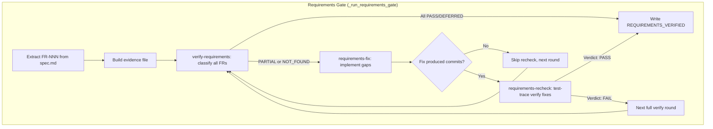
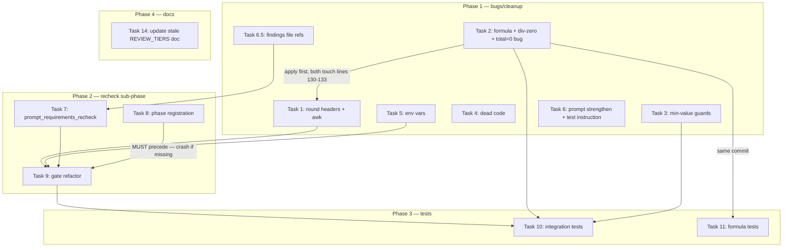

# Wave 5 Implementation Plan — Requirements Gate Hardening + Recheck Phase

**Version:** 0.12.0 (target)
**Predecessor:** Wave 4 (v0.11.x) — secret scanning & branch scoping
**Date:** 2026-03-14
**Status:** DRAFT — awaiting approval
**Investigation rounds:** 5 (see conversation history for full audit trail)

---

## Executive Summary

The verify-requirements phase (shipped in Wave 3) caught 4 real FR gaps in ADflair epic 009 at $2.49. The design is sound, but investigation revealed 7 bugs, 3 configuration improvements, and 1 missing sub-phase. Wave 5 closes all of these.

**Key deliverables:**
1. Fix DEFERRED coverage inflation bug (critical)
2. Add requirements-recheck sub-phase with test-trace verification (new capability)
3. Harden all gates against max_rounds=0 bypass
4. Clean up dead config + strengthen fix prompts

**Estimated scope:** ~300 lines changed across 6 files + ~500 lines new integration test

---

## Motivation

### Bug: DEFERRED inflates coverage percentage

Current formula counts DEFERRED as "safe," allowing auto-advance with 0% actual implementation:
- 0 PASS + 0 PARTIAL + 1 NOT_FOUND + 10 DEFERRED → safe=10, total=11, pct=90% → **advances despite zero implemented FRs**

### Gap: Round 2 is a repeat, not independent verification

Round 2 re-runs verify-requirements with the same prompt, same evidence, same lens. It asks "is FR implemented?" — the same question as round 1. A proper verify step should ask a *different* question: "is the fix correct and tested?" This is the pattern clarify-verify and analyze-verify already follow.

### Bug: max_rounds=0 silently bypasses all gates

No gate has a min-value guard. Setting any `*_MAX_ROUNDS=0` causes the while loop to never execute, silently skipping verification.

---

## Architecture



---

## Phase 1: Bug Fixes & Cleanup

### Task 1: Append-with-round-headers + awk-scoped parsing (ATOMIC)

**Files:** `src/autopilot-prompts.sh`, `src/autopilot-requirements.sh`

**1a.** Modify `prompt_verify_requirements` (~line 1150-1175 of autopilot-prompts.sh):
- Add `## Round $round ($round/$max_rounds)` header format instruction
- Add "APPEND to existing content, do NOT overwrite" (matching security gate prompt at line 535)

**1b.** Scope grep sites to latest round in autopilot-requirements.sh using inline awk:

| Lines | Current | Change |
|-------|---------|--------|
| 99 | `grep -qE ': NOT_FOUND' "$findings_file"` | Extract latest round via inline awk, grep the result |
| 100 | `grep -qE ': PARTIAL' "$findings_file"` | Same |
| 107 | `grep -E '(NOT_FOUND\|PARTIAL)' "$findings_file"` | Same |
| 130-133 | `grep -c ': PASS' "$findings_file"` (etc.) | Same awk scoping for formula counts |

**Lines 130-133 (formula counts) MUST also be awk-scoped to the latest round.** Since Task 1a instructs Claude to APPEND with round headers, a multi-round findings file will contain duplicate FR classifications (one per round). Unscoped `grep -c` would double-count, producing an inflated/meaningless coverage percentage after loop exhaustion.

**Lines 99-100 (gap detection) are EQUALLY CRITICAL to awk-scope.** Without scoping, multi-round files false-positive on stale NOT_FOUND/PARTIAL from prior rounds, triggering unnecessary fix+recheck cycles. Line 107 (failing FR extraction) is the linchpin: if unscoped, the fix loop re-processes FR gaps from prior rounds, doubling implementation cycles. All grep sites (99, 100, 107, 130-133) MUST read from the same awk-extracted `latest_round` variable — extract once, reuse everywhere (Approach A, matching the security gate pattern at `autopilot-gates.sh` line 133). Anchor the header regex with `^` to avoid false matches in LLM output.

**Line 149 (audit trail skip_text) remains UNSCOPED** — the audit trail intentionally shows full history across all rounds for transparency.

**1c.** Add backward-compat fallback after each awk extraction:
```bash
[[ -z "$latest_round" ]] && latest_round=$(cat "$findings_file")
```
Handles old-format files without `## Round` headers. Degrades to current behavior.

**Atomicity:** Tasks 1a and 1b are strictly co-dependent. The awk pattern matches `## Round` headers that only exist after 1a modifies the prompt. Shipping 1b without 1a breaks gap detection (awk returns empty → no gaps detected → false all-PASS).

---

### Task 2: Fix DEFERRED denominator + division-by-zero guard

**File:** `src/autopilot-requirements.sh` (~lines 129-138)

**Change formula from:**
```bash
safe_count=$((pass_count + partial_count + deferred_count))
total=$((pass_count + partial_count + deferred_count + not_found_count))
[[ $total -eq 0 ]] && return 0
pct=$((safe_count * 100 / total))
```

**To:**
```bash
safe_count=$((pass_count + partial_count))
actionable=$((pass_count + partial_count + not_found_count))
```

**All-deferred guard (actionable==0):** Must write `REQUIREMENTS_VERIFIED` marker + commit before returning, modeled on the existing no-FRs early return at lines 42-48:
```bash
if [[ $actionable -eq 0 ]]; then
    log OK "All FRs deferred — requirements trivially satisfied"
    echo '<!-- REQUIREMENTS_VERIFIED -->' >> "$tasks_file"
    git -C "$repo_root" add "$tasks_file" "$findings_file" && \
    git -C "$repo_root" commit -m "chore($epic_num): requirements verified (all deferred)" --no-verify
    return 0
fi
pct=$((safe_count * 100 / actionable))
```

**Rationale for keeping PARTIAL in safe_count:**
- The gate already dispatches fixes for PARTIAL (lines 102-116). If PARTIAL survives 2 fix rounds, the automated system gave its best effort.
- PARTIAL means "attempted but incomplete" — it IS partial progress, unlike NOT_FOUND (not attempted) or DEFERRED (intentionally skipped).
- Removing PARTIAL makes the 80% threshold too strict (3 PASS + 2 PARTIAL = 60% → halts) without adjusting the threshold.
- Industry practice: requirements coverage is typically binary, but this gate's purpose is force-advance decision, not certification. PARTIAL-as-safe is a pragmatic choice for an automated pipeline.

**Update log message at line 138:**
```
log INFO "FR coverage: ${safe_count}/${actionable} (${pct}%) — ${deferred_count} deferred, threshold: 80%"
```

**Fixes pre-existing total=0 bug:** The old line 135 (`[[ $total -eq 0 ]] && return 0`) returned success without writing `REQUIREMENTS_VERIFIED` marker when all rounds of `invoke_claude` failed and no findings were written. This caused `detect_state()` to route back to `verify-requirements` indefinitely. The new `actionable==0` guard writes the marker before returning, matching the no-FRs early return pattern at lines 42-48.

**`_write_force_skip_audit` is unaffected** — confirmed it receives `skip_count` and `skip_text` computed independently from the formula variables (line 151: `skip_count=$((partial_count + not_found_count))`).

---

### Task 3: Make max_rounds configurable + min-value guard (ALL 4 GATES)

**6 guard lines across 3 files:**

**`src/autopilot-requirements.sh` line 18:**
```bash
local max_rounds=${REQUIREMENTS_MAX_ROUNDS:-2}
[[ $max_rounds -lt 1 ]] && max_rounds=1
```

**`src/autopilot-gates.sh` line 63 (security gate):**
Existing code already has `${SECURITY_MAX_ROUNDS:-3}`. Only add the guard:
```bash
local max_rounds=${SECURITY_MAX_ROUNDS:-3}
[[ $max_rounds -lt 1 ]] && max_rounds=1
```
Note: default is 3 (not 2) — preserve the existing default.

**`src/autopilot-gates.sh` line 237 (CI gate):**
Currently hardcoded: `local max_rounds=3 round=0 ci_passed=false`. Change to:
```bash
local max_rounds=${CI_MAX_ROUNDS:-3} round=0 ci_passed=false
[[ $max_rounds -lt 1 ]] && max_rounds=1
```

**`src/autopilot-review.sh` lines 161-165 (review gate, 3 tiers):**
```bash
case "$tier" in
    cli)    max_rounds="${CODERABBIT_MAX_ROUNDS:-2}"; [[ $max_rounds -lt 1 ]] && max_rounds=1 ;;
    codex)  max_rounds="${CODEX_MAX_ROUNDS:-2}"; [[ $max_rounds -lt 1 ]] && max_rounds=1 ;;
    self)   max_rounds="${CLAUDE_SELF_REVIEW_MAX_ROUNDS:-2}"; [[ $max_rounds -lt 1 ]] && max_rounds=1 ;;
    *)      max_rounds=2 ;;
esac
```

**Validated:** All 4 gates produce exactly 1 iteration with max_rounds=1 despite different loop idioms (requirements uses round=1 with -le; others use round=0 with -lt). No side effects on log messages, prompts, or comparisons.

---

### Task 4: Remove dead PHASE_MAX_RETRIES entries

**File:** `src/autopilot.sh` (~lines 195-196)

Remove:
```bash
[verify-requirements]=2
[requirements-fix]=2
```

**Confirmed:** Zero runtime references. Gate functions manage their own loops. The `:-3` fallback handles missing keys.

---

### Task 5: Register new env vars in load_project_config()

**File:** `src/autopilot-lib.sh` (~line 605, alongside SECURITY_MAX_ROUNDS)

```bash
REQUIREMENTS_MAX_ROUNDS="${REQUIREMENTS_MAX_ROUNDS:-2}"
CI_MAX_ROUNDS="${CI_MAX_ROUNDS:-3}"
```

---

### Task 6: Strengthen requirements-fix prompt + diagnostic warning

**File:** `src/autopilot-prompts.sh` (~line 1199 in prompt_requirements_fix)

**Replace step 6:**
```
6. Commit your changes
```

**With:**
```
6. Commit your changes with explicit file staging:
   git add <specific files you modified>
   git commit -m "fix(${epic_num}): resolve FR requirement gaps"
7. Verify clean working tree:
   git status
   If uncommitted changes remain, stage and commit them.
```

This matches the explicit commit templates in `prompt_security_fix` (line 597-598) and `prompt_verify_ci_fix` (line 844-847).

**File:** `src/autopilot-requirements.sh` (~after line 111, after invoke_claude returns)

Add diagnostic warning:
```bash
if ! git -C "$repo_root" diff --quiet 2>/dev/null; then
    log WARN "requirements-fix left uncommitted changes — these will carry into next verify round"
fi
```

**NOT using `_restore_clean_working_tree`** — that function runs `git checkout -- .` which discards all uncommitted modifications to tracked files, destroying Claude's implementation work. It's designed for review phase cleanup (read-only tools), not fix phases (write tools).

**6b. Strengthen test creation instruction** (~line 1197 in prompt_requirements_fix):

Replace the current soft instruction:
```
4. Write tests for the new code
```

With:
```
4. Write tests using the project's existing test framework if available (e.g., tests/test-*.sh for bash).
   If no test framework exists, create a verification script with explicit assertions
   that exercises the fix and asserts expected behavior. Do not create orphaned test files —
   ensure tests are discoverable by the project's test runner.
```

This stronger instruction increases the probability that the recheck phase (Task 7) will find tests to verify, without creating a hard dependency on test existence.

---

### Task 6.5: Add file references to findings_file format (NEW)

**File:** `src/autopilot-prompts.sh` (~line 1171 in prompt_verify_requirements)

**Change format instruction from:**
```
- FR-NNN: PASS|PARTIAL|NOT_FOUND|DEFERRED — brief explanation
```

**To:**
```
- FR-NNN: PASS|PARTIAL|NOT_FOUND|DEFERRED | files: path1, path2 — brief explanation
```

**Rationale:** Enables Task 7 regression spot-checks to look up FR-to-file mapping directly from findings_file, avoiding expensive re-derivation from spec.md.

**Backward compatibility:** All existing grep patterns anchor on `': STATUS'` which appears before the pipe delimiter. Validated against all 7 grep sites in autopilot-requirements.sh, audit trail writer (`_write_force_skip_audit`), GitHub issue bodies, and all tests. Zero changes needed to consumers. The `| files:` data is additive — old findings without it still parse correctly.

**Prerequisite for:** Task 7 (regression check efficiency).

---

## Phase 2: Requirements-Recheck Sub-Phase

### Task 7: Create prompt_requirements_recheck() function

**File:** `src/autopilot-prompts.sh` (new function after ~line 1203)

**Function signature:** `prompt_requirements_recheck(epic_num, title, repo_root, short_name, recheck_file, recheck_evidence, findings_file, failing_frs, round, max_rounds)` — 10 parameters matching the call site at Task 9e (lines 415-416). The `findings_file` parameter is required because the recheck prompt references it (step 5: read previously-PASS FRs for regression spot-check).

**Design principle:** The recheck MUST use a fundamentally different verification lens than verify-requirements. Verify-requirements asks "is the FR implemented?" via code-grep evidence. Recheck asks "is the fix correct and tested?" via test-trace analysis + diff review. This is the same pattern as clarify-verify (different lens from clarify) and security-verify (different lens from security-review).

**Prompt structure:**

```
# Requirements Recheck — Cycle ${round}/${max_rounds}

You are independently verifying that failing requirements were correctly fixed.
Your approach is DIFFERENT from verify-requirements — you focus on TEST ASSERTIONS
and DIFF REVIEW, not code-grep evidence.

The following FRs were PARTIAL or NOT_FOUND and have been fixed:
  ${failing_frs}

The fix diff is available at: ${recheck_evidence}
The full findings from previous verification rounds are at: ${findings_file}
Read this file to identify previously-PASS FRs for the regression spot-check in step 5.

## Instructions

For each failing FR:

1. Read the FR's full text from specs/${short_name}/spec.md
2. Read the fix diff at ${recheck_evidence} — understand WHAT was changed
3. Find TEST FILES that exercise this FR:
   - Primary: search for test files importing/testing the modified functions from the diff
   - Secondary: search for test files referencing the FR number (FR-NNN) in comments
   - If test file was created by the fix phase (appears in the diff as a new file),
     verify it is discoverable by the project's test runner (not an orphaned file)
   - If no tests found via either method, fall back to DIFF-WALKTHROUGH:
     walk through the fix diff line-by-line against the FR's acceptance criteria,
     checking boundary conditions and edge cases explicitly stated in the requirement.
     Classify as VERIFIED only if the diff clearly satisfies ALL acceptance criteria;
     otherwise classify as INCOMPLETE ("no test coverage, diff review inconclusive")
4. Verify: does the test ASSERT the SPECIFIC acceptance criteria?
   - Example: FR-008 says "budget check on largest variant only"
     → does the test assert only ONE budget check runs, on the largest variant?
   - Example: FR-014 says "pg:1 for animated GIFs"
     → does the test verify the generated URL contains pg:1?
   - A test that exercises adjacent behavior but doesn't assert the specific
     requirement is INSUFFICIENT — classify as INCOMPLETE
5. Check: did the fix introduce regressions?
   - Check the files modified in the diff — if any appear in the `| files:` references
     of previously-PASS FRs in ${findings_file}, verify those FRs are not regressed
   - Limit to 2-3 spot-checks, prioritizing FRs with most file overlap with the fix
   - Read those FRs from spec.md, check the relevant code still satisfies them
   - If a regression is found, note it in your findings

## Output

Append your findings to ${recheck_file}:

### Recheck Cycle ${round}

| FR | Status | Test File | Assertion Check | Regression Risk |
|----|--------|-----------|-----------------|-----------------|
| FR-NNN | VERIFIED/INCOMPLETE | path/to/test.ts | "asserts X" / "no test" | None / "FR-MMM may regress" |

Verdict: PASS (if all VERIFIED and no regressions)
Verdict: FAIL (if any INCOMPLETE or regression found)

## Prohibitions

- Do NOT modify source code (verification only)
- Do NOT add HTML markers to tasks.md (orchestrator responsibility)
- Do NOT commit any files
- Do NOT overwrite existing content — only APPEND
- Do NOT re-classify FRs beyond the failing list and 2-3 regression spot-checks
```

**Tools:** `Read,Glob,Grep,Bash` (no Write, no Edit — matching security-verify pattern)
**Model:** `$SONNET` (closed-form classification, not adversarial reasoning; ~$0.30/invocation)

**Fallback lens rationale:** The diff-walkthrough fallback (step 3) is intentionally kept as the simplest viable approach. Investigation considered alternatives: (a) generating verification scripts requires Write tool access (violates read-only principle), (b) a `VERIFIED_LOW_CONFIDENCE` verdict adds state machine complexity with no actionable orchestrator difference, (c) requiring fix to create tests can't be a hard gate (fails for legitimate test-free projects). The current binary VERIFIED/INCOMPLETE classification is sufficient — INCOMPLETE triggers bounce-back, and the strengthened fix prompt (Task 6b) increases test creation probability.

**Key differences from verify-requirements:**

| Aspect | verify-requirements | requirements-recheck |
|--------|-------------------|---------------------|
| Evidence source | Code-grep references | Fix diff + test files |
| Question asked | "Is FR implemented?" | "Is the fix correct and tested?" |
| Scope | All FRs | Only failing FRs |
| Verification method | Read implementation code | Read test assertions |
| Regression check | None | Spot-check 2-3 adjacent FRs |
| Cost | ~$0.59/round (22 FRs) | ~$0.30/round (4 FRs) |

---

### Task 8: Register requirements-recheck phase config

**6 registration points (3 crash if missing, 3 silently degrade):**

**`src/autopilot.sh`:**
```bash
# ~line 140 (PHASE_MODEL) — CRASH if missing
PHASE_MODEL[requirements-recheck]=$SONNET

# ~line 168 (PHASE_TOOLS) — CRASH if missing
PHASE_TOOLS[requirements-recheck]="Read,Glob,Grep,Bash"

# ~line 199 (PHASE_MAX_RETRIES) — silent: defaults to 3 if missing
PHASE_MAX_RETRIES[requirements-recheck]=1
```

**`src/autopilot-github.sh` ~line 91:**
```bash
# _gh_phase_to_status case — silent: wrong GitHub status if missing
requirements-recheck) echo "In Progress" ;;
```

**`src/autopilot-watch.sh`:**
```bash
# Line 17: PHASES array — silent: invisible in dashboard if missing
# Insert after verify-requirements:
PHASES=(... verify-requirements requirements-recheck security-review ...)

# Line 58: short_phase() — cosmetic
requirements-recheck) echo "req-rchk" ;;
```

**Marker strategy:** Reuse `<!-- REQUIREMENTS_VERIFIED -->`. The gate orchestrator writes this marker after recheck passes — no new marker, no state machine changes, no `detect_state()` modifications needed. This follows the security gate pattern where `_run_security_gate()` writes `<!-- SECURITY_REVIEWED -->` (not security-verify).

---

### Task 9: Refactor _run_requirements_gate flow

**File:** `src/autopilot-requirements.sh` (lines 13-168)

**9a. Add recheck file declaration and cleanup:**
```bash
# ~line 17: declare
local recheck_file="$spec_dir/requirement-recheck-findings.md"

# ~line 51 (gate init): cleanup
rm -f "$recheck_file" 2>/dev/null

# Inside while loop top (~line 58): cleanup per round
rm -f "$recheck_file" 2>/dev/null
```

**9b. Capture git HEAD before fix invoke (~line 109):**
```bash
local head_before
head_before=$(git -C "$repo_root" rev-parse HEAD 2>/dev/null)
```

**9c. Diagnostic warning after fix invoke (between _accumulate_phase_cost and round++):**
```bash
if ! git -C "$repo_root" diff --quiet 2>/dev/null; then
    log WARN "requirements-fix left uncommitted changes — carrying into recheck"
fi
```

**Do NOT call `_restore_clean_working_tree`** — it runs `git checkout -- .` which destroys Claude's implementation work. The diagnostic warning is sufficient; uncommitted work carries into the next round as valid input.

**9d. Zero-commit check:**
```bash
local head_after
head_after=$(git -C "$repo_root" rev-parse HEAD 2>/dev/null)
if [[ "$head_after" == "$head_before" ]]; then
    log WARN "requirements-fix produced no commits — skipping recheck"
    ((round++))
    continue
fi
```

**9e. Build evidence and invoke requirements-recheck:**
```bash
# Pre-create recheck file (required — recheck has Bash but not Write tool)
cat > "$recheck_file" <<EOF
# Requirement Recheck Findings
Epic: $epic_num — $title
EOF

# Build fix diff evidence
local recheck_evidence
recheck_evidence=$(mktemp /tmp/req-recheck-evidence-XXXXXX)
git -C "$repo_root" diff "$head_before"..HEAD > "$recheck_evidence" 2>/dev/null || true

# Invoke recheck
local recheck_prompt
recheck_prompt=$(prompt_requirements_recheck "$epic_num" "$title" "$repo_root" "$short_name" \
    "$recheck_file" "$recheck_evidence" "$findings_file" "$failing_frs" "$round" "$max_rounds")
invoke_claude "requirements-recheck" "$recheck_prompt" "$epic_num" "$title" || true
_accumulate_phase_cost "$repo_root"
rm -f "$recheck_evidence" 2>/dev/null
```

**9f. Parse Verdict line and decide next action:**
```bash
local recheck_verdict
recheck_verdict=$(grep -i '^Verdict:' "$recheck_file" 2>/dev/null | tail -1 | awk '{print toupper($2)}')

if [[ "$recheck_verdict" == "PASS" ]]; then
    # Recheck confirmed fixes are correct and tested
    echo '<!-- REQUIREMENTS_VERIFIED -->' >> "$tasks_file"
    git -C "$repo_root" add "$tasks_file" "$findings_file" "$recheck_file" && \
    git -C "$repo_root" commit -m "chore($epic_num): requirements verified (recheck pass)" --no-verify
    return 0
fi

# Verdict: FAIL — fall through to next FULL verify-requirements round
# This is the "bounce back to full re-scan" flow from the original design
log WARN "Requirements recheck FAIL — bouncing back to full verify-requirements scan"
((round++))
continue
```

**Note:** The 9c-9f block REPLACES the existing `((round++)); continue` at lines 114-115. Every path through 9d/9f either returns, or increments round and continues. The original lines 114-115 become unreachable after insertion and must be removed to avoid confusion. Do not insert 9c-9f after the existing increment — insert it between `_accumulate_phase_cost` (line 112) and the current `((round++))` (line 114), removing lines 114-115.

**Bounce-back flow (Gap 4 fix):** When recheck returns Verdict: FAIL, the code falls through to `((round++)); continue` which loops back to the top of the while loop. This triggers a complete verify-requirements re-scan (not just a retry of recheck). The next iteration re-runs the full evidence-building + classification cycle for ALL FRs, catching any issues the targeted recheck flagged. This matches the original design: "if fixes incomplete → back to full verify-requirements (full re-scan)."

**9g. Add recheck file to all git add calls:**

At lines 121, 141, 157, and the new 9f PASS path, replace the single `git add` with a split pattern that handles the optional recheck file:

```bash
git -C "$repo_root" add "$tasks_file" "$findings_file"
[[ -f "$recheck_file" ]] && git -C "$repo_root" add "$recheck_file"
git -C "$repo_root" commit -m "..." --no-verify
```

The `[[ -f ]]` guard is necessary because `git add` on a non-existent file returns non-zero even with `2>/dev/null` — this would break `&&` chains and silently prevent commits. The recheck file may not exist on first-round all-PASS (no fix was dispatched), after per-round cleanup (9a deletes it), or on the force-advance/halt paths if recheck never ran.

---

## Phase 3: Tests

### Task 10: Integration test for _run_requirements_gate()

**File:** `tests/test-requirements-gate-integration.sh` (new)

Model on `test-security-gate-integration.sh` (592 lines, 8 scenarios + 10 verdict parsing tests).

**Stubs (define before sourcing autopilot-requirements.sh):**
- `log() { :; }`
- `_emit_event() { :; }`
- `_accumulate_phase_cost() { :; }`
- `prompt_verify_requirements() { echo "stub"; }`
- `prompt_requirements_fix() { echo "stub"; }`
- `prompt_requirements_recheck() { echo "stub"; }`
- `_write_force_skip_audit() { :; }`
- `invoke_claude()` — redefined per-test with `case "$1"` on phase name

**Test helper `create_test_repo`** must create `specs/$short_name/spec.md` with FR-NNN identifiers (e.g., `FR-001`, `FR-002`) in addition to `tasks.md`. Without spec.md, the gate takes the "no FRs" early return (line 42-48), bypassing all verification logic.

**Scenarios:**

| # | Scenario | Key assertions | Covers |
|---|---------|----------------|--------|
| A | All FRs PASS on round 1 | rc=0, REQUIREMENTS_VERIFIED marker, 1 invoke (verify only), no recheck | Happy path |
| B | Gaps → fix → recheck Verdict: PASS | rc=0, REQUIREMENTS_VERIFIED, 3 invokes (verify + fix + recheck) | Task 7+9 |
| C | Gaps → fix → recheck Verdict: FAIL → round 2 all PASS | rc=0, 4+ invokes, recheck FAIL triggers full re-scan | Bounce-back |
| D | Gaps → fix (no commits) → skip recheck → round 2 | Recheck skipped when HEAD unchanged, verify still re-runs | Task 9d |
| E | Max rounds exhausted, >=80% coverage → force-advance | rc=0, FORCE_SKIPPED + VERIFIED markers | Task 2 |
| F | Max rounds exhausted, <80% → halt | rc=1, FORCE_SKIPPED only | Task 2 |
| G | All FRs DEFERRED → trivial pass | rc=0, REQUIREMENTS_VERIFIED, "all deferred" commit msg, actionable=0 guard | Task 2 div-zero |
| H | No FRs in spec → skip | rc=0, REQUIREMENTS_VERIFIED, "no FRs" commit msg | Existing path |
| I | REQUIREMENTS_MAX_ROUNDS=1 → only 1 round | Single round before threshold, env var respected | Task 3 |
| J | REQUIREMENTS_MAX_ROUNDS=0 → guarded to 1 | Guard fires, 1 round executes (not silent bypass) | Task 3 |
| K | Old findings format (no round headers) → backward compat | awk fallback returns full file content, formula works | Task 1c |
| L | Resume guard: FORCE_SKIPPED + skip=false → halt | rc=1, gate re-halts, no new verification attempted | Existing path |
| M | Resume guard: FORCE_SKIPPED + skip=true → force-advance | rc=0, gate force-advances immediately without re-running verification | Existing path |
| N | Rounds exhausted + force_skip=false → unconditional halt | rc=1 regardless of coverage percentage | Existing path |
| O | Round 1 recheck FAIL → round 2 fix → recheck PASS | rc=0, recheck file cleaned between rounds (9a), second recheck succeeds | Multi-round |
| P | Awk scoping: round 1 NOT_FOUND → fix → round 2 all PASS | Gap detection reads round 2 only; round 1 stale NOT_FOUND ignored; formula uses round 2 counts only | Task 1b |
| Q | Recheck verdict missing → treated as FAIL | invoke_claude recheck writes no Verdict line → gate treats as FAIL → bounce-back | Task 9f edge |
| R | Recheck verdict lowercase/extra whitespace | `verdict: pass` and `Verdict:   PASS  ` both parse correctly | Task 9f parsing |
| S | Fix leaves uncommitted changes → diagnostic warning | invoke_claude stub modifies file without committing → log WARN fires → no crash → next round proceeds | Task 6/9c |
| T | Formula with multi-round append: only latest round counted | Round 1: 3 PASS + 4 NOT_FOUND; Round 2: 5 PASS + 2 NOT_FOUND → formula uses 5/7=71% (not 8/14=57%) | Task 1b+2 |
| U | invoke_claude verify-requirements returns non-zero | round increments, loop retries, no crash, error logged | Lines 91-95 |

**Additional: Recheck verdict parsing unit tests** (modeled on security gate's 10 verdict parsing tests):

| # | Input | Expected |
|---|-------|----------|
| V1 | `Verdict: PASS` | "PASS" |
| V2 | `Verdict: FAIL` | "FAIL" |
| V3 | `verdict: pass` (lowercase) | "PASS" |
| V4 | `Verdict:   PASS  ` (extra whitespace) | "PASS" |
| V5 | No Verdict line in file | "" (empty → treated as FAIL) |
| V6 | Empty file | "" (empty → treated as FAIL) |
| V7 | Multiple Verdict lines (last wins) | Last line's value |
| V8 | `Verdict: PASS — all verified` (trailing text) | "PASS" (awk $2 extracts first word) |

**Additional: Phase registration test** (modeled on test-security-verify-phase.sh):

Verify that `PHASE_MODEL[requirements-recheck]`, `PHASE_TOOLS[requirements-recheck]`, and `PHASE_MAX_RETRIES[requirements-recheck]` are set after sourcing autopilot.sh. Verify `requirements-recheck` appears in PHASES array (autopilot-watch.sh). Verify `_gh_phase_to_status requirements-recheck` returns "In Progress".

**Test infrastructure patterns (model on test-security-gate-integration.sh):**
- Per-test `rm -rf "$repo"` cleanup after each scenario
- `TEST_FINDINGS_FILE` variable exposed to `invoke_claude` stub for writing findings
- Phase-specific invoke counters: `VERIFY_COUNT`, `FIX_COUNT`, `RECHECK_COUNT` reset per test
- Explicit env var initialization per scenario (`REQUIREMENTS_FORCE_SKIP_ALLOWED`, `REQUIREMENTS_MAX_ROUNDS`)
- `assert_eq` and `assert_contains` helpers defined inline (same pattern as security gate test)

---

### Task 11: Update test-fr-coverage.sh threshold test

**File:** `tests/test-fr-coverage.sh` (lines 207-220)

**Current fixture:** 2 PASS, 1 PARTIAL, 1 DEFERRED, 1 NOT_FOUND → asserts pct=80

**Update to new formula:**
- actionable = 2 + 1 + 1 = 4 (excludes DEFERRED)
- safe = 2 + 1 = 3 (PASS + PARTIAL)
- pct = 75

**Add new test cases:**
- All DEFERRED (actionable=0) → pass, REQUIREMENTS_VERIFIED marker written, no division by zero
- 0 PASS + 0 PARTIAL + 1 NOT_FOUND + 10 DEFERRED → actionable=1, safe=0, pct=0% (the original bug case)
- Single FR (1 PASS) → actionable=1, safe=1, pct=100%

---

## Phase 4: Documentation Cleanup

### Task 14: Update stale docs/IMPLEMENTATION_PLAN_REVIEW_TIERS.md (NEW)

**Files:** `docs/IMPLEMENTATION_PLAN_REVIEW_TIERS.md`, `tests/test-detect-project-patch.sh`

The wave6 commit `c1e3d5b` reduced CLI/Codex max_rounds defaults from 3 to 2 in code, but the documentation was not updated. 9 locations need correction:

| # | Line | Before | After |
|---|------|--------|-------|
| 1 | 42 | Decision #17: CLI=3, Codex=3 | CLI=2, Codex=2 |
| 2 | 185 | `CODERABBIT_MAX_ROUNDS:-3` | `:-2` |
| 3 | 186 | `CODEX_MAX_ROUNDS:-3` | `:-2` |
| 4 | 188 | `*) max_rounds=3` | `=2` |
| 5 | 245 | Comment: CLI=3, Codex=3 | CLI=2, Codex=2 |
| 6 | 362 | Config table: (3) | (2) |
| 7 | 1124 | Example: `=3` | `=2` |
| 8 | 1130 | Commented example: `=3` | `=2` |
| 9 | test-detect-project-patch.sh:205 | `CODERABBIT_MAX_ROUNDS=3` | `=2` |

**Note:** Security gate (`SECURITY_MAX_ROUNDS:-3`) and CI gate (`CI_MAX_ROUNDS:-3`) defaults MUST remain 3. Only review tier CLI/Codex defaults change.

This document is purely human-readable — not programmatically parsed. Zero code impact.

---

## Phase 5: Optional (separate PRs, ADflair-specific)

### Task 12: Spot-check epic 005 in ADflair
~$2 cost, one-off. 41 FRs, most complex validation logic. Run verify-requirements against current codebase.

### Task 13: Update ADflair deployed scripts
After speckit-autopilot ships, update `.specify/scripts/bash/autopilot-requirements.sh` and `autopilot-prompts.sh`.

---

## Dependency Graph



**Recommended commit sequence:**
1. Tasks 2 + 11 (formula fix + test update — same commit, mandatory)
2. Task 1 (awk-scoping — atomic 1a+1b+1c)
3. Tasks 3, 4, 5 (independent, can be parallel or sequential)
4. Tasks 6 + 6.5 (prompt changes)
5. Task 8 (phase registration — MUST precede Task 9)
6. Task 7 (recheck prompt)
7. Task 9 (gate refactor — depends on 1, 5, 7, 8)
8. Task 10 (integration tests — depends on 2, 3, 9)
9. Task 14 (docs cleanup — independent)

Phase 1 tasks are independent of each other (except 1a+1b+1c which are atomic), **with one coupling note:** Task 1b (awk-scoping) and Task 2 (formula change) both modify lines 130-133. Apply Task 2 first (change the formula), then Task 1b (wrap the new formula's greps in awk), or apply atomically.

**Implementation note:** Task 6 adds a diagnostic warning after line 111. Task 9c adds a similar warning in a more precise position (between `_accumulate_phase_cost` and the recheck block). When implementing Task 9, the Task 6 warning should be absorbed into 9c's placement — do not duplicate.

Phase 2 depends on Phase 1 completing (specifically Tasks 1, 5, and 6.5).
Phase 3 depends on Phases 1+2.
Phase 4 is independent (documentation only).
Phase 5 is independent (ADflair-specific, after ship).

---

## Traceability Matrix

| Original Finding | Task | Status |
|-----------------|------|--------|
| Bug: DEFERRED inflates coverage | Task 2 | Fixed |
| Bug: Division-by-zero when all deferred | Task 2 | Fixed |
| Bug: All-deferred missing marker | Task 2 | Fixed |
| Bug: total=0 returns without marker (pre-existing) | Task 2 | Fixed |
| Bug: Multi-round accumulation | Task 1 | Fixed |
| Bug: Gap detection (lines 99-100) must be awk-scoped | Task 1b | Fixed |
| Bug: Weak commit instructions | Task 6 | Fixed |
| Bug: max_rounds=0 bypass | Task 3 | Fixed |
| Bug: Dead PHASE_MAX_RETRIES entries | Task 4 | Fixed |
| Bug: Plan Task 3 had :-3 instead of :-2 | Task 3 (plan fix) | Fixed |
| Improvement: max_rounds configurable | Tasks 3+5 | Fixed |
| Improvement: Env var registration | Task 5 | Fixed |
| Improvement: Findings file lacks file refs for regression checks | Task 6.5 | Fixed |
| Improvement: Fix prompt test creation too soft | Task 6b | Fixed |
| Gap: Test-trace verification lens | Task 7 (prompt design) | Filled |
| Gap: No-test fallback (diff-walkthrough) | Task 7 (step 3 fallback) | Filled |
| Gap: Regression check needs file mapping | Tasks 6.5 + 7 | Filled |
| Gap: Missing scope prohibition | Task 7 (prohibitions) | Filled |
| Gap: Test discoverability check for fix-created tests | Task 7 (step 3) | Filled |
| Gap: Fix diff as evidence | Task 9e (recheck_evidence) | Filled |
| Gap: Bounce-back to full re-scan | Task 9f (FAIL path) | Filled |
| Gap: Requirements max_rounds configurable | Task 3 (line 18) | Filled |
| Gap: Missing _write_force_skip_audit stub in tests | Task 10 | Filled |
| Gap: create_test_repo needs spec.md | Task 10 | Filled |
| Gap: Missing verify-failure scenario | Task 10 (scenario U) | Filled |
| Bug: Formula double-counts across rounds | Task 1b (awk-scope lines 99-100, 107, 130-133) | Fixed |
| Gap: No recheck verdict parsing tests | Task 10 (scenarios V1-V8) | Filled |
| Gap: No awk-scoping validation test | Task 10 (scenario P+T) | Filled |
| Gap: No diagnostic warning test | Task 10 (scenario S) | Filled |
| Gap: No phase registration test | Task 10 (registration test) | Filled |
| Gap: Stale REVIEW_TIERS.md defaults (9 locations) | Task 14 | Fixed |
| Suggestion: Retroactive epic 005-008 audit | Task 12 (optional) | Deferred to Phase 5 |
